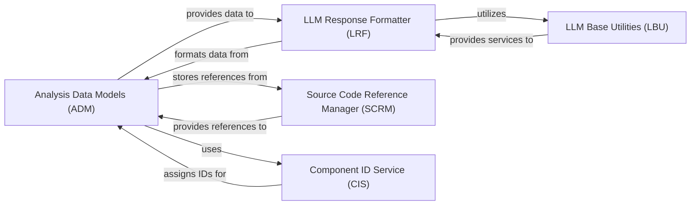

## Details

Defines canonical data structures and schemas for representing analysis results, intermediate states, and architectural insights, ensuring consistent data exchange across the subsystem.

### Analysis Data Models (ADM)
Defines canonical data structures and schemas for representing analysis results, intermediate states, and architectural insights, ensuring consistent data exchange across the subsystem.

**Related Classes/Methods**: _None_

### LLM Response Formatter (LRF)
Converts structured analysis data into human‑readable or LLM‑consumable string formats. Manages representation of CFG‑specific components and clusters, ensuring complex data can be communicated to AI agents or documentation.

**Related Classes/Methods**: _None_

### LLM Base Utilities (LBU)
Provides foundational utilities for interacting with LLMs, including a base model for LLM responses and mechanisms for extracting relevant strings.

**Related Classes/Methods**:

- <a href="https://github.com/CodeBoarding/CodeBoarding/blob/main/.codeboardingagents/agent_responses.py" target="_blank" rel="noopener noreferrer">`repos.codeboarding.llm_utils.LLMBaseModel`</a>
- <a href="https://github.com/CodeBoarding/CodeBoarding/blob/main/.codeboardingagents/agent_responses.py" target="_blank" rel="noopener noreferrer">`repos.codeboarding.llm_utils.extractor_str`</a>

### Source Code Reference Manager (SCRM)
Manages references to specific parts of source code (file paths, line numbers) enabling agents to point to relevant snippets.

**Related Classes/Methods**: _None_

### Component ID Service (CIS)
Ensures unique identification and tracking of components by providing functions for assigning and hashing component IDs.

**Related Classes/Methods**: _None_

### [FAQ](https://github.com/CodeBoarding/GeneratedOnBoardings/tree/main?tab=readme-ov-file#faq)