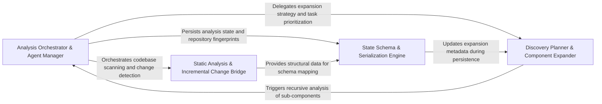

```mermaid
graph LR
    Analysis_Orchestrator_Agent_Manager["Analysis Orchestrator & Agent Manager"]
    Static_Analysis_Incremental_Change_Bridge["Static Analysis & Incremental Change Bridge"]
    Discovery_Planner_Component_Expander["Discovery Planner & Component Expander"]
    State_Schema_Serialization_Engine["State Schema & Serialization Engine"]
    Analysis_Orchestrator_Agent_Manager -- "Orchestrates codebase scanning and change detection" --> Static_Analysis_Incremental_Change_Bridge
    Analysis_Orchestrator_Agent_Manager -- "Delegates expansion strategy and task prioritization" --> Discovery_Planner_Component_Expander
    Analysis_Orchestrator_Agent_Manager -- "Persists analysis state and repository fingerprints" --> State_Schema_Serialization_Engine
    Static_Analysis_Incremental_Change_Bridge -- "Provides structural data for schema mapping" --> State_Schema_Serialization_Engine
    Discovery_Planner_Component_Expander -- "Triggers recursive analysis of sub-components" --> Analysis_Orchestrator_Agent_Manager
    State_Schema_Serialization_Engine -- "Updates expansion metadata during persistence" --> Discovery_Planner_Component_Expander
    click Analysis_Orchestrator_Agent_Manager href "https://github.com/CodeBoarding/CodeBoarding/blob/main/.codeboarding/Analysis_Orchestrator_Agent_Manager.md" "Details"
    click Static_Analysis_Incremental_Change_Bridge href "https://github.com/CodeBoarding/CodeBoarding/blob/main/.codeboarding/Static_Analysis_Incremental_Change_Bridge.md" "Details"
    click Discovery_Planner_Component_Expander href "https://github.com/CodeBoarding/CodeBoarding/blob/main/.codeboarding/Discovery_Planner_Component_Expander.md" "Details"
    click State_Schema_Serialization_Engine href "https://github.com/CodeBoarding/CodeBoarding/blob/main/.codeboarding/State_Schema_Serialization_Engine.md" "Details"
```

## Details

Manages the core logic of transforming raw source code into structured architectural data, bridging deterministic static analysis with AI-augmented reasoning.

### Analysis Orchestrator & Agent Manager [[Expand]](./Analysis_Orchestrator_Agent_Manager.md)
Acts as the brain of the engine, managing the high-level execution pipeline, the lifecycle of specialized AI agents, and repository-wide fingerprints for incremental updates.

**Related Classes/Methods**:

- `agents.abstraction_agent.AbstractionAgent`:47-247
- `agents.content_hash.compute_source_tree_hash`:111-113
- `diagram_analysis.io_utils.save_analysis`:344-367

**Source Files:**

- [`agents/abstraction_agent.py`](https://github.com/CodeBoarding/CodeBoarding/blob/main/.codeboardingagents/abstraction_agent.py)
  - `agents.abstraction_agent.AbstractionAgent` ([L44-L230](https://github.com/CodeBoarding/CodeBoarding/blob/main/.codeboardingagents/abstraction_agent.py#L44-L230)) - Class
- [`agents/content_hash.py`](https://github.com/CodeBoarding/CodeBoarding/blob/main/.codeboardingagents/content_hash.py)
  - `agents.content_hash.hash_whole_file` ([L64-L68](https://github.com/CodeBoarding/CodeBoarding/blob/main/.codeboardingagents/content_hash.py#L64-L68)) - Function
  - `agents.content_hash.tree_hash_from_file_hashes` ([L93-L103](https://github.com/CodeBoarding/CodeBoarding/blob/main/.codeboardingagents/content_hash.py#L93-L103)) - Function
  - `agents.content_hash.hash_repo_source_files` ([L106-L130](https://github.com/CodeBoarding/CodeBoarding/blob/main/.codeboardingagents/content_hash.py#L106-L130)) - Function
  - `agents.content_hash.compute_source_tree_hash` ([L133-L135](https://github.com/CodeBoarding/CodeBoarding/blob/main/.codeboardingagents/content_hash.py#L133-L135)) - Function
- [`agents/details_agent.py`](https://github.com/CodeBoarding/CodeBoarding/blob/main/.codeboardingagents/details_agent.py)
  - `agents.details_agent.DetailsAgent` ([L45-L300](https://github.com/CodeBoarding/CodeBoarding/blob/main/.codeboardingagents/details_agent.py#L45-L300)) - Class
- [`agents/incremental_agent.py`](https://github.com/CodeBoarding/CodeBoarding/blob/main/.codeboardingagents/incremental_agent.py)
  - `agents.incremental_agent.IncrementalAgent` ([L52-L428](https://github.com/CodeBoarding/CodeBoarding/blob/main/.codeboardingagents/incremental_agent.py#L52-L428)) - Class
- [`agents/meta_agent.py`](https://github.com/CodeBoarding/CodeBoarding/blob/main/.codeboardingagents/meta_agent.py)
  - `agents.meta_agent.MetaAgent` ([L18-L66](https://github.com/CodeBoarding/CodeBoarding/blob/main/.codeboardingagents/meta_agent.py#L18-L66)) - Class
- [`diagram_analysis/diagram_generator.py`](https://github.com/CodeBoarding/CodeBoarding/blob/main/.codeboardingdiagram_analysis/diagram_generator.py)
  - `diagram_analysis.diagram_generator._component_expansion_seeds` ([L92-L98](https://github.com/CodeBoarding/CodeBoarding/blob/main/.codeboardingdiagram_analysis/diagram_generator.py#L92-L98)) - Function
  - `diagram_analysis.diagram_generator.DiagramGenerator._source_tree_fingerprint_map` ([L815-L819](https://github.com/CodeBoarding/CodeBoarding/blob/main/.codeboardingdiagram_analysis/diagram_generator.py#L815-L819)) - Method
  - `diagram_analysis.diagram_generator.DiagramGenerator._source_tree_hash` ([L821-L823](https://github.com/CodeBoarding/CodeBoarding/blob/main/.codeboardingdiagram_analysis/diagram_generator.py#L821-L823)) - Method
  - `diagram_analysis.diagram_generator.DiagramGenerator._initialize_meta_agent` ([L825-L834](https://github.com/CodeBoarding/CodeBoarding/blob/main/.codeboardingdiagram_analysis/diagram_generator.py#L825-L834)) - Method
  - `diagram_analysis.diagram_generator.DiagramGenerator._initialize_agents` ([L836-L876](https://github.com/CodeBoarding/CodeBoarding/blob/main/.codeboardingdiagram_analysis/diagram_generator.py#L836-L876)) - Method
  - `diagram_analysis.diagram_generator.DiagramGenerator.pre_analysis` ([L878-L949](https://github.com/CodeBoarding/CodeBoarding/blob/main/.codeboardingdiagram_analysis/diagram_generator.py#L878-L949)) - Method
  - `diagram_analysis.diagram_generator.DiagramGenerator._generate_subcomponents` ([L951-L1043](https://github.com/CodeBoarding/CodeBoarding/blob/main/.codeboardingdiagram_analysis/diagram_generator.py#L951-L1043)) - Method
  - `diagram_analysis.diagram_generator.DiagramGenerator.generate_analysis` ([L1046-L1074](https://github.com/CodeBoarding/CodeBoarding/blob/main/.codeboardingdiagram_analysis/diagram_generator.py#L1046-L1074)) - Method
  - `diagram_analysis.diagram_generator.DiagramGenerator.finalize_and_save` ([L1139-L1188](https://github.com/CodeBoarding/CodeBoarding/blob/main/.codeboardingdiagram_analysis/diagram_generator.py#L1139-L1188)) - Method
- [`diagram_analysis/io_utils.py`](https://github.com/CodeBoarding/CodeBoarding/blob/main/.codeboardingdiagram_analysis/io_utils.py)
  - `diagram_analysis.io_utils._AnalysisFileStore.write` ([L114-L144](https://github.com/CodeBoarding/CodeBoarding/blob/main/.codeboardingdiagram_analysis/io_utils.py#L114-L144)) - Method
  - `diagram_analysis.io_utils.write_fingerprint` ([L368-L373](https://github.com/CodeBoarding/CodeBoarding/blob/main/.codeboardingdiagram_analysis/io_utils.py#L368-L373)) - Function
  - `diagram_analysis.io_utils.save_analysis` ([L388-L417](https://github.com/CodeBoarding/CodeBoarding/blob/main/.codeboardingdiagram_analysis/io_utils.py#L388-L417)) - Function
- [`monitoring/writers.py`](https://github.com/CodeBoarding/CodeBoarding/blob/main/.codeboardingmonitoring/writers.py)
  - `monitoring.writers.StreamingStatsWriter` ([L18-L172](https://github.com/CodeBoarding/CodeBoarding/blob/main/.codeboardingmonitoring/writers.py#L18-L172)) - Class

### Static Analysis & Incremental Change Bridge [[Expand]](./Static_Analysis_Incremental_Change_Bridge.md)
Manages the interface between the engine and the physical codebase, identifying structural changes and tracking file coverage to ensure relevant source artifacts are mapped.

**Related Classes/Methods**:

- `static_analyzer.__init__.StaticAnalyzer`:169-834
- `diagram_analysis.file_coverage.FileCoverage`:23-212
- `repo_utils.ignore.RepoIgnoreManager`:166-331

**Source Files:**

- [`agents/validation.py`](https://github.com/CodeBoarding/CodeBoarding/blob/main/.codeboardingagents/validation.py)
  - `agents.validation.validate_file_classifications` ([L210-L270](https://github.com/CodeBoarding/CodeBoarding/blob/main/.codeboardingagents/validation.py#L210-L270)) - Function
- [`diagram_analysis/diagram_generator.py`](https://github.com/CodeBoarding/CodeBoarding/blob/main/.codeboardingdiagram_analysis/diagram_generator.py)
  - `diagram_analysis.diagram_generator.DiagramGenerator._strip_ignored` ([L689-L709](https://github.com/CodeBoarding/CodeBoarding/blob/main/.codeboardingdiagram_analysis/diagram_generator.py#L689-L709)) - Method
  - `diagram_analysis.diagram_generator.DiagramGenerator._build_file_coverage` ([L711-L720](https://github.com/CodeBoarding/CodeBoarding/blob/main/.codeboardingdiagram_analysis/diagram_generator.py#L711-L720)) - Method
  - `diagram_analysis.diagram_generator.DiagramGenerator._changed_files_for_static_analysis` ([L740-L753](https://github.com/CodeBoarding/CodeBoarding/blob/main/.codeboardingdiagram_analysis/diagram_generator.py#L740-L753)) - Method
  - `diagram_analysis.diagram_generator.DiagramGenerator._get_static_with_injected_analyzer` ([L755-L771](https://github.com/CodeBoarding/CodeBoarding/blob/main/.codeboardingdiagram_analysis/diagram_generator.py#L755-L771)) - Method
  - `diagram_analysis.diagram_generator.DiagramGenerator._get_static_with_new_analyzer` ([L773-L787](https://github.com/CodeBoarding/CodeBoarding/blob/main/.codeboardingdiagram_analysis/diagram_generator.py#L773-L787)) - Method
  - `diagram_analysis.diagram_generator.DiagramGenerator.finalize_for_save` ([L1124-L1137](https://github.com/CodeBoarding/CodeBoarding/blob/main/.codeboardingdiagram_analysis/diagram_generator.py#L1124-L1137)) - Method
- [`diagram_analysis/file_coverage.py`](https://github.com/CodeBoarding/CodeBoarding/blob/main/.codeboardingdiagram_analysis/file_coverage.py)
  - `diagram_analysis.file_coverage.FileCoverage` ([L23-L212](https://github.com/CodeBoarding/CodeBoarding/blob/main/.codeboardingdiagram_analysis/file_coverage.py#L23-L212)) - Class
  - `diagram_analysis.file_coverage.FileCoverage.__init__` ([L30-L38](https://github.com/CodeBoarding/CodeBoarding/blob/main/.codeboardingdiagram_analysis/file_coverage.py#L30-L38)) - Method
  - `diagram_analysis.file_coverage.FileCoverage.build` ([L40-L75](https://github.com/CodeBoarding/CodeBoarding/blob/main/.codeboardingdiagram_analysis/file_coverage.py#L40-L75)) - Method
  - `diagram_analysis.file_coverage.FileCoverage.update` ([L77-L133](https://github.com/CodeBoarding/CodeBoarding/blob/main/.codeboardingdiagram_analysis/file_coverage.py#L77-L133)) - Method
  - `diagram_analysis.file_coverage.FileCoverage._apply_changes` ([L135-L173](https://github.com/CodeBoarding/CodeBoarding/blob/main/.codeboardingdiagram_analysis/file_coverage.py#L135-L173)) - Method
  - `diagram_analysis.file_coverage.FileCoverage.load` ([L176-L199](https://github.com/CodeBoarding/CodeBoarding/blob/main/.codeboardingdiagram_analysis/file_coverage.py#L176-L199)) - Method
  - `diagram_analysis.file_coverage.FileCoverage.save` ([L202-L212](https://github.com/CodeBoarding/CodeBoarding/blob/main/.codeboardingdiagram_analysis/file_coverage.py#L202-L212)) - Method
- [`repo_utils/__init__.py`](https://github.com/CodeBoarding/CodeBoarding/blob/main/.codeboardingrepo_utils/__init__.py)
  - `repo_utils.__init__.normalize_path` ([L230-L261](https://github.com/CodeBoarding/CodeBoarding/blob/main/.codeboardingrepo_utils/__init__.py#L230-L261)) - Function
  - `repo_utils.__init__.normalize_paths` ([L264-L274](https://github.com/CodeBoarding/CodeBoarding/blob/main/.codeboardingrepo_utils/__init__.py#L264-L274)) - Function
- [`repo_utils/change_detector.py`](https://github.com/CodeBoarding/CodeBoarding/blob/main/.codeboardingrepo_utils/change_detector.py)
  - `repo_utils.change_detector.ChangeType.from_status_code` ([L39-L43](https://github.com/CodeBoarding/CodeBoarding/blob/main/.codeboardingrepo_utils/change_detector.py#L39-L43)) - Method
  - `repo_utils.change_detector.FileChange.change_type` ([L83-L84](https://github.com/CodeBoarding/CodeBoarding/blob/main/.codeboardingrepo_utils/change_detector.py#L83-L84)) - Method
  - `repo_utils.change_detector.FileChange.is_rename` ([L86-L87](https://github.com/CodeBoarding/CodeBoarding/blob/main/.codeboardingrepo_utils/change_detector.py#L86-L87)) - Method
  - `repo_utils.change_detector.FileChange.is_content_change` ([L89-L91](https://github.com/CodeBoarding/CodeBoarding/blob/main/.codeboardingrepo_utils/change_detector.py#L89-L91)) - Method
  - `repo_utils.change_detector.FileChange.is_structural` ([L93-L95](https://github.com/CodeBoarding/CodeBoarding/blob/main/.codeboardingrepo_utils/change_detector.py#L93-L95)) - Method
  - `repo_utils.change_detector.ChangeSet.get_file` ([L236-L240](https://github.com/CodeBoarding/CodeBoarding/blob/main/.codeboardingrepo_utils/change_detector.py#L236-L240)) - Method
  - `repo_utils.change_detector.ChangeSet.added_files` ([L246-L247](https://github.com/CodeBoarding/CodeBoarding/blob/main/.codeboardingrepo_utils/change_detector.py#L246-L247)) - Method
  - `repo_utils.change_detector.ChangeSet.modified_files` ([L250-L251](https://github.com/CodeBoarding/CodeBoarding/blob/main/.codeboardingrepo_utils/change_detector.py#L250-L251)) - Method
  - `repo_utils.change_detector.ChangeSet.deleted_files` ([L254-L255](https://github.com/CodeBoarding/CodeBoarding/blob/main/.codeboardingrepo_utils/change_detector.py#L254-L255)) - Method
  - `repo_utils.change_detector.ChangeSet.renames` ([L258-L260](https://github.com/CodeBoarding/CodeBoarding/blob/main/.codeboardingrepo_utils/change_detector.py#L258-L260)) - Method
  - `repo_utils.change_detector.ChangeSet.has_renames_or_copies` ([L262-L263](https://github.com/CodeBoarding/CodeBoarding/blob/main/.codeboardingrepo_utils/change_detector.py#L262-L263)) - Method
  - `repo_utils.change_detector.ChangeSet.file_status` ([L265-L276](https://github.com/CodeBoarding/CodeBoarding/blob/main/.codeboardingrepo_utils/change_detector.py#L265-L276)) - Method
- [`repo_utils/ignore.py`](https://github.com/CodeBoarding/CodeBoarding/blob/main/.codeboardingrepo_utils/ignore.py)
  - `repo_utils.ignore.RepoIgnoreManager` ([L166-L336](https://github.com/CodeBoarding/CodeBoarding/blob/main/.codeboardingrepo_utils/ignore.py#L166-L336)) - Class
  - `repo_utils.ignore.RepoIgnoreManager.strip_ignored` ([L264-L294](https://github.com/CodeBoarding/CodeBoarding/blob/main/.codeboardingrepo_utils/ignore.py#L264-L294)) - Method
  - `repo_utils.ignore.RepoIgnoreManager.categorize_file` ([L308-L336](https://github.com/CodeBoarding/CodeBoarding/blob/main/.codeboardingrepo_utils/ignore.py#L308-L336)) - Method
- [`static_analyzer/__init__.py`](https://github.com/CodeBoarding/CodeBoarding/blob/main/.codeboardingstatic_analyzer/__init__.py)
  - `static_analyzer.__init__.StaticAnalyzer` ([L169-L834](https://github.com/CodeBoarding/CodeBoarding/blob/main/.codeboardingstatic_analyzer/__init__.py#L169-L834)) - Class
  - `static_analyzer.__init__.StaticAnalyzer.__init__` ([L172-L200](https://github.com/CodeBoarding/CodeBoarding/blob/main/.codeboardingstatic_analyzer/__init__.py#L172-L200)) - Method
  - `static_analyzer.__init__.get_static_analysis` ([L837-L870](https://github.com/CodeBoarding/CodeBoarding/blob/main/.codeboardingstatic_analyzer/__init__.py#L837-L870)) - Function
- [`static_analyzer/analysis_result.py`](https://github.com/CodeBoarding/CodeBoarding/blob/main/.codeboardingstatic_analyzer/analysis_result.py)
  - `static_analyzer.analysis_result.StaticAnalysisResults.get_all_source_files` ([L322-L327](https://github.com/CodeBoarding/CodeBoarding/blob/main/.codeboardingstatic_analyzer/analysis_result.py#L322-L327)) - Method
- [`static_analyzer/csharp_config_scanner.py`](https://github.com/CodeBoarding/CodeBoarding/blob/main/.codeboardingstatic_analyzer/csharp_config_scanner.py)
  - `static_analyzer.csharp_config_scanner.CSharpProjectConfig.__init__` ([L20-L26](https://github.com/CodeBoarding/CodeBoarding/blob/main/.codeboardingstatic_analyzer/csharp_config_scanner.py#L20-L26)) - Method
  - `static_analyzer.csharp_config_scanner.CSharpProjectConfig.__repr__` ([L28-L29](https://github.com/CodeBoarding/CodeBoarding/blob/main/.codeboardingstatic_analyzer/csharp_config_scanner.py#L28-L29)) - Method
  - `static_analyzer.csharp_config_scanner.CSharpConfigScanner.__init__` ([L45-L47](https://github.com/CodeBoarding/CodeBoarding/blob/main/.codeboardingstatic_analyzer/csharp_config_scanner.py#L45-L47)) - Method
- [`static_analyzer/java_config_scanner.py`](https://github.com/CodeBoarding/CodeBoarding/blob/main/.codeboardingstatic_analyzer/java_config_scanner.py)
  - `static_analyzer.java_config_scanner.JavaProjectConfig.__init__` ([L12-L22](https://github.com/CodeBoarding/CodeBoarding/blob/main/.codeboardingstatic_analyzer/java_config_scanner.py#L12-L22)) - Method
  - `static_analyzer.java_config_scanner.JavaProjectConfig.__repr__` ([L24-L30](https://github.com/CodeBoarding/CodeBoarding/blob/main/.codeboardingstatic_analyzer/java_config_scanner.py#L24-L30)) - Method
  - `static_analyzer.java_config_scanner.JavaConfigScanner.__init__` ([L35-L37](https://github.com/CodeBoarding/CodeBoarding/blob/main/.codeboardingstatic_analyzer/java_config_scanner.py#L35-L37)) - Method
- [`static_analyzer/scanner.py`](https://github.com/CodeBoarding/CodeBoarding/blob/main/.codeboardingstatic_analyzer/scanner.py)
  - `static_analyzer.scanner.ProjectScanner` ([L64-L179](https://github.com/CodeBoarding/CodeBoarding/blob/main/.codeboardingstatic_analyzer/scanner.py#L64-L179)) - Class
- [`static_analyzer/typescript_config_scanner.py`](https://github.com/CodeBoarding/CodeBoarding/blob/main/.codeboardingstatic_analyzer/typescript_config_scanner.py)
  - `static_analyzer.typescript_config_scanner.TypeScriptConfigScanner.__init__` ([L44-L46](https://github.com/CodeBoarding/CodeBoarding/blob/main/.codeboardingstatic_analyzer/typescript_config_scanner.py#L44-L46)) - Method

### Discovery Planner & Component Expander [[Expand]](./Discovery_Planner_Component_Expander.md)
Implements the strategy for incremental discovery and depth-control, managing the task queue for deep-dive analysis and breaking down complex systems into manageable sub-components.

**Related Classes/Methods**:

- `agents.planner_agent.get_expandable_components`:94-117
- `diagram_analysis.diagram_generator.DiagramGenerator.process_component`:144-147
- `diagram_analysis.io_utils._AnalysisFileStore._compute_expandable_components`:48-53

**Source Files:**

- [`agents/planner_agent.py`](https://github.com/CodeBoarding/CodeBoarding/blob/main/.codeboardingagents/planner_agent.py)
  - `agents.planner_agent.should_expand_component` ([L85-L143](https://github.com/CodeBoarding/CodeBoarding/blob/main/.codeboardingagents/planner_agent.py#L85-L143)) - Function
  - `agents.planner_agent.get_expandable_components` ([L146-L181](https://github.com/CodeBoarding/CodeBoarding/blob/main/.codeboardingagents/planner_agent.py#L146-L181)) - Function
- [`diagram_analysis/diagram_generator.py`](https://github.com/CodeBoarding/CodeBoarding/blob/main/.codeboardingdiagram_analysis/diagram_generator.py)
  - `diagram_analysis.diagram_generator.DiagramGenerator.process_component` ([L548-L551](https://github.com/CodeBoarding/CodeBoarding/blob/main/.codeboardingdiagram_analysis/diagram_generator.py#L548-L551)) - Method
  - `diagram_analysis.diagram_generator.DiagramGenerator._process_component` ([L642-L667](https://github.com/CodeBoarding/CodeBoarding/blob/main/.codeboardingdiagram_analysis/diagram_generator.py#L642-L667)) - Method
  - `diagram_analysis.diagram_generator.DiagramGenerator._generate_subcomponents.submit_component` ([L975-L979](https://github.com/CodeBoarding/CodeBoarding/blob/main/.codeboardingdiagram_analysis/diagram_generator.py#L975-L979)) - Function
- [`diagram_analysis/io_utils.py`](https://github.com/CodeBoarding/CodeBoarding/blob/main/.codeboardingdiagram_analysis/io_utils.py)
  - `diagram_analysis.io_utils._AnalysisFileStore._compute_expandable_components` ([L49-L54](https://github.com/CodeBoarding/CodeBoarding/blob/main/.codeboardingdiagram_analysis/io_utils.py#L49-L54)) - Method
- [`telemetry/events.py`](https://github.com/CodeBoarding/CodeBoarding/blob/main/.codeboardingtelemetry/events.py)
  - `telemetry.events.track_analysis` ([L160-L222](https://github.com/CodeBoarding/CodeBoarding/blob/main/.codeboardingtelemetry/events.py#L160-L222)) - Function

### State Schema & Serialization Engine [[Expand]](./State_Schema_Serialization_Engine.md)
Handles the mapping of internal analysis objects into the standardized UnifiedAnalysisJson format, ensuring data integrity and schema-compliant output.

**Related Classes/Methods**:

- `diagram_analysis.analysis_json.UnifiedAnalysisJson`:147-161
- `diagram_analysis.analysis_json.from_analysis_to_json`:347-373
- `diagram_analysis.io_utils._AnalysisFileStore._write_with_lock_held`:189-251
- `agents.relation_edges.merge_relations_by_pair`:26-30

**Source Files:**

- [`agents/relation_edges.py`](https://github.com/CodeBoarding/CodeBoarding/blob/main/.codeboardingagents/relation_edges.py)
  - `agents.relation_edges.merge_relations_by_pair` ([L26-L30](https://github.com/CodeBoarding/CodeBoarding/blob/main/.codeboardingagents/relation_edges.py#L26-L30)) - Function
- [`diagram_analysis/analysis_json.py`](https://github.com/CodeBoarding/CodeBoarding/blob/main/.codeboardingdiagram_analysis/analysis_json.py)
  - `diagram_analysis.analysis_json.RelationEdgeJson` ([L23-L27](https://github.com/CodeBoarding/CodeBoarding/blob/main/.codeboardingdiagram_analysis/analysis_json.py#L23-L27)) - Class
  - `diagram_analysis.analysis_json.RelationJson` ([L30-L43](https://github.com/CodeBoarding/CodeBoarding/blob/main/.codeboardingdiagram_analysis/analysis_json.py#L30-L43)) - Class
  - `diagram_analysis.analysis_json.ComponentJson` ([L46-L70](https://github.com/CodeBoarding/CodeBoarding/blob/main/.codeboardingdiagram_analysis/analysis_json.py#L46-L70)) - Class
  - `diagram_analysis.analysis_json.NotAnalyzedFile` ([L73-L75](https://github.com/CodeBoarding/CodeBoarding/blob/main/.codeboardingdiagram_analysis/analysis_json.py#L73-L75)) - Class
  - `diagram_analysis.analysis_json.FileCoverageSummary` ([L78-L84](https://github.com/CodeBoarding/CodeBoarding/blob/main/.codeboardingdiagram_analysis/analysis_json.py#L78-L84)) - Class
  - `diagram_analysis.analysis_json.FileCoverageReport` ([L87-L92](https://github.com/CodeBoarding/CodeBoarding/blob/main/.codeboardingdiagram_analysis/analysis_json.py#L87-L92)) - Class
  - `diagram_analysis.analysis_json.AnalysisMetadata` ([L95-L113](https://github.com/CodeBoarding/CodeBoarding/blob/main/.codeboardingdiagram_analysis/analysis_json.py#L95-L113)) - Class
  - `diagram_analysis.analysis_json.MethodIndexEntry` ([L116-L125](https://github.com/CodeBoarding/CodeBoarding/blob/main/.codeboardingdiagram_analysis/analysis_json.py#L116-L125)) - Class
  - `diagram_analysis.analysis_json.ComponentFileMethodGroupJson` ([L128-L133](https://github.com/CodeBoarding/CodeBoarding/blob/main/.codeboardingdiagram_analysis/analysis_json.py#L128-L133)) - Class
  - `diagram_analysis.analysis_json.FileEntryJson` ([L136-L153](https://github.com/CodeBoarding/CodeBoarding/blob/main/.codeboardingdiagram_analysis/analysis_json.py#L136-L153)) - Class
  - `diagram_analysis.analysis_json.UnifiedAnalysisJson` ([L156-L170](https://github.com/CodeBoarding/CodeBoarding/blob/main/.codeboardingdiagram_analysis/analysis_json.py#L156-L170)) - Class
  - `diagram_analysis.analysis_json._build_files_index_from_analysis` ([L173-L186](https://github.com/CodeBoarding/CodeBoarding/blob/main/.codeboardingdiagram_analysis/analysis_json.py#L173-L186)) - Function
  - `diagram_analysis.analysis_json._method_key` ([L189-L191](https://github.com/CodeBoarding/CodeBoarding/blob/main/.codeboardingdiagram_analysis/analysis_json.py#L189-L191)) - Function
  - `diagram_analysis.analysis_json._source_reference_method_key` ([L194-L196](https://github.com/CodeBoarding/CodeBoarding/blob/main/.codeboardingdiagram_analysis/analysis_json.py#L194-L196)) - Function
  - `diagram_analysis.analysis_json._relation_edge_to_json` ([L216-L222](https://github.com/CodeBoarding/CodeBoarding/blob/main/.codeboardingdiagram_analysis/analysis_json.py#L216-L222)) - Function
  - `diagram_analysis.analysis_json._to_component_file_method_refs` ([L225-L237](https://github.com/CodeBoarding/CodeBoarding/blob/main/.codeboardingdiagram_analysis/analysis_json.py#L225-L237)) - Function
  - `diagram_analysis.analysis_json._build_methods_index_from_files` ([L252-L264](https://github.com/CodeBoarding/CodeBoarding/blob/main/.codeboardingdiagram_analysis/analysis_json.py#L252-L264)) - Function
  - `diagram_analysis.analysis_json._build_file_entry_json_from_files` ([L267-L276](https://github.com/CodeBoarding/CodeBoarding/blob/main/.codeboardingdiagram_analysis/analysis_json.py#L267-L276)) - Function
  - `diagram_analysis.analysis_json._relation_to_json` ([L314-L326](https://github.com/CodeBoarding/CodeBoarding/blob/main/.codeboardingdiagram_analysis/analysis_json.py#L314-L326)) - Function
  - `diagram_analysis.analysis_json.from_component_to_json_component` ([L329-L383](https://github.com/CodeBoarding/CodeBoarding/blob/main/.codeboardingdiagram_analysis/analysis_json.py#L329-L383)) - Function
  - `diagram_analysis.analysis_json.from_analysis_to_json` ([L386-L412](https://github.com/CodeBoarding/CodeBoarding/blob/main/.codeboardingdiagram_analysis/analysis_json.py#L386-L412)) - Function
  - `diagram_analysis.analysis_json._compute_depth_level` ([L415-L456](https://github.com/CodeBoarding/CodeBoarding/blob/main/.codeboardingdiagram_analysis/analysis_json.py#L415-L456)) - Function
  - `diagram_analysis.analysis_json._compute_depth_level.get_depth` ([L426-L436](https://github.com/CodeBoarding/CodeBoarding/blob/main/.codeboardingdiagram_analysis/analysis_json.py#L426-L436)) - Function
  - `diagram_analysis.analysis_json.build_unified_analysis_json` ([L459-L510](https://github.com/CodeBoarding/CodeBoarding/blob/main/.codeboardingdiagram_analysis/analysis_json.py#L459-L510)) - Function
- [`diagram_analysis/diagram_generator.py`](https://github.com/CodeBoarding/CodeBoarding/blob/main/.codeboardingdiagram_analysis/diagram_generator.py)
  - `diagram_analysis.diagram_generator.DiagramGenerator._write_file_coverage` ([L722-L738](https://github.com/CodeBoarding/CodeBoarding/blob/main/.codeboardingdiagram_analysis/diagram_generator.py#L722-L738)) - Method
  - `diagram_analysis.diagram_generator.DiagramGenerator._build_file_coverage_summary` ([L1190-L1199](https://github.com/CodeBoarding/CodeBoarding/blob/main/.codeboardingdiagram_analysis/diagram_generator.py#L1190-L1199)) - Method
- [`diagram_analysis/io_utils.py`](https://github.com/CodeBoarding/CodeBoarding/blob/main/.codeboardingdiagram_analysis/io_utils.py)
  - `diagram_analysis.io_utils._AnalysisFileStore.__init__` ([L56-L62](https://github.com/CodeBoarding/CodeBoarding/blob/main/.codeboardingdiagram_analysis/io_utils.py#L56-L62)) - Method
  - `diagram_analysis.io_utils._AnalysisFileStore._write_with_lock_held` ([L196-L295](https://github.com/CodeBoarding/CodeBoarding/blob/main/.codeboardingdiagram_analysis/io_utils.py#L196-L295)) - Method
  - `diagram_analysis.io_utils.write_text_atomic` ([L351-L362](https://github.com/CodeBoarding/CodeBoarding/blob/main/.codeboardingdiagram_analysis/io_utils.py#L351-L362)) - Function

### [FAQ](https://github.com/CodeBoarding/GeneratedOnBoardings/tree/main?tab=readme-ov-file#faq)