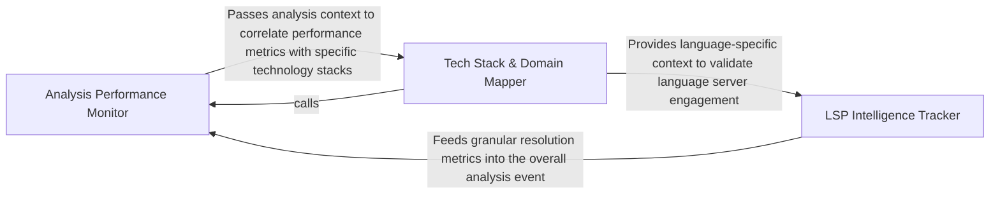

## Details

Translates static analysis outcomes into telemetry events, capturing performance metrics and domain-specific data.

### Analysis Performance Monitor
Orchestrates the collection of high-level execution metrics for analysis runs, capturing duration, success states, and project scale.

**Related Classes/Methods**: _None_

**Source Files:**

- [`telemetry/device_id.py`](https://github.com/CodeBoarding/CodeBoarding/blob/main/.codeboardingtelemetry/device_id.py)
  - `telemetry.device_id._sha256` ([L10-L11](https://github.com/CodeBoarding/CodeBoarding/blob/main/.codeboardingtelemetry/device_id.py#L10-L11)) - Function
  - `telemetry.device_id.generate_device_id` ([L85-L91](https://github.com/CodeBoarding/CodeBoarding/blob/main/.codeboardingtelemetry/device_id.py#L85-L91)) - Function
- [`telemetry/events.py`](https://github.com/CodeBoarding/CodeBoarding/blob/main/.codeboardingtelemetry/events.py)
  - `telemetry.events._resolve_run_id` ([L53-L55](https://github.com/CodeBoarding/CodeBoarding/blob/main/.codeboardingtelemetry/events.py#L53-L55)) - Function

### Tech Stack & Domain Mapper
Translates discovered environment data like languages and frameworks into domain-specific telemetry to provide context on the codebase.

**Related Classes/Methods**: _None_

**Source Files:**

- [`telemetry/events.py`](https://github.com/CodeBoarding/CodeBoarding/blob/main/.codeboardingtelemetry/events.py)
  - `telemetry.events.track_lsp_result` ([L94-L157](https://github.com/CodeBoarding/CodeBoarding/blob/main/.codeboardingtelemetry/events.py#L94-L157)) - Function
- [`telemetry/schemas.py`](https://github.com/CodeBoarding/CodeBoarding/blob/main/.codeboardingtelemetry/schemas.py)
  - `telemetry.schemas.LspAnalysisResult` ([L25-L40](https://github.com/CodeBoarding/CodeBoarding/blob/main/.codeboardingtelemetry/schemas.py#L25-L40)) - Class
- [`telemetry/service.py`](https://github.com/CodeBoarding/CodeBoarding/blob/main/.codeboardingtelemetry/service.py)
  - `telemetry.service.ProductTelemetry._init` ([L32-L49](https://github.com/CodeBoarding/CodeBoarding/blob/main/.codeboardingtelemetry/service.py#L32-L49)) - Method
  - `telemetry.service.ProductTelemetry.capture` ([L60-L73](https://github.com/CodeBoarding/CodeBoarding/blob/main/.codeboardingtelemetry/service.py#L60-L73)) - Method

### LSP Intelligence Tracker
A specialized transformer for Language Server Protocol data, tracking symbol density, reference resolution success, and communication health.

**Related Classes/Methods**:

- `telemetry.events.track_lsp_result`:94-157

**Source Files:**

- [`telemetry/service.py`](https://github.com/CodeBoarding/CodeBoarding/blob/main/.codeboardingtelemetry/service.py)
  - `telemetry.service.ProductTelemetry.user_id` ([L52-L58](https://github.com/CodeBoarding/CodeBoarding/blob/main/.codeboardingtelemetry/service.py#L52-L58)) - Method
  - `telemetry.service.ProductTelemetry.flush` ([L89-L94](https://github.com/CodeBoarding/CodeBoarding/blob/main/.codeboardingtelemetry/service.py#L89-L94)) - Method

### [FAQ](https://github.com/CodeBoarding/GeneratedOnBoardings/tree/main?tab=readme-ov-file#faq)