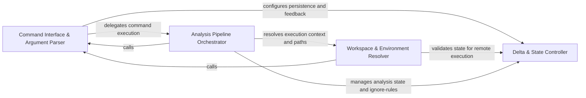

## Details

Bridges the gap between CLI commands and the workflow engine by resolving repository paths and translating flags into parameters for the orchestration pipeline.

### Command Interface & Argument Parser
Acts as the entry point for the application, responsible for parsing CLI flags, validating user input, and routing execution to the appropriate analysis mode.

**Related Classes/Methods**: _None_

**Source Files:**

- [`codeboarding_cli/bootstrap.py`](https://github.com/CodeBoarding/CodeBoarding/blob/main/.codeboardingcodeboarding_cli/bootstrap.py)
  - `codeboarding_cli.bootstrap.resolve_local_run_paths` ([L17-L26](https://github.com/CodeBoarding/CodeBoarding/blob/main/.codeboardingcodeboarding_cli/bootstrap.py#L17-L26)) - Function
- [`codeboarding_cli/commands/full_analysis.py`](https://github.com/CodeBoarding/CodeBoarding/blob/main/.codeboardingcodeboarding_cli/commands/full_analysis.py)
  - `codeboarding_cli.commands.full_analysis._run_local` ([L83-L117](https://github.com/CodeBoarding/CodeBoarding/blob/main/.codeboardingcodeboarding_cli/commands/full_analysis.py#L83-L117)) - Function
  - `codeboarding_cli.commands.full_analysis._process_one_remote` ([L161-L207](https://github.com/CodeBoarding/CodeBoarding/blob/main/.codeboardingcodeboarding_cli/commands/full_analysis.py#L161-L207)) - Function
- [`diagram_analysis/run_context.py`](https://github.com/CodeBoarding/CodeBoarding/blob/main/.codeboardingdiagram_analysis/run_context.py)
  - `diagram_analysis.run_context.RunPaths` ([L16-L21](https://github.com/CodeBoarding/CodeBoarding/blob/main/.codeboardingdiagram_analysis/run_context.py#L16-L21)) - Class

### Workspace & Environment Resolver
Normalizes the execution environment by resolving repository roots, validating local paths, and ensuring the workspace is correctly bootstrapped for the analysis pipeline.

**Related Classes/Methods**: _None_

**Source Files:**

- [`codeboarding_cli/commands/full_analysis.py`](https://github.com/CodeBoarding/CodeBoarding/blob/main/.codeboardingcodeboarding_cli/commands/full_analysis.py)
  - `codeboarding_cli.commands.full_analysis.validate_arguments` ([L58-L71](https://github.com/CodeBoarding/CodeBoarding/blob/main/.codeboardingcodeboarding_cli/commands/full_analysis.py#L58-L71)) - Function
  - `codeboarding_cli.commands.full_analysis.run_from_args` ([L74-L80](https://github.com/CodeBoarding/CodeBoarding/blob/main/.codeboardingcodeboarding_cli/commands/full_analysis.py#L74-L80)) - Function
  - `codeboarding_cli.commands.full_analysis._run_remote` ([L120-L158](https://github.com/CodeBoarding/CodeBoarding/blob/main/.codeboardingcodeboarding_cli/commands/full_analysis.py#L120-L158)) - Function
- [`codeboarding_cli/commands/incremental_analysis.py`](https://github.com/CodeBoarding/CodeBoarding/blob/main/.codeboardingcodeboarding_cli/commands/incremental_analysis.py)
  - `codeboarding_cli.commands.incremental_analysis._emit` ([L98-L101](https://github.com/CodeBoarding/CodeBoarding/blob/main/.codeboardingcodeboarding_cli/commands/incremental_analysis.py#L98-L101)) - Function

### Analysis Pipeline Orchestrator
The primary bridge that maps CLI configurations to the internal API of the AI agents and static analyzers, orchestrating the sequence of operations.

**Related Classes/Methods**: _None_

**Source Files:**

- [`codeboarding_cli/commands/incremental_analysis.py`](https://github.com/CodeBoarding/CodeBoarding/blob/main/.codeboardingcodeboarding_cli/commands/incremental_analysis.py)
  - `codeboarding_cli.commands.incremental_analysis.validate_arguments` ([L26-L28](https://github.com/CodeBoarding/CodeBoarding/blob/main/.codeboardingcodeboarding_cli/commands/incremental_analysis.py#L26-L28)) - Function
  - `codeboarding_cli.commands.incremental_analysis.run_from_args` ([L31-L85](https://github.com/CodeBoarding/CodeBoarding/blob/main/.codeboardingcodeboarding_cli/commands/incremental_analysis.py#L31-L85)) - Function
  - `codeboarding_cli.commands.incremental_analysis._emit_error` ([L88-L95](https://github.com/CodeBoarding/CodeBoarding/blob/main/.codeboardingcodeboarding_cli/commands/incremental_analysis.py#L88-L95)) - Function
- [`codeboarding_cli/commands/partial_analysis.py`](https://github.com/CodeBoarding/CodeBoarding/blob/main/.codeboardingcodeboarding_cli/commands/partial_analysis.py)
  - `codeboarding_cli.commands.partial_analysis.validate_arguments` ([L31-L33](https://github.com/CodeBoarding/CodeBoarding/blob/main/.codeboardingcodeboarding_cli/commands/partial_analysis.py#L31-L33)) - Function
  - `codeboarding_cli.commands.partial_analysis.run_from_args` ([L36-L69](https://github.com/CodeBoarding/CodeBoarding/blob/main/.codeboardingcodeboarding_cli/commands/partial_analysis.py#L36-L69)) - Function

### Delta & State Controller
Manages the logic for incremental updates by comparing current repository state against persisted analysis metadata.

**Related Classes/Methods**: _None_

**Source Files:**

- [`codeboarding_cli/view_instructions.py`](https://github.com/CodeBoarding/CodeBoarding/blob/main/.codeboardingcodeboarding_cli/view_instructions.py)
  - `codeboarding_cli.view_instructions.print_view_instructions` ([L20-L41](https://github.com/CodeBoarding/CodeBoarding/blob/main/.codeboardingcodeboarding_cli/view_instructions.py#L20-L41)) - Function
- [`codeboarding_workflows/sources/local.py`](https://github.com/CodeBoarding/CodeBoarding/blob/main/.codeboardingcodeboarding_workflows/sources/local.py)
  - `codeboarding_workflows.sources.local.local_source` ([L22-L23](https://github.com/CodeBoarding/CodeBoarding/blob/main/.codeboardingcodeboarding_workflows/sources/local.py#L22-L23)) - Function
- [`repo_utils/ignore.py`](https://github.com/CodeBoarding/CodeBoarding/blob/main/.codeboardingrepo_utils/ignore.py)
  - `repo_utils.ignore.initialize_codeboardingignore` ([L334-L347](https://github.com/CodeBoarding/CodeBoarding/blob/main/.codeboardingrepo_utils/ignore.py#L334-L347)) - Function
- [`utils.py`](https://github.com/CodeBoarding/CodeBoarding/blob/main/.codeboardingutils.py)
  - `utils.monitoring_enabled` ([L78-L80](https://github.com/CodeBoarding/CodeBoarding/blob/main/.codeboardingutils.py#L78-L80)) - Function

### [FAQ](https://github.com/CodeBoarding/GeneratedOnBoardings/tree/main?tab=readme-ov-file#faq)