```mermaid
graph LR
    Analysis_Orchestrator_Context_Manager["Analysis Orchestrator & Context Manager"]
    Recursive_Synthesis_Engine["Recursive Synthesis Engine"]
    Incremental_Delta_Processor["Incremental Delta Processor"]
    Static_Analysis_Refinement_Guard["Static Analysis & Refinement Guard"]
    Analysis_Orchestrator_Context_Manager -- "triggers configuration and cleanup" --> Static_Analysis_Refinement_Guard
    Analysis_Orchestrator_Context_Manager -- "passes context for incremental check" --> Incremental_Delta_Processor
    Incremental_Delta_Processor -- "provides dirty components for synthesis" --> Recursive_Synthesis_Engine
    Recursive_Synthesis_Engine -- "invokes refinement utilities" --> Static_Analysis_Refinement_Guard
    Analysis_Orchestrator_Context_Manager -- "calls" --> Recursive_Synthesis_Engine
    Recursive_Synthesis_Engine -- "calls" --> Analysis_Orchestrator_Context_Manager
    Recursive_Synthesis_Engine -- "calls" --> Incremental_Delta_Processor
    Incremental_Delta_Processor -- "calls" --> Analysis_Orchestrator_Context_Manager
    Incremental_Delta_Processor -- "calls" --> Static_Analysis_Refinement_Guard
    click Analysis_Orchestrator_Context_Manager href "https://github.com/CodeBoarding/CodeBoarding/blob/main/.codeboarding/Analysis_Orchestrator_Context_Manager.md" "Details"
    click Recursive_Synthesis_Engine href "https://github.com/CodeBoarding/CodeBoarding/blob/main/.codeboarding/Recursive_Synthesis_Engine.md" "Details"
    click Incremental_Delta_Processor href "https://github.com/CodeBoarding/CodeBoarding/blob/main/.codeboarding/Incremental_Delta_Processor.md" "Details"
    click Static_Analysis_Refinement_Guard href "https://github.com/CodeBoarding/CodeBoarding/blob/main/.codeboarding/Static_Analysis_Refinement_Guard.md" "Details"
```

## Details

The core processing unit that executes static analysis and LLM-driven reasoning to generate diagrams and architectural insights.

### Analysis Orchestrator & Context Manager [[Expand]](./Analysis_Orchestrator_Context_Manager.md)
Acts as the subsystem's entry point, responsible for initializing the analysis environment, loading static analysis results, and managing the lifecycle of the DiagramGenerator.

**Related Classes/Methods**:

- `diagram_analysis.diagram_generator.DiagramGenerator`:72-688
- `static_analyzer.analysis_result.StaticAnalysisResults`:166-317
- `monitoring.paths.get_monitoring_run_dir`:15-22

**Source Files:**

- [`agents/abstraction_agent.py`](https://github.com/CodeBoarding/CodeBoarding/blob/main/.codeboardingagents/abstraction_agent.py)
  - `agents.abstraction_agent.AbstractionAgent` ([L38-L177](https://github.com/CodeBoarding/CodeBoarding/blob/main/.codeboardingagents/abstraction_agent.py#L38-L177)) - Class
- [`agents/details_agent.py`](https://github.com/CodeBoarding/CodeBoarding/blob/main/.codeboardingagents/details_agent.py)
  - `agents.details_agent.DetailsAgent` ([L37-L249](https://github.com/CodeBoarding/CodeBoarding/blob/main/.codeboardingagents/details_agent.py#L37-L249)) - Class
- [`agents/meta_agent.py`](https://github.com/CodeBoarding/CodeBoarding/blob/main/.codeboardingagents/meta_agent.py)
  - `agents.meta_agent.MetaAgent` ([L18-L66](https://github.com/CodeBoarding/CodeBoarding/blob/main/.codeboardingagents/meta_agent.py#L18-L66)) - Class
- [`diagram_analysis/diagram_generator.py`](https://github.com/CodeBoarding/CodeBoarding/blob/main/.codeboardingdiagram_analysis/diagram_generator.py)
  - `diagram_analysis.diagram_generator.DiagramGenerator._build_file_coverage` ([L190-L199](https://github.com/CodeBoarding/CodeBoarding/blob/main/.codeboardingdiagram_analysis/diagram_generator.py#L190-L199)) - Method
  - `diagram_analysis.diagram_generator.DiagramGenerator._get_static_from_injected_analyzer` ([L219-L230](https://github.com/CodeBoarding/CodeBoarding/blob/main/.codeboardingdiagram_analysis/diagram_generator.py#L219-L230)) - Method
  - `diagram_analysis.diagram_generator.DiagramGenerator.pre_analysis` ([L257-L376](https://github.com/CodeBoarding/CodeBoarding/blob/main/.codeboardingdiagram_analysis/diagram_generator.py#L257-L376)) - Method
  - `diagram_analysis.diagram_generator.DiagramGenerator.pre_analysis.get_static_with_injected_analyzer` ([L272-L282](https://github.com/CodeBoarding/CodeBoarding/blob/main/.codeboardingdiagram_analysis/diagram_generator.py#L272-L282)) - Function
- [`diagram_analysis/file_coverage.py`](https://github.com/CodeBoarding/CodeBoarding/blob/main/.codeboardingdiagram_analysis/file_coverage.py)
  - `diagram_analysis.file_coverage.FileCoverage` ([L23-L212](https://github.com/CodeBoarding/CodeBoarding/blob/main/.codeboardingdiagram_analysis/file_coverage.py#L23-L212)) - Class
- [`diagram_analysis/version.py`](https://github.com/CodeBoarding/CodeBoarding/blob/main/.codeboardingdiagram_analysis/version.py)
  - `diagram_analysis.version.Version` ([L4-L6](https://github.com/CodeBoarding/CodeBoarding/blob/main/.codeboardingdiagram_analysis/version.py#L4-L6)) - Class
- [`monitoring/paths.py`](https://github.com/CodeBoarding/CodeBoarding/blob/main/.codeboardingmonitoring/paths.py)
  - `monitoring.paths.get_monitoring_base_dir` ([L8-L12](https://github.com/CodeBoarding/CodeBoarding/blob/main/.codeboardingmonitoring/paths.py#L8-L12)) - Function
  - `monitoring.paths.get_monitoring_run_dir` ([L15-L22](https://github.com/CodeBoarding/CodeBoarding/blob/main/.codeboardingmonitoring/paths.py#L15-L22)) - Function
  - `monitoring.paths.get_latest_run_dir` ([L30-L50](https://github.com/CodeBoarding/CodeBoarding/blob/main/.codeboardingmonitoring/paths.py#L30-L50)) - Function
- [`monitoring/writers.py`](https://github.com/CodeBoarding/CodeBoarding/blob/main/.codeboardingmonitoring/writers.py)
  - `monitoring.writers.StreamingStatsWriter` ([L18-L172](https://github.com/CodeBoarding/CodeBoarding/blob/main/.codeboardingmonitoring/writers.py#L18-L172)) - Class
- [`static_analyzer/analysis_result.py`](https://github.com/CodeBoarding/CodeBoarding/blob/main/.codeboardingstatic_analyzer/analysis_result.py)
  - `static_analyzer.analysis_result.StaticAnalysisResults.get_source_files` ([L305-L310](https://github.com/CodeBoarding/CodeBoarding/blob/main/.codeboardingstatic_analyzer/analysis_result.py#L305-L310)) - Method
  - `static_analyzer.analysis_result.StaticAnalysisResults.get_all_source_files` ([L312-L317](https://github.com/CodeBoarding/CodeBoarding/blob/main/.codeboardingstatic_analyzer/analysis_result.py#L312-L317)) - Method
- [`utils.py`](https://github.com/CodeBoarding/CodeBoarding/blob/main/.codeboardingutils.py)
  - `utils.get_project_root` ([L55-L60](https://github.com/CodeBoarding/CodeBoarding/blob/main/.codeboardingutils.py#L55-L60)) - Function
  - `utils.monitoring_enabled` ([L74-L76](https://github.com/CodeBoarding/CodeBoarding/blob/main/.codeboardingutils.py#L74-L76)) - Function

### Recursive Synthesis Engine [[Expand]](./Recursive_Synthesis_Engine.md)
The core execution logic that performs depth-first or breadth-first expansion of the software architecture and synthesizes final visual representations.

**Related Classes/Methods**:

- `diagram_analysis.diagram_generator.DiagramGenerator.generate_analysis`:458-501
- `agents.planner_agent.get_expandable_components`:94-117
- `diagram_analysis.io_utils.save_analysis`:377-396

**Source Files:**

- [`agents/planner_agent.py`](https://github.com/CodeBoarding/CodeBoarding/blob/main/.codeboardingagents/planner_agent.py)
  - `agents.planner_agent.get_expandable_components` ([L94-L117](https://github.com/CodeBoarding/CodeBoarding/blob/main/.codeboardingagents/planner_agent.py#L94-L117)) - Function
- [`diagram_analysis/analysis_json.py`](https://github.com/CodeBoarding/CodeBoarding/blob/main/.codeboardingdiagram_analysis/analysis_json.py)
  - `diagram_analysis.analysis_json.NotAnalyzedFile` ([L56-L58](https://github.com/CodeBoarding/CodeBoarding/blob/main/.codeboardingdiagram_analysis/analysis_json.py#L56-L58)) - Class
  - `diagram_analysis.analysis_json.FileCoverageReport` ([L70-L75](https://github.com/CodeBoarding/CodeBoarding/blob/main/.codeboardingdiagram_analysis/analysis_json.py#L70-L75)) - Class
- [`diagram_analysis/diagram_generator.py`](https://github.com/CodeBoarding/CodeBoarding/blob/main/.codeboardingdiagram_analysis/diagram_generator.py)
  - `diagram_analysis.diagram_generator._component_depth` ([L56-L60](https://github.com/CodeBoarding/CodeBoarding/blob/main/.codeboardingdiagram_analysis/diagram_generator.py#L56-L60)) - Function
  - `diagram_analysis.diagram_generator._component_expansion_seeds` ([L63-L69](https://github.com/CodeBoarding/CodeBoarding/blob/main/.codeboardingdiagram_analysis/diagram_generator.py#L63-L69)) - Function
  - `diagram_analysis.diagram_generator.DiagramGenerator.process_component` ([L123-L126](https://github.com/CodeBoarding/CodeBoarding/blob/main/.codeboardingdiagram_analysis/diagram_generator.py#L123-L126)) - Method
  - `diagram_analysis.diagram_generator.DiagramGenerator._process_component` ([L128-L146](https://github.com/CodeBoarding/CodeBoarding/blob/main/.codeboardingdiagram_analysis/diagram_generator.py#L128-L146)) - Method
  - `diagram_analysis.diagram_generator.DiagramGenerator._strip_ignored` ([L168-L188](https://github.com/CodeBoarding/CodeBoarding/blob/main/.codeboardingdiagram_analysis/diagram_generator.py#L168-L188)) - Method
  - `diagram_analysis.diagram_generator.DiagramGenerator._write_file_coverage` ([L201-L217](https://github.com/CodeBoarding/CodeBoarding/blob/main/.codeboardingdiagram_analysis/diagram_generator.py#L201-L217)) - Method
  - `diagram_analysis.diagram_generator.DiagramGenerator._generate_subcomponents` ([L378-L455](https://github.com/CodeBoarding/CodeBoarding/blob/main/.codeboardingdiagram_analysis/diagram_generator.py#L378-L455)) - Method
  - `diagram_analysis.diagram_generator.DiagramGenerator._generate_subcomponents.submit_component` ([L396-L400](https://github.com/CodeBoarding/CodeBoarding/blob/main/.codeboardingdiagram_analysis/diagram_generator.py#L396-L400)) - Function
  - `diagram_analysis.diagram_generator.DiagramGenerator.generate_analysis` ([L458-L501](https://github.com/CodeBoarding/CodeBoarding/blob/main/.codeboardingdiagram_analysis/diagram_generator.py#L458-L501)) - Method
- [`diagram_analysis/io_utils.py`](https://github.com/CodeBoarding/CodeBoarding/blob/main/.codeboardingdiagram_analysis/io_utils.py)
  - `diagram_analysis.io_utils.load_analysis_commit_hash` ([L322-L349](https://github.com/CodeBoarding/CodeBoarding/blob/main/.codeboardingdiagram_analysis/io_utils.py#L322-L349)) - Function
  - `diagram_analysis.io_utils.save_analysis` ([L377-L396](https://github.com/CodeBoarding/CodeBoarding/blob/main/.codeboardingdiagram_analysis/io_utils.py#L377-L396)) - Function
- [`repo_utils/__init__.py`](https://github.com/CodeBoarding/CodeBoarding/blob/main/.codeboardingrepo_utils/__init__.py)
  - `repo_utils.__init__.get_git_commit_hash` ([L177-L182](https://github.com/CodeBoarding/CodeBoarding/blob/main/.codeboardingrepo_utils/__init__.py#L177-L182)) - Function
  - `repo_utils.__init__.get_branch` ([L227-L232](https://github.com/CodeBoarding/CodeBoarding/blob/main/.codeboardingrepo_utils/__init__.py#L227-L232)) - Function
- [`telemetry/events.py`](https://github.com/CodeBoarding/CodeBoarding/blob/main/.codeboardingtelemetry/events.py)
  - `telemetry.events.track_analysis` ([L160-L222](https://github.com/CodeBoarding/CodeBoarding/blob/main/.codeboardingtelemetry/events.py#L160-L222)) - Function

### Incremental Delta Processor [[Expand]](./Incremental_Delta_Processor.md)
Implements the Incremental Analysis pattern by comparing current repository snapshots against previous runs to identify components requiring re-analysis.

**Related Classes/Methods**:

- `diagram_analysis.diagram_generator.DiagramGenerator.generate_analysis_incremental`:547-688
- `diagram_analysis.cluster_delta.ClusterDelta`:46-66
- `diagram_analysis.cluster_snapshot.ClusterSnapshot`:30-37

**Source Files:**

- [`agents/incremental_agent.py`](https://github.com/CodeBoarding/CodeBoarding/blob/main/.codeboardingagents/incremental_agent.py)
  - `agents.incremental_agent.IncrementalAgent` ([L50-L241](https://github.com/CodeBoarding/CodeBoarding/blob/main/.codeboardingagents/incremental_agent.py#L50-L241)) - Class
  - `agents.incremental_agent.remove_deleted_files` ([L713-L723](https://github.com/CodeBoarding/CodeBoarding/blob/main/.codeboardingagents/incremental_agent.py#L713-L723)) - Function
  - `agents.incremental_agent._scrub_one_analysis` ([L726-L742](https://github.com/CodeBoarding/CodeBoarding/blob/main/.codeboardingagents/incremental_agent.py#L726-L742)) - Function
- [`diagram_analysis/cluster_delta.py`](https://github.com/CodeBoarding/CodeBoarding/blob/main/.codeboardingdiagram_analysis/cluster_delta.py)
  - `diagram_analysis.cluster_delta.LanguageDelta.affected_cluster_ids` ([L41-L42](https://github.com/CodeBoarding/CodeBoarding/blob/main/.codeboardingdiagram_analysis/cluster_delta.py#L41-L42)) - Method
  - `diagram_analysis.cluster_delta.ClusterDelta.has_changes` ([L50-L51](https://github.com/CodeBoarding/CodeBoarding/blob/main/.codeboardingdiagram_analysis/cluster_delta.py#L50-L51)) - Method
  - `diagram_analysis.cluster_delta.ClusterDelta.all_affected_cluster_ids` ([L53-L54](https://github.com/CodeBoarding/CodeBoarding/blob/main/.codeboardingdiagram_analysis/cluster_delta.py#L53-L54)) - Method
  - `diagram_analysis.cluster_delta.ClusterDelta.cluster_results` ([L59-L60](https://github.com/CodeBoarding/CodeBoarding/blob/main/.codeboardingdiagram_analysis/cluster_delta.py#L59-L60)) - Method
- [`diagram_analysis/cluster_snapshot.py`](https://github.com/CodeBoarding/CodeBoarding/blob/main/.codeboardingdiagram_analysis/cluster_snapshot.py)
  - `diagram_analysis.cluster_snapshot.ClusterSnapshot.all_cluster_ids` ([L36-L37](https://github.com/CodeBoarding/CodeBoarding/blob/main/.codeboardingdiagram_analysis/cluster_snapshot.py#L36-L37)) - Method
- [`diagram_analysis/diagram_generator.py`](https://github.com/CodeBoarding/CodeBoarding/blob/main/.codeboardingdiagram_analysis/diagram_generator.py)
  - `diagram_analysis.diagram_generator.DiagramGenerator._build_file_coverage_summary` ([L535-L544](https://github.com/CodeBoarding/CodeBoarding/blob/main/.codeboardingdiagram_analysis/diagram_generator.py#L535-L544)) - Method
  - `diagram_analysis.diagram_generator.DiagramGenerator.generate_analysis_incremental` ([L547-L688](https://github.com/CodeBoarding/CodeBoarding/blob/main/.codeboardingdiagram_analysis/diagram_generator.py#L547-L688)) - Method
  - `diagram_analysis.diagram_generator._collect_components_by_id` ([L691-L706](https://github.com/CodeBoarding/CodeBoarding/blob/main/.codeboardingdiagram_analysis/diagram_generator.py#L691-L706)) - Function
  - `diagram_analysis.diagram_generator._merge_sub_analyses` ([L709-L744](https://github.com/CodeBoarding/CodeBoarding/blob/main/.codeboardingdiagram_analysis/diagram_generator.py#L709-L744)) - Function
- [`diagram_analysis/exceptions.py`](https://github.com/CodeBoarding/CodeBoarding/blob/main/.codeboardingdiagram_analysis/exceptions.py)
  - `diagram_analysis.exceptions.IncrementalCacheMissingError` ([L8-L43](https://github.com/CodeBoarding/CodeBoarding/blob/main/.codeboardingdiagram_analysis/exceptions.py#L8-L43)) - Class

### Static Analysis & Refinement Guard [[Expand]](./Static_Analysis_Refinement_Guard.md)
Configures language-specific scanners and applies post-processing filters to ensure data fed into LLM agents is clean and relevant.

**Related Classes/Methods**:

- `static_analyzer.typescript_config_scanner.TypeScriptConfigScanner`:39-204
- `agents.incremental_agent.prune_empty_components`:745-781
- `repo_utils.ignore.RepoIgnoreManager`:164-329

**Source Files:**

- [`agents/incremental_agent.py`](https://github.com/CodeBoarding/CodeBoarding/blob/main/.codeboardingagents/incremental_agent.py)
  - `agents.incremental_agent.prune_empty_components` ([L745-L781](https://github.com/CodeBoarding/CodeBoarding/blob/main/.codeboardingagents/incremental_agent.py#L745-L781)) - Function
  - `agents.incremental_agent.prune_empty_components._has_methods` ([L755-L756](https://github.com/CodeBoarding/CodeBoarding/blob/main/.codeboardingagents/incremental_agent.py#L755-L756)) - Function
  - `agents.incremental_agent.prune_empty_components._collect_empty` ([L758-L761](https://github.com/CodeBoarding/CodeBoarding/blob/main/.codeboardingagents/incremental_agent.py#L758-L761)) - Function
  - `agents.incremental_agent._strip_relations` ([L784-L787](https://github.com/CodeBoarding/CodeBoarding/blob/main/.codeboardingagents/incremental_agent.py#L784-L787)) - Function
- [`repo_utils/ignore.py`](https://github.com/CodeBoarding/CodeBoarding/blob/main/.codeboardingrepo_utils/ignore.py)
  - `repo_utils.ignore.RepoIgnoreManager` ([L164-L329](https://github.com/CodeBoarding/CodeBoarding/blob/main/.codeboardingrepo_utils/ignore.py#L164-L329)) - Class
  - `repo_utils.ignore.initialize_codeboardingignore` ([L332-L345](https://github.com/CodeBoarding/CodeBoarding/blob/main/.codeboardingrepo_utils/ignore.py#L332-L345)) - Function
- [`static_analyzer/csharp_config_scanner.py`](https://github.com/CodeBoarding/CodeBoarding/blob/main/.codeboardingstatic_analyzer/csharp_config_scanner.py)
  - `static_analyzer.csharp_config_scanner.CSharpConfigScanner.__init__` ([L45-L47](https://github.com/CodeBoarding/CodeBoarding/blob/main/.codeboardingstatic_analyzer/csharp_config_scanner.py#L45-L47)) - Method
- [`static_analyzer/java_config_scanner.py`](https://github.com/CodeBoarding/CodeBoarding/blob/main/.codeboardingstatic_analyzer/java_config_scanner.py)
  - `static_analyzer.java_config_scanner.JavaConfigScanner.__init__` ([L35-L37](https://github.com/CodeBoarding/CodeBoarding/blob/main/.codeboardingstatic_analyzer/java_config_scanner.py#L35-L37)) - Method
- [`static_analyzer/typescript_config_scanner.py`](https://github.com/CodeBoarding/CodeBoarding/blob/main/.codeboardingstatic_analyzer/typescript_config_scanner.py)
  - `static_analyzer.typescript_config_scanner.TypeScriptConfigScanner.__init__` ([L44-L46](https://github.com/CodeBoarding/CodeBoarding/blob/main/.codeboardingstatic_analyzer/typescript_config_scanner.py#L44-L46)) - Method

### [FAQ](https://github.com/CodeBoarding/GeneratedOnBoardings/tree/main?tab=readme-ov-file#faq)