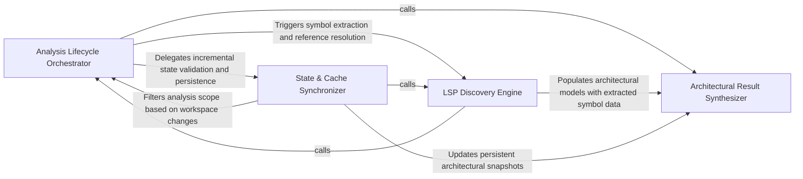

## Details

Acts as the central controller for the analysis process, managing the state machine of an analysis pass and orchestrating the sequence between source discovery, LSP diagnostics, and result absorption.

### Analysis Lifecycle Orchestrator
Acts as the primary controller and state machine for the analysis process, managing execution flow and configuration boundaries.

**Related Classes/Methods**: _None_

**Source Files:**

- [`static_analyzer/__init__.py`](https://github.com/CodeBoarding/CodeBoarding/blob/main/.codeboardingstatic_analyzer/__init__.py)
  - `static_analyzer.__init__.StaticAnalyzer._changed_files_for_language` ([L684-L702](https://github.com/CodeBoarding/CodeBoarding/blob/main/.codeboardingstatic_analyzer/__init__.py#L684-L702)) - Method
  - `static_analyzer.__init__.StaticAnalyzer._extract_language_dict` ([L704-L727](https://github.com/CodeBoarding/CodeBoarding/blob/main/.codeboardingstatic_analyzer/__init__.py#L704-L727)) - Method

### LSP Discovery Engine
Handles interaction with Language Servers to extract structural data, perform workspace scans, and resolve symbol references.

**Related Classes/Methods**:

- `static_analyzer.__init__.StaticAnalyzer._run_full_lsp_pass`:578-632

**Source Files:**

- [`static_analyzer/__init__.py`](https://github.com/CodeBoarding/CodeBoarding/blob/main/.codeboardingstatic_analyzer/__init__.py)
  - `static_analyzer.__init__.StaticAnalyzer._run_full_lsp_pass` ([L578-L632](https://github.com/CodeBoarding/CodeBoarding/blob/main/.codeboardingstatic_analyzer/__init__.py#L578-L632)) - Method
  - `static_analyzer.__init__.StaticAnalyzer._update_cached_results` ([L634-L682](https://github.com/CodeBoarding/CodeBoarding/blob/main/.codeboardingstatic_analyzer/__init__.py#L634-L682)) - Method
  - `static_analyzer.__init__.StaticAnalyzer._loc_for_adapter` ([L762-L770](https://github.com/CodeBoarding/CodeBoarding/blob/main/.codeboardingstatic_analyzer/__init__.py#L762-L770)) - Method

### State & Cache Synchronizer
Manages delta-updates between analysis runs to ensure incremental updates and avoid redundant processing.

**Related Classes/Methods**: _None_

**Source Files:**

- [`static_analyzer/__init__.py`](https://github.com/CodeBoarding/CodeBoarding/blob/main/.codeboardingstatic_analyzer/__init__.py)
  - `static_analyzer.__init__.StaticAnalyzer.analyze` ([L514-L576](https://github.com/CodeBoarding/CodeBoarding/blob/main/.codeboardingstatic_analyzer/__init__.py#L514-L576)) - Method
  - `static_analyzer.__init__.StaticAnalyzer._validate_analysis_results` ([L815-L834](https://github.com/CodeBoarding/CodeBoarding/blob/main/.codeboardingstatic_analyzer/__init__.py#L815-L834)) - Method

### Architectural Result Synthesizer
Bridges low-level static symbols and high-level architectural components by organizing methods into clusters and resolving relationship endpoints.

**Related Classes/Methods**: _None_

**Source Files:**

- [`static_analyzer/analysis_result.py`](https://github.com/CodeBoarding/CodeBoarding/blob/main/.codeboardingstatic_analyzer/analysis_result.py)
  - `static_analyzer.analysis_result.StaticAnalysisResults` ([L166-L327](https://github.com/CodeBoarding/CodeBoarding/blob/main/.codeboardingstatic_analyzer/analysis_result.py#L166-L327)) - Class
  - `static_analyzer.analysis_result.StaticAnalysisResults.get_source_files` ([L315-L320](https://github.com/CodeBoarding/CodeBoarding/blob/main/.codeboardingstatic_analyzer/analysis_result.py#L315-L320)) - Method

### [FAQ](https://github.com/CodeBoarding/GeneratedOnBoardings/tree/main?tab=readme-ov-file#faq)