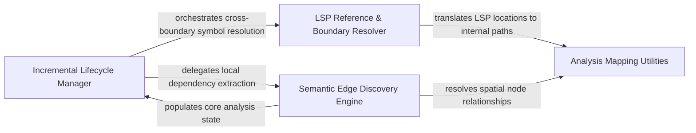

## Details

The integration layer that connects the protocol controller to the higher-level analysis logic, coordinating incremental updates.

### Incremental Lifecycle Manager
Manages the high-level orchestration of the analysis state, initializing core data structures and coordinating update sequences upon file changes.

**Related Classes/Methods**:

- `static_analyzer.incremental_orchestrator._rebuild_changed_file_edges`:110-127
- `static_analyzer.engine.source_inspector.SourceInspector`:94-365
- `static_analyzer.engine.symbol_table.SymbolTable`:16-328

**Source Files:**

- [`static_analyzer/engine/call_graph_builder.py`](https://github.com/CodeBoarding/CodeBoarding/blob/main/.codeboardingstatic_analyzer/engine/call_graph_builder.py)
  - `static_analyzer.engine.call_graph_builder.CallGraphBuilder.__init__` ([L26-L37](https://github.com/CodeBoarding/CodeBoarding/blob/main/.codeboardingstatic_analyzer/engine/call_graph_builder.py#L26-L37)) - Method
- [`static_analyzer/engine/source_inspector.py`](https://github.com/CodeBoarding/CodeBoarding/blob/main/.codeboardingstatic_analyzer/engine/source_inspector.py)
  - `static_analyzer.engine.source_inspector.SourceInspector` ([L94-L365](https://github.com/CodeBoarding/CodeBoarding/blob/main/.codeboardingstatic_analyzer/engine/source_inspector.py#L94-L365)) - Class
- [`static_analyzer/engine/symbol_table.py`](https://github.com/CodeBoarding/CodeBoarding/blob/main/.codeboardingstatic_analyzer/engine/symbol_table.py)
  - `static_analyzer.engine.symbol_table.SymbolTable` ([L16-L328](https://github.com/CodeBoarding/CodeBoarding/blob/main/.codeboardingstatic_analyzer/engine/symbol_table.py#L16-L328)) - Class
- [`static_analyzer/incremental_orchestrator.py`](https://github.com/CodeBoarding/CodeBoarding/blob/main/.codeboardingstatic_analyzer/incremental_orchestrator.py)
  - `static_analyzer.incremental_orchestrator._rebuild_changed_file_edges` ([L110-L127](https://github.com/CodeBoarding/CodeBoarding/blob/main/.codeboardingstatic_analyzer/incremental_orchestrator.py#L110-L127)) - Function

### LSP Reference & Boundary Resolver
Integrates with the LSP client to perform deep symbol resolution and restore cross-boundary edges to maintain graph connectivity.

**Related Classes/Methods**:

- `static_analyzer.engine.lsp_client.LSPClient.references`:284-296
- `static_analyzer.engine.call_graph_builder.CallGraphBuilder._warmup_references`:201-216
- `static_analyzer.incremental_orchestrator._restore_cross_boundary_edges`:130-182

**Source Files:**

- [`static_analyzer/engine/call_graph_builder.py`](https://github.com/CodeBoarding/CodeBoarding/blob/main/.codeboardingstatic_analyzer/engine/call_graph_builder.py)
  - `static_analyzer.engine.call_graph_builder.CallGraphBuilder._warmup_references` ([L201-L216](https://github.com/CodeBoarding/CodeBoarding/blob/main/.codeboardingstatic_analyzer/engine/call_graph_builder.py#L201-L216)) - Method
- [`static_analyzer/engine/language_adapter.py`](https://github.com/CodeBoarding/CodeBoarding/blob/main/.codeboardingstatic_analyzer/engine/language_adapter.py)
  - `static_analyzer.engine.language_adapter.LanguageAdapter.references_per_query_timeout` ([L316-L318](https://github.com/CodeBoarding/CodeBoarding/blob/main/.codeboardingstatic_analyzer/engine/language_adapter.py#L316-L318)) - Method
- [`static_analyzer/engine/lsp_client.py`](https://github.com/CodeBoarding/CodeBoarding/blob/main/.codeboardingstatic_analyzer/engine/lsp_client.py)
  - `static_analyzer.engine.lsp_client.LSPClient.did_open` ([L221-L246](https://github.com/CodeBoarding/CodeBoarding/blob/main/.codeboardingstatic_analyzer/engine/lsp_client.py#L221-L246)) - Method
  - `static_analyzer.engine.lsp_client.LSPClient.references` ([L284-L296](https://github.com/CodeBoarding/CodeBoarding/blob/main/.codeboardingstatic_analyzer/engine/lsp_client.py#L284-L296)) - Method
- [`static_analyzer/incremental_orchestrator.py`](https://github.com/CodeBoarding/CodeBoarding/blob/main/.codeboardingstatic_analyzer/incremental_orchestrator.py)
  - `static_analyzer.incremental_orchestrator._restore_cross_boundary_edges` ([L130-L182](https://github.com/CodeBoarding/CodeBoarding/blob/main/.codeboardingstatic_analyzer/incremental_orchestrator.py#L130-L182)) - Function

### Semantic Edge Discovery Engine
Maps AST-level positions to semantic nodes, identifying outbound calls and affected nodes to bridge raw text changes with the logical call graph.

**Related Classes/Methods**:

- `static_analyzer.incremental_orchestrator._add_outbound_edges_from_changed_files`:214-264
- `static_analyzer.incremental_orchestrator._most_specific_node_at_position`:267-291
- `static_analyzer.node.Node.is_callable`:33-35
- `static_analyzer.__init__.StaticAnalyzer.discover_file_dependencies`:463-512

**Source Files:**

- [`static_analyzer/__init__.py`](https://github.com/CodeBoarding/CodeBoarding/blob/main/.codeboardingstatic_analyzer/__init__.py)
  - `static_analyzer.__init__.StaticAnalyzer.discover_file_dependencies` ([L463-L512](https://github.com/CodeBoarding/CodeBoarding/blob/main/.codeboardingstatic_analyzer/__init__.py#L463-L512)) - Method
- [`static_analyzer/engine/models.py`](https://github.com/CodeBoarding/CodeBoarding/blob/main/.codeboardingstatic_analyzer/engine/models.py)
  - `static_analyzer.engine.models.CallSite.lsp_line` ([L54-L55](https://github.com/CodeBoarding/CodeBoarding/blob/main/.codeboardingstatic_analyzer/engine/models.py#L54-L55)) - Method
  - `static_analyzer.engine.models.CallSite.lsp_column` ([L58-L59](https://github.com/CodeBoarding/CodeBoarding/blob/main/.codeboardingstatic_analyzer/engine/models.py#L58-L59)) - Method
- [`static_analyzer/incremental_orchestrator.py`](https://github.com/CodeBoarding/CodeBoarding/blob/main/.codeboardingstatic_analyzer/incremental_orchestrator.py)
  - `static_analyzer.incremental_orchestrator._add_outbound_edges_from_changed_files` ([L214-L264](https://github.com/CodeBoarding/CodeBoarding/blob/main/.codeboardingstatic_analyzer/incremental_orchestrator.py#L214-L264)) - Function
  - `static_analyzer.incremental_orchestrator._most_specific_node_at_position` ([L267-L291](https://github.com/CodeBoarding/CodeBoarding/blob/main/.codeboardingstatic_analyzer/incremental_orchestrator.py#L267-L291)) - Function
  - `static_analyzer.incremental_orchestrator._definition_nodes` ([L294-L308](https://github.com/CodeBoarding/CodeBoarding/blob/main/.codeboardingstatic_analyzer/incremental_orchestrator.py#L294-L308)) - Function
- [`static_analyzer/internal_references.py`](https://github.com/CodeBoarding/CodeBoarding/blob/main/.codeboardingstatic_analyzer/internal_references.py)
  - `static_analyzer.internal_references.ReferenceNode` ([L9-L10](https://github.com/CodeBoarding/CodeBoarding/blob/main/.codeboardingstatic_analyzer/internal_references.py#L9-L10)) - Class
  - `static_analyzer.internal_references.InternalReferenceSource` ([L13-L16](https://github.com/CodeBoarding/CodeBoarding/blob/main/.codeboardingstatic_analyzer/internal_references.py#L13-L16)) - Class
  - `static_analyzer.internal_references.parent_qualified_name` ([L23-L28](https://github.com/CodeBoarding/CodeBoarding/blob/main/.codeboardingstatic_analyzer/internal_references.py#L23-L28)) - Function
- [`static_analyzer/node.py`](https://github.com/CodeBoarding/CodeBoarding/blob/main/.codeboardingstatic_analyzer/node.py)
  - `static_analyzer.node.Node.is_callable` ([L33-L35](https://github.com/CodeBoarding/CodeBoarding/blob/main/.codeboardingstatic_analyzer/node.py#L33-L35)) - Method
  - `static_analyzer.node.Node.is_callback_or_anonymous` ([L48-L57](https://github.com/CodeBoarding/CodeBoarding/blob/main/.codeboardingstatic_analyzer/node.py#L48-L57)) - Method
  - `static_analyzer.node.Node.__hash__` ([L65-L66](https://github.com/CodeBoarding/CodeBoarding/blob/main/.codeboardingstatic_analyzer/node.py#L65-L66)) - Method
  - `static_analyzer.node.Node.__repr__` ([L68-L69](https://github.com/CodeBoarding/CodeBoarding/blob/main/.codeboardingstatic_analyzer/node.py#L68-L69)) - Method

### Analysis Mapping Utilities
Provides a translation layer between the filesystem/LSP domain and the internal analysis domain, handling URI conversions and spatial relationship calculations.

**Related Classes/Methods**:

- `static_analyzer.engine.utils.uri_to_path`:16-32
- `static_analyzer.engine.utils.definition_location`:35-51
- `static_analyzer.incremental_orchestrator._position_inside_node`:311-317

**Source Files:**

- [`static_analyzer/engine/utils.py`](https://github.com/CodeBoarding/CodeBoarding/blob/main/.codeboardingstatic_analyzer/engine/utils.py)
  - `static_analyzer.engine.utils.uri_to_path` ([L16-L32](https://github.com/CodeBoarding/CodeBoarding/blob/main/.codeboardingstatic_analyzer/engine/utils.py#L16-L32)) - Function
  - `static_analyzer.engine.utils.definition_location` ([L35-L51](https://github.com/CodeBoarding/CodeBoarding/blob/main/.codeboardingstatic_analyzer/engine/utils.py#L35-L51)) - Function
- [`static_analyzer/incremental_orchestrator.py`](https://github.com/CodeBoarding/CodeBoarding/blob/main/.codeboardingstatic_analyzer/incremental_orchestrator.py)
  - `static_analyzer.incremental_orchestrator._edge_reference_call_sites` ([L185-L211](https://github.com/CodeBoarding/CodeBoarding/blob/main/.codeboardingstatic_analyzer/incremental_orchestrator.py#L185-L211)) - Function
  - `static_analyzer.incremental_orchestrator._position_inside_node` ([L311-L317](https://github.com/CodeBoarding/CodeBoarding/blob/main/.codeboardingstatic_analyzer/incremental_orchestrator.py#L311-L317)) - Function

### [FAQ](https://github.com/CodeBoarding/GeneratedOnBoardings/tree/main?tab=readme-ov-file#faq)