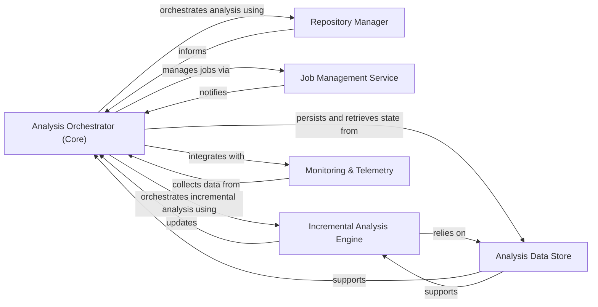

## Details

This component serves as the central control plane, managing the entire analysis workflow from project initialization and repository change detection to orchestrating static analysis, AI-driven insights, and output generation. It handles job execution, incremental updates, and collects monitoring metrics.

### Analysis Orchestrator (Core)
This component serves as the central control plane, managing the entire analysis workflow from project initialization and repository change detection to orchestrating static analysis, AI-driven insights, and output generation. It handles job execution, incremental updates, and collects monitoring metrics. It is the primary coordinator of the analysis pipeline.

**Related Classes/Methods**:

- <a href="https://github.com/CodeBoarding/CodeBoarding/blob/main/.codeboardingmain.py" target="_blank" rel="noopener noreferrer">`main.main`</a>
- <a href="https://github.com/CodeBoarding/CodeBoarding/blob/main/.codeboardingdiagram_analysis/diagram_generator.py" target="_blank" rel="noopener noreferrer">`diagram_analysis.diagram_generator.DiagramGenerator`</a>
- <a href="https://github.com/CodeBoarding/CodeBoarding/blob/main/.codeboardingmain.py" target="_blank" rel="noopener noreferrer">`orchestrator.workflow_manager.WorkflowManager`</a>
- <a href="https://github.com/CodeBoarding/CodeBoarding/blob/main/.codeboardingmain.py" target="_blank" rel="noopener noreferrer">`orchestrator.cli_parser.CLIParser`</a>

### Repository Manager
Handles all interactions with the code repository, such as cloning, fetching changes, managing ignore rules, detecting file modifications, and generating git diffs. It provides the raw data for analysis.

**Related Classes/Methods**:

- <a href="https://github.com/CodeBoarding/CodeBoarding/blob/main/.codeboardingrepo_utils/change_detector.py" target="_blank" rel="noopener noreferrer">`repo_utils.change_detector.detect_changes`</a>
- <a href="https://github.com/CodeBoarding/CodeBoarding/blob/main/.codeboardingrepo_utils/change_detector.py" target="_blank" rel="noopener noreferrer">`repo_utils.git_manager.GitManager`</a>
- <a href="https://github.com/CodeBoarding/CodeBoarding/blob/main/.codeboardingrepo_utils/change_detector.py" target="_blank" rel="noopener noreferrer">`repo_utils.ignore_rules.IgnoreRules`</a>
- <a href="https://github.com/CodeBoarding/CodeBoarding/blob/main/.codeboardingrepo_utils/change_detector.py" target="_blank" rel="noopener noreferrer">`repo_utils.diff_generator.DiffGenerator`</a>

### Job Management Service
Provides an API and backend for managing asynchronous documentation generation jobs, tracking their status and results, and persisting job data using DuckDB. It also includes general utilities for temporary file management and configuration.

**Related Classes/Methods**:

- <a href="https://github.com/CodeBoarding/CodeBoarding/blob/main/.codeboardingduckdb_crud.py" target="_blank" rel="noopener noreferrer">`job_management.job_manager.JobManager`</a>
- <a href="https://github.com/CodeBoarding/CodeBoarding/blob/main/.codeboardingduckdb_crud.py" target="_blank" rel="noopener noreferrer">`job_management.duckdb_store.DuckDBJobStore`</a>
- <a href="https://github.com/CodeBoarding/CodeBoarding/blob/main/.codeboardingduckdb_crud.py" target="_blank" rel="noopener noreferrer">`job_management.job_status_tracker.JobStatusTracker`</a>
- <a href="https://github.com/CodeBoarding/CodeBoarding/blob/main/.codeboardingduckdb_crud.py" target="_blank" rel="noopener noreferrer">`job_management.temp_file_manager.TempFileManager`</a>

### Incremental Analysis Engine
Optimizes analysis by detecting code changes, analyzing their impact on existing components, classifying new files, re-expanding affected components, patching paths in analysis data, and validating the integrity of incremental updates. It defines the models and logic for incremental processing.

**Related Classes/Methods**:

- <a href="https://github.com/CodeBoarding/CodeBoarding/blob/main/.codeboardingdiagram_analysis/incremental/updater.py" target="_blank" rel="noopener noreferrer">`diagram_analysis.incremental.updater.analyze`</a>
- <a href="https://github.com/CodeBoarding/CodeBoarding/blob/main/.codeboardingdiagram_analysis/incremental/updater.py" target="_blank" rel="noopener noreferrer">`incremental.change_detector.IncrementalChangeDetector`</a>
- <a href="https://github.com/CodeBoarding/CodeBoarding/blob/main/.codeboardingdiagram_analysis/incremental/updater.py" target="_blank" rel="noopener noreferrer">`incremental.component_reexpander.ComponentReexpander`</a>
- <a href="https://github.com/CodeBoarding/CodeBoarding/blob/main/.codeboardingdiagram_analysis/incremental/updater.py" target="_blank" rel="noopener noreferrer">`incremental.path_patcher.PathPatcher`</a>

### Analysis Data Store
Persists and retrieves the structural metadata of the codebase analysis, including component definitions, file-to-component mappings, and repository state. It also tracks which files have been processed, identifies skipped or not yet analyzed files, and manages file coverage data.

**Related Classes/Methods**:

- <a href="https://github.com/CodeBoarding/CodeBoarding/blob/main/.codeboardingdiagram_analysis/file_coverage.py" target="_blank" rel="noopener noreferrer">`data_store.analysis_repository.AnalysisRepository`</a>
- <a href="https://github.com/CodeBoarding/CodeBoarding/blob/main/.codeboardingdiagram_analysis/file_coverage.py" target="_blank" rel="noopener noreferrer">`data_store.component_definitions_store.ComponentDefinitionsStore`</a>
- <a href="https://github.com/CodeBoarding/CodeBoarding/blob/main/.codeboardingdiagram_analysis/file_coverage.py" target="_blank" rel="noopener noreferrer">`data_store.file_mapping_store.FileMappingStore`</a>
- <a href="https://github.com/CodeBoarding/CodeBoarding/blob/main/.codeboardingdiagram_analysis/file_coverage.py" target="_blank" rel="noopener noreferrer">`data_store.file_coverage_tracker.FileCoverageTracker`</a>

### Monitoring & Telemetry
Collects, aggregates, and reports operational metrics, LLM usage, and performance data from the analysis pipeline. It provides callbacks for capturing events, writers for persisting data, and a mixin for easy integration into other components.

**Related Classes/Methods**:

- <a href="https://github.com/CodeBoarding/CodeBoarding/blob/main/.codeboardingmonitoring/callbacks.py" target="_blank" rel="noopener noreferrer">`monitoring.callbacks.MonitoringCallback`</a>
- <a href="https://github.com/CodeBoarding/CodeBoarding/blob/main/.codeboardingmonitoring/callbacks.py" target="_blank" rel="noopener noreferrer">`monitoring.metric_aggregator.MetricAggregator`</a>
- <a href="https://github.com/CodeBoarding/CodeBoarding/blob/main/.codeboardingmonitoring/callbacks.py" target="_blank" rel="noopener noreferrer">`monitoring.data_writer.DataWriter`</a>
- <a href="https://github.com/CodeBoarding/CodeBoarding/blob/main/.codeboardingmonitoring/callbacks.py" target="_blank" rel="noopener noreferrer">`monitoring.llm_usage_tracker.LLMUsageTracker`</a>

### [FAQ](https://github.com/CodeBoarding/GeneratedOnBoardings/tree/main?tab=readme-ov-file#faq)
