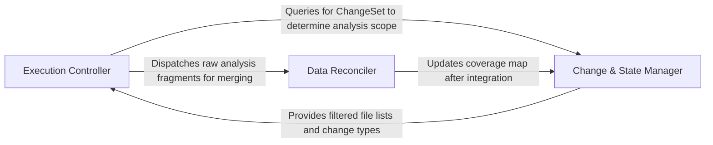

```mermaid
graph LR
    Execution_Controller["Execution Controller"]
    Change_State_Manager["Change & State Manager"]
    Data_Reconciler["Data Reconciler"]
    Execution_Controller -- "Queries for ChangeSet to determine analysis scope" --> Change_State_Manager
    Change_State_Manager -- "Provides filtered file lists and change types" --> Execution_Controller
    Execution_Controller -- "Dispatches raw analysis fragments for merging" --> Data_Reconciler
    Data_Reconciler -- "Updates coverage map after integration" --> Change_State_Manager
    click Execution_Controller href "https://github.com/CodeBoarding/CodeBoarding/blob/main/.codeboarding/Execution_Controller.md" "Details"
    click Change_State_Manager href "https://github.com/CodeBoarding/CodeBoarding/blob/main/.codeboarding/Change_State_Manager.md" "Details"
    click Data_Reconciler href "https://github.com/CodeBoarding/CodeBoarding/blob/main/.codeboarding/Data_Reconciler.md" "Details"
```

## Details

Acts as the control plane, managing execution flow between full repository scans and incremental updates.

### Execution Controller [[Expand]](./Execution_Controller.md)
The primary entry point and state machine for the analysis process, determining scan types and managing LSP session lifecycles.

**Related Classes/Methods**:

- `static_analyzer.__init__.StaticAnalyzer`:169-771
- `static_analyzer.__init__.StaticAnalyzer.analyze`:490-549
- `static_analyzer.__init__.StaticAnalyzer._run_full_analysis`:709-750
- `static_analyzer.engine.language_adapter.LanguageAdapter`:22-368

**Source Files:**

- [`static_analyzer/__init__.py`](https://github.com/CodeBoarding/CodeBoarding/blob/main/.codeboardingstatic_analyzer/__init__.py)
  - `static_analyzer.__init__.StaticAnalysisFatalError` ([L47-L48](https://github.com/CodeBoarding/CodeBoarding/blob/main/.codeboardingstatic_analyzer/__init__.py#L47-L48)) - Class
  - `static_analyzer.__init__.StaticAnalyzer.collect_fresh_diagnostics` ([L337-L349](https://github.com/CodeBoarding/CodeBoarding/blob/main/.codeboardingstatic_analyzer/__init__.py#L337-L349)) - Method
  - `static_analyzer.__init__.StaticAnalyzer.notify_file_changed` ([L387-L404](https://github.com/CodeBoarding/CodeBoarding/blob/main/.codeboardingstatic_analyzer/__init__.py#L387-L404)) - Method
  - `static_analyzer.__init__.StaticAnalyzer.get_adapter_for_file` ([L431-L437](https://github.com/CodeBoarding/CodeBoarding/blob/main/.codeboardingstatic_analyzer/__init__.py#L431-L437)) - Method
  - `static_analyzer.__init__.StaticAnalyzer.analyze` ([L490-L549](https://github.com/CodeBoarding/CodeBoarding/blob/main/.codeboardingstatic_analyzer/__init__.py#L490-L549)) - Method
  - `static_analyzer.__init__.StaticAnalyzer._run_full_lsp_pass` ([L551-L591](https://github.com/CodeBoarding/CodeBoarding/blob/main/.codeboardingstatic_analyzer/__init__.py#L551-L591)) - Method
  - `static_analyzer.__init__.StaticAnalyzer._update_cached_results` ([L593-L639](https://github.com/CodeBoarding/CodeBoarding/blob/main/.codeboardingstatic_analyzer/__init__.py#L593-L639)) - Method
  - `static_analyzer.__init__.StaticAnalyzer._collect_diagnostics_for` ([L675-L697](https://github.com/CodeBoarding/CodeBoarding/blob/main/.codeboardingstatic_analyzer/__init__.py#L675-L697)) - Method
  - `static_analyzer.__init__.StaticAnalyzer._loc_for_adapter` ([L699-L707](https://github.com/CodeBoarding/CodeBoarding/blob/main/.codeboardingstatic_analyzer/__init__.py#L699-L707)) - Method
  - `static_analyzer.__init__.StaticAnalyzer._run_full_analysis` ([L709-L750](https://github.com/CodeBoarding/CodeBoarding/blob/main/.codeboardingstatic_analyzer/__init__.py#L709-L750)) - Method
  - `static_analyzer.__init__.StaticAnalyzer._validate_analysis_results` ([L752-L771](https://github.com/CodeBoarding/CodeBoarding/blob/main/.codeboardingstatic_analyzer/__init__.py#L752-L771)) - Method
- [`static_analyzer/analysis_result.py`](https://github.com/CodeBoarding/CodeBoarding/blob/main/.codeboardingstatic_analyzer/analysis_result.py)
  - `static_analyzer.analysis_result.AnalysisData.to_dict` ([L60-L70](https://github.com/CodeBoarding/CodeBoarding/blob/main/.codeboardingstatic_analyzer/analysis_result.py#L60-L70)) - Method
  - `static_analyzer.analysis_result.StaticAnalysisResults` ([L166-L317](https://github.com/CodeBoarding/CodeBoarding/blob/main/.codeboardingstatic_analyzer/analysis_result.py#L166-L317)) - Class
- [`static_analyzer/engine/adapters/go_adapter.py`](https://github.com/CodeBoarding/CodeBoarding/blob/main/.codeboardingstatic_analyzer/engine/adapters/go_adapter.py)
  - `static_analyzer.engine.adapters.go_adapter.GoAdapter.discover_source_files` ([L188-L200](https://github.com/CodeBoarding/CodeBoarding/blob/main/.codeboardingstatic_analyzer/engine/adapters/go_adapter.py#L188-L200)) - Method
  - `static_analyzer.engine.adapters.go_adapter.GoAdapter._has_excluding_build_tag` ([L203-L223](https://github.com/CodeBoarding/CodeBoarding/blob/main/.codeboardingstatic_analyzer/engine/adapters/go_adapter.py#L203-L223)) - Method
- [`static_analyzer/engine/call_graph_builder.py`](https://github.com/CodeBoarding/CodeBoarding/blob/main/.codeboardingstatic_analyzer/engine/call_graph_builder.py)
  - `static_analyzer.engine.call_graph_builder.CallGraphBuilder` ([L23-L302](https://github.com/CodeBoarding/CodeBoarding/blob/main/.codeboardingstatic_analyzer/engine/call_graph_builder.py#L23-L302)) - Class
  - `static_analyzer.engine.call_graph_builder.CallGraphBuilder.symbol_table` ([L40-L42](https://github.com/CodeBoarding/CodeBoarding/blob/main/.codeboardingstatic_analyzer/engine/call_graph_builder.py#L40-L42)) - Method
- [`static_analyzer/engine/language_adapter.py`](https://github.com/CodeBoarding/CodeBoarding/blob/main/.codeboardingstatic_analyzer/engine/language_adapter.py)
  - `static_analyzer.engine.language_adapter.LanguageAdapter.language` ([L27-L28](https://github.com/CodeBoarding/CodeBoarding/blob/main/.codeboardingstatic_analyzer/engine/language_adapter.py#L27-L28)) - Method
  - `static_analyzer.engine.language_adapter.LanguageAdapter.language_enum` ([L32-L37](https://github.com/CodeBoarding/CodeBoarding/blob/main/.codeboardingstatic_analyzer/engine/language_adapter.py#L32-L37)) - Method
  - `static_analyzer.engine.language_adapter.LanguageAdapter.file_extensions` ([L40-L46](https://github.com/CodeBoarding/CodeBoarding/blob/main/.codeboardingstatic_analyzer/engine/language_adapter.py#L40-L46)) - Method
  - `static_analyzer.engine.language_adapter.LanguageAdapter.language_id` ([L77-L79](https://github.com/CodeBoarding/CodeBoarding/blob/main/.codeboardingstatic_analyzer/engine/language_adapter.py#L77-L79)) - Method
  - `static_analyzer.engine.language_adapter.LanguageAdapter.fail_on_empty_symbols` ([L195-L197](https://github.com/CodeBoarding/CodeBoarding/blob/main/.codeboardingstatic_analyzer/engine/language_adapter.py#L195-L197)) - Method
  - `static_analyzer.engine.language_adapter.LanguageAdapter.wait_for_diagnostics` ([L199-L214](https://github.com/CodeBoarding/CodeBoarding/blob/main/.codeboardingstatic_analyzer/engine/language_adapter.py#L199-L214)) - Method
  - `static_analyzer.engine.language_adapter.LanguageAdapter.discover_source_files` ([L230-L250](https://github.com/CodeBoarding/CodeBoarding/blob/main/.codeboardingstatic_analyzer/engine/language_adapter.py#L230-L250)) - Method
- [`static_analyzer/engine/lsp_client.py`](https://github.com/CodeBoarding/CodeBoarding/blob/main/.codeboardingstatic_analyzer/engine/lsp_client.py)
  - `static_analyzer.engine.lsp_client.LSPClient.get_collected_diagnostics` ([L402-L405](https://github.com/CodeBoarding/CodeBoarding/blob/main/.codeboardingstatic_analyzer/engine/lsp_client.py#L402-L405)) - Method
- [`static_analyzer/incremental_orchestrator.py`](https://github.com/CodeBoarding/CodeBoarding/blob/main/.codeboardingstatic_analyzer/incremental_orchestrator.py)
  - `static_analyzer.incremental_orchestrator.update_cfg_for_changed_files` ([L34-L106](https://github.com/CodeBoarding/CodeBoarding/blob/main/.codeboardingstatic_analyzer/incremental_orchestrator.py#L34-L106)) - Function

### Change & State Manager [[Expand]](./Change_State_Manager.md)
Responsible for identifying repository modifications and maintaining the file coverage map to enable surgical incremental updates.

**Related Classes/Methods**:

- `repo_utils.change_detector.ChangeSet`:224-292
- `static_analyzer.incremental_orchestrator.update_cfg_for_changed_files`:34-106
- `diagram_analysis.file_coverage.FileCoverage.update`:77-133
- `repo_utils.ignore.RepoIgnoreManager`:164-329

**Source Files:**

- [`agents/validation.py`](https://github.com/CodeBoarding/CodeBoarding/blob/main/.codeboardingagents/validation.py)
  - `agents.validation.validate_file_classifications` ([L450-L510](https://github.com/CodeBoarding/CodeBoarding/blob/main/.codeboardingagents/validation.py#L450-L510)) - Function
- [`diagram_analysis/file_coverage.py`](https://github.com/CodeBoarding/CodeBoarding/blob/main/.codeboardingdiagram_analysis/file_coverage.py)
  - `diagram_analysis.file_coverage.FileCoverage.build` ([L40-L75](https://github.com/CodeBoarding/CodeBoarding/blob/main/.codeboardingdiagram_analysis/file_coverage.py#L40-L75)) - Method
  - `diagram_analysis.file_coverage.FileCoverage.update` ([L77-L133](https://github.com/CodeBoarding/CodeBoarding/blob/main/.codeboardingdiagram_analysis/file_coverage.py#L77-L133)) - Method
  - `diagram_analysis.file_coverage.FileCoverage._apply_changes` ([L135-L173](https://github.com/CodeBoarding/CodeBoarding/blob/main/.codeboardingdiagram_analysis/file_coverage.py#L135-L173)) - Method
- [`repo_utils/__init__.py`](https://github.com/CodeBoarding/CodeBoarding/blob/main/.codeboardingrepo_utils/__init__.py)
  - `repo_utils.__init__.normalize_path` ([L235-L261](https://github.com/CodeBoarding/CodeBoarding/blob/main/.codeboardingrepo_utils/__init__.py#L235-L261)) - Function
  - `repo_utils.__init__.normalize_paths` ([L264-L274](https://github.com/CodeBoarding/CodeBoarding/blob/main/.codeboardingrepo_utils/__init__.py#L264-L274)) - Function
- [`repo_utils/change_detector.py`](https://github.com/CodeBoarding/CodeBoarding/blob/main/.codeboardingrepo_utils/change_detector.py)
  - `repo_utils.change_detector.ChangeType.from_status_code` ([L38-L42](https://github.com/CodeBoarding/CodeBoarding/blob/main/.codeboardingrepo_utils/change_detector.py#L38-L42)) - Method
  - `repo_utils.change_detector.FileChange.change_type` ([L82-L83](https://github.com/CodeBoarding/CodeBoarding/blob/main/.codeboardingrepo_utils/change_detector.py#L82-L83)) - Method
  - `repo_utils.change_detector.FileChange.is_rename` ([L85-L86](https://github.com/CodeBoarding/CodeBoarding/blob/main/.codeboardingrepo_utils/change_detector.py#L85-L86)) - Method
  - `repo_utils.change_detector.FileChange.is_content_change` ([L88-L90](https://github.com/CodeBoarding/CodeBoarding/blob/main/.codeboardingrepo_utils/change_detector.py#L88-L90)) - Method
  - `repo_utils.change_detector.FileChange.is_structural` ([L92-L94](https://github.com/CodeBoarding/CodeBoarding/blob/main/.codeboardingrepo_utils/change_detector.py#L92-L94)) - Method
  - `repo_utils.change_detector.ChangeSet.get_file` ([L237-L241](https://github.com/CodeBoarding/CodeBoarding/blob/main/.codeboardingrepo_utils/change_detector.py#L237-L241)) - Method
  - `repo_utils.change_detector.ChangeSet.added_files` ([L247-L248](https://github.com/CodeBoarding/CodeBoarding/blob/main/.codeboardingrepo_utils/change_detector.py#L247-L248)) - Method
  - `repo_utils.change_detector.ChangeSet.modified_files` ([L251-L252](https://github.com/CodeBoarding/CodeBoarding/blob/main/.codeboardingrepo_utils/change_detector.py#L251-L252)) - Method
  - `repo_utils.change_detector.ChangeSet.deleted_files` ([L255-L256](https://github.com/CodeBoarding/CodeBoarding/blob/main/.codeboardingrepo_utils/change_detector.py#L255-L256)) - Method
  - `repo_utils.change_detector.ChangeSet.renames` ([L259-L261](https://github.com/CodeBoarding/CodeBoarding/blob/main/.codeboardingrepo_utils/change_detector.py#L259-L261)) - Method
  - `repo_utils.change_detector.ChangeSet.has_renames_or_copies` ([L263-L264](https://github.com/CodeBoarding/CodeBoarding/blob/main/.codeboardingrepo_utils/change_detector.py#L263-L264)) - Method
  - `repo_utils.change_detector.ChangeSet.file_status` ([L266-L277](https://github.com/CodeBoarding/CodeBoarding/blob/main/.codeboardingrepo_utils/change_detector.py#L266-L277)) - Method
- [`repo_utils/ignore.py`](https://github.com/CodeBoarding/CodeBoarding/blob/main/.codeboardingrepo_utils/ignore.py)
  - `repo_utils.ignore.RepoIgnoreManager.categorize_file` ([L301-L329](https://github.com/CodeBoarding/CodeBoarding/blob/main/.codeboardingrepo_utils/ignore.py#L301-L329)) - Method

### Data Reconciler [[Expand]](./Data_Reconciler.md)
Handles the structural merging of analysis outputs into the global state, ensuring consistency in class hierarchies and dependencies.

**Related Classes/Methods**:

- `static_analyzer.analysis_result.StaticAnalysisResults`:166-317
- `static_analyzer.__init__.StaticAnalyzer._absorb_into_results`:666-673
- `static_analyzer.language_results.ClassHierarchy.merge`:44-52
- `static_analyzer.language_results.PackageDependencies.merge`:84-88

**Source Files:**

- [`static_analyzer/__init__.py`](https://github.com/CodeBoarding/CodeBoarding/blob/main/.codeboardingstatic_analyzer/__init__.py)
  - `static_analyzer.__init__.StaticAnalyzer._absorb_into_results` ([L666-L673](https://github.com/CodeBoarding/CodeBoarding/blob/main/.codeboardingstatic_analyzer/__init__.py#L666-L673)) - Method
- [`static_analyzer/analysis_result.py`](https://github.com/CodeBoarding/CodeBoarding/blob/main/.codeboardingstatic_analyzer/analysis_result.py)
  - `static_analyzer.analysis_result.StaticAnalysisResults._bucket` ([L177-L178](https://github.com/CodeBoarding/CodeBoarding/blob/main/.codeboardingstatic_analyzer/analysis_result.py#L177-L178)) - Method
  - `static_analyzer.analysis_result.StaticAnalysisResults.add_class_hierarchy` ([L184-L186](https://github.com/CodeBoarding/CodeBoarding/blob/main/.codeboardingstatic_analyzer/analysis_result.py#L184-L186)) - Method
  - `static_analyzer.analysis_result.StaticAnalysisResults.add_cfg` ([L188-L190](https://github.com/CodeBoarding/CodeBoarding/blob/main/.codeboardingstatic_analyzer/analysis_result.py#L188-L190)) - Method
  - `static_analyzer.analysis_result.StaticAnalysisResults.add_package_dependencies` ([L192-L194](https://github.com/CodeBoarding/CodeBoarding/blob/main/.codeboardingstatic_analyzer/analysis_result.py#L192-L194)) - Method
  - `static_analyzer.analysis_result.StaticAnalysisResults.add_references` ([L196-L202](https://github.com/CodeBoarding/CodeBoarding/blob/main/.codeboardingstatic_analyzer/analysis_result.py#L196-L202)) - Method
  - `static_analyzer.analysis_result.StaticAnalysisResults.add_source_files` ([L301-L303](https://github.com/CodeBoarding/CodeBoarding/blob/main/.codeboardingstatic_analyzer/analysis_result.py#L301-L303)) - Method
- [`static_analyzer/language_results.py`](https://github.com/CodeBoarding/CodeBoarding/blob/main/.codeboardingstatic_analyzer/language_results.py)
  - `static_analyzer.language_results.ControlFlowGraph` ([L18-L37](https://github.com/CodeBoarding/CodeBoarding/blob/main/.codeboardingstatic_analyzer/language_results.py#L18-L37)) - Class
  - `static_analyzer.language_results.ClassHierarchy` ([L41-L59](https://github.com/CodeBoarding/CodeBoarding/blob/main/.codeboardingstatic_analyzer/language_results.py#L41-L59)) - Class
  - `static_analyzer.language_results.ClassHierarchy.merge` ([L44-L52](https://github.com/CodeBoarding/CodeBoarding/blob/main/.codeboardingstatic_analyzer/language_results.py#L44-L52)) - Method
  - `static_analyzer.language_results.References` ([L63-L77](https://github.com/CodeBoarding/CodeBoarding/blob/main/.codeboardingstatic_analyzer/language_results.py#L63-L77)) - Class
  - `static_analyzer.language_results.References.add` ([L66-L70](https://github.com/CodeBoarding/CodeBoarding/blob/main/.codeboardingstatic_analyzer/language_results.py#L66-L70)) - Method
  - `static_analyzer.language_results.PackageDependencies` ([L81-L95](https://github.com/CodeBoarding/CodeBoarding/blob/main/.codeboardingstatic_analyzer/language_results.py#L81-L95)) - Class
  - `static_analyzer.language_results.PackageDependencies.merge` ([L84-L88](https://github.com/CodeBoarding/CodeBoarding/blob/main/.codeboardingstatic_analyzer/language_results.py#L84-L88)) - Method
  - `static_analyzer.language_results.SourceFiles` ([L99-L110](https://github.com/CodeBoarding/CodeBoarding/blob/main/.codeboardingstatic_analyzer/language_results.py#L99-L110)) - Class
  - `static_analyzer.language_results.SourceFiles.extend` ([L102-L105](https://github.com/CodeBoarding/CodeBoarding/blob/main/.codeboardingstatic_analyzer/language_results.py#L102-L105)) - Method
  - `static_analyzer.language_results.LanguageResults` ([L114-L128](https://github.com/CodeBoarding/CodeBoarding/blob/main/.codeboardingstatic_analyzer/language_results.py#L114-L128)) - Class

### [FAQ](https://github.com/CodeBoarding/GeneratedOnBoardings/tree/main?tab=readme-ov-file#faq)