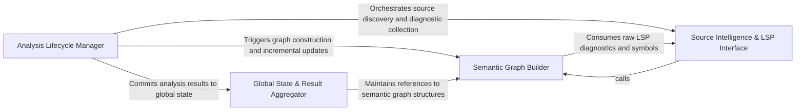

```mermaid
graph LR
    Analysis_Lifecycle_Manager["Analysis Lifecycle Manager"]
    Source_Intelligence_LSP_Interface["Source Intelligence & LSP Interface"]
    Semantic_Graph_Builder["Semantic Graph Builder"]
    Global_State_Result_Aggregator["Global State & Result Aggregator"]
    Analysis_Lifecycle_Manager -- "Triggers graph construction and incremental updates" --> Semantic_Graph_Builder
    Analysis_Lifecycle_Manager -- "Orchestrates source discovery and diagnostic collection" --> Source_Intelligence_LSP_Interface
    Analysis_Lifecycle_Manager -- "Commits analysis results to global state" --> Global_State_Result_Aggregator
    Source_Intelligence_LSP_Interface -- "calls" --> Semantic_Graph_Builder
    Semantic_Graph_Builder -- "Consumes raw LSP diagnostics and symbols" --> Source_Intelligence_LSP_Interface
    Global_State_Result_Aggregator -- "Maintains references to semantic graph structures" --> Semantic_Graph_Builder
    click Analysis_Lifecycle_Manager href "https://github.com/CodeBoarding/CodeBoarding/blob/main/.codeboarding/Analysis_Lifecycle_Manager.md" "Details"
    click Source_Intelligence_LSP_Interface href "https://github.com/CodeBoarding/CodeBoarding/blob/main/.codeboarding/Source_Intelligence_LSP_Interface.md" "Details"
    click Semantic_Graph_Builder href "https://github.com/CodeBoarding/CodeBoarding/blob/main/.codeboarding/Semantic_Graph_Builder.md" "Details"
    click Global_State_Result_Aggregator href "https://github.com/CodeBoarding/CodeBoarding/blob/main/.codeboarding/Global_State_Result_Aggregator.md" "Details"
```

## Details

Acts as the central nervous system of the engine, managing the end-to-end lifecycle of a static analysis pass, coordinating between LSP clients and graph builders, and handling result caching.

### Analysis Lifecycle Manager [[Expand]](./Analysis_Lifecycle_Manager.md)
Acts as the central controller for the analysis process, managing the state machine of an analysis pass and orchestrating the sequence between source discovery, LSP diagnostics, and result absorption.

**Related Classes/Methods**:

- `static_analyzer.__init__.StaticAnalyzer.analyze`:514-576
- `static_analyzer.__init__.StaticAnalyzer._run_full_lsp_pass`:578-632
- `static_analyzer.__init__.StaticAnalyzer._update_cached_results`:634-682

**Source Files:**

- [`static_analyzer/__init__.py`](https://github.com/CodeBoarding/CodeBoarding/blob/main/.codeboardingstatic_analyzer/__init__.py)
  - `static_analyzer.__init__.StaticAnalyzer.analyze` ([L514-L576](https://github.com/CodeBoarding/CodeBoarding/blob/main/.codeboardingstatic_analyzer/__init__.py#L514-L576)) - Method
  - `static_analyzer.__init__.StaticAnalyzer._run_full_lsp_pass` ([L578-L632](https://github.com/CodeBoarding/CodeBoarding/blob/main/.codeboardingstatic_analyzer/__init__.py#L578-L632)) - Method
  - `static_analyzer.__init__.StaticAnalyzer._update_cached_results` ([L634-L682](https://github.com/CodeBoarding/CodeBoarding/blob/main/.codeboardingstatic_analyzer/__init__.py#L634-L682)) - Method
  - `static_analyzer.__init__.StaticAnalyzer._changed_files_for_language` ([L684-L702](https://github.com/CodeBoarding/CodeBoarding/blob/main/.codeboardingstatic_analyzer/__init__.py#L684-L702)) - Method
  - `static_analyzer.__init__.StaticAnalyzer._extract_language_dict` ([L704-L727](https://github.com/CodeBoarding/CodeBoarding/blob/main/.codeboardingstatic_analyzer/__init__.py#L704-L727)) - Method
  - `static_analyzer.__init__.StaticAnalyzer._loc_for_adapter` ([L762-L770](https://github.com/CodeBoarding/CodeBoarding/blob/main/.codeboardingstatic_analyzer/__init__.py#L762-L770)) - Method
  - `static_analyzer.__init__.StaticAnalyzer._validate_analysis_results` ([L815-L834](https://github.com/CodeBoarding/CodeBoarding/blob/main/.codeboardingstatic_analyzer/__init__.py#L815-L834)) - Method
- [`static_analyzer/analysis_result.py`](https://github.com/CodeBoarding/CodeBoarding/blob/main/.codeboardingstatic_analyzer/analysis_result.py)
  - `static_analyzer.analysis_result.StaticAnalysisResults` ([L166-L327](https://github.com/CodeBoarding/CodeBoarding/blob/main/.codeboardingstatic_analyzer/analysis_result.py#L166-L327)) - Class
  - `static_analyzer.analysis_result.StaticAnalysisResults.get_source_files` ([L315-L320](https://github.com/CodeBoarding/CodeBoarding/blob/main/.codeboardingstatic_analyzer/analysis_result.py#L315-L320)) - Method

### Source Intelligence & LSP Interface [[Expand]](./Source_Intelligence_LSP_Interface.md)
Handles low-level communication with language-specific servers and the filesystem, identifying source files and collecting raw diagnostics and symbols.

**Related Classes/Methods**:

- `static_analyzer.engine.language_adapter.LanguageAdapter.discover_source_files`:234-254
- `static_analyzer.__init__.StaticAnalyzer.collect_fresh_diagnostics`:355-367

**Source Files:**

- [`static_analyzer/__init__.py`](https://github.com/CodeBoarding/CodeBoarding/blob/main/.codeboardingstatic_analyzer/__init__.py)
  - `static_analyzer.__init__.StaticAnalyzer.collect_fresh_diagnostics` ([L355-L367](https://github.com/CodeBoarding/CodeBoarding/blob/main/.codeboardingstatic_analyzer/__init__.py#L355-L367)) - Method
  - `static_analyzer.__init__.StaticAnalyzer.notify_file_changed` ([L411-L428](https://github.com/CodeBoarding/CodeBoarding/blob/main/.codeboardingstatic_analyzer/__init__.py#L411-L428)) - Method
  - `static_analyzer.__init__.StaticAnalyzer.get_adapter_for_file` ([L455-L461](https://github.com/CodeBoarding/CodeBoarding/blob/main/.codeboardingstatic_analyzer/__init__.py#L455-L461)) - Method
  - `static_analyzer.__init__.StaticAnalyzer._collect_diagnostics_for` ([L738-L760](https://github.com/CodeBoarding/CodeBoarding/blob/main/.codeboardingstatic_analyzer/__init__.py#L738-L760)) - Method
- [`static_analyzer/engine/adapters/go_adapter.py`](https://github.com/CodeBoarding/CodeBoarding/blob/main/.codeboardingstatic_analyzer/engine/adapters/go_adapter.py)
  - `static_analyzer.engine.adapters.go_adapter.GoAdapter.discover_source_files` ([L213-L225](https://github.com/CodeBoarding/CodeBoarding/blob/main/.codeboardingstatic_analyzer/engine/adapters/go_adapter.py#L213-L225)) - Method
  - `static_analyzer.engine.adapters.go_adapter.GoAdapter._has_excluding_build_tag` ([L228-L248](https://github.com/CodeBoarding/CodeBoarding/blob/main/.codeboardingstatic_analyzer/engine/adapters/go_adapter.py#L228-L248)) - Method
- [`static_analyzer/engine/language_adapter.py`](https://github.com/CodeBoarding/CodeBoarding/blob/main/.codeboardingstatic_analyzer/engine/language_adapter.py)
  - `static_analyzer.engine.language_adapter.LanguageAdapter.language` ([L32-L33](https://github.com/CodeBoarding/CodeBoarding/blob/main/.codeboardingstatic_analyzer/engine/language_adapter.py#L32-L33)) - Method
  - `static_analyzer.engine.language_adapter.LanguageAdapter.language_enum` ([L37-L42](https://github.com/CodeBoarding/CodeBoarding/blob/main/.codeboardingstatic_analyzer/engine/language_adapter.py#L37-L42)) - Method
  - `static_analyzer.engine.language_adapter.LanguageAdapter.file_extensions` ([L45-L51](https://github.com/CodeBoarding/CodeBoarding/blob/main/.codeboardingstatic_analyzer/engine/language_adapter.py#L45-L51)) - Method
  - `static_analyzer.engine.language_adapter.LanguageAdapter.config_key` ([L59-L65](https://github.com/CodeBoarding/CodeBoarding/blob/main/.codeboardingstatic_analyzer/engine/language_adapter.py#L59-L65)) - Method
  - `static_analyzer.engine.language_adapter.LanguageAdapter.language_id` ([L82-L84](https://github.com/CodeBoarding/CodeBoarding/blob/main/.codeboardingstatic_analyzer/engine/language_adapter.py#L82-L84)) - Method
  - `static_analyzer.engine.language_adapter.LanguageAdapter.wait_for_diagnostics` ([L209-L224](https://github.com/CodeBoarding/CodeBoarding/blob/main/.codeboardingstatic_analyzer/engine/language_adapter.py#L209-L224)) - Method
  - `static_analyzer.engine.language_adapter.LanguageAdapter.discover_source_files` ([L244-L264](https://github.com/CodeBoarding/CodeBoarding/blob/main/.codeboardingstatic_analyzer/engine/language_adapter.py#L244-L264)) - Method
- [`static_analyzer/engine/lsp_client.py`](https://github.com/CodeBoarding/CodeBoarding/blob/main/.codeboardingstatic_analyzer/engine/lsp_client.py)
  - `static_analyzer.engine.lsp_client.LSPClient.__init__` ([L55-L102](https://github.com/CodeBoarding/CodeBoarding/blob/main/.codeboardingstatic_analyzer/engine/lsp_client.py#L55-L102)) - Method
  - `static_analyzer.engine.lsp_client.LSPClient.get_collected_diagnostics` ([L422-L425](https://github.com/CodeBoarding/CodeBoarding/blob/main/.codeboardingstatic_analyzer/engine/lsp_client.py#L422-L425)) - Method

### Semantic Graph Builder [[Expand]](./Semantic_Graph_Builder.md)
The core transformation engine that converts raw LSP data and source symbols into a unified semantic model, including call graphs and class hierarchies.

**Related Classes/Methods**:

- `static_analyzer.engine.call_graph_builder.CallGraphBuilder.build`:44-118
- `static_analyzer.engine.symbol_table.SymbolTable.build_indices`:169-188
- `static_analyzer.engine.result_converter.convert_to_codeboarding_format`:17-137
- `static_analyzer.graph.CallGraph`:123-894

**Source Files:**

- [`static_analyzer/__init__.py`](https://github.com/CodeBoarding/CodeBoarding/blob/main/.codeboardingstatic_analyzer/__init__.py)
  - `static_analyzer.__init__.StaticAnalysisFatalError` ([L47-L48](https://github.com/CodeBoarding/CodeBoarding/blob/main/.codeboardingstatic_analyzer/__init__.py#L47-L48)) - Class
  - `static_analyzer.__init__.StaticAnalyzer._run_full_analysis` ([L772-L813](https://github.com/CodeBoarding/CodeBoarding/blob/main/.codeboardingstatic_analyzer/__init__.py#L772-L813)) - Method
- [`static_analyzer/analysis_result.py`](https://github.com/CodeBoarding/CodeBoarding/blob/main/.codeboardingstatic_analyzer/analysis_result.py)
  - `static_analyzer.analysis_result.AnalysisData.to_dict` ([L60-L70](https://github.com/CodeBoarding/CodeBoarding/blob/main/.codeboardingstatic_analyzer/analysis_result.py#L60-L70)) - Method
- [`static_analyzer/constants.py`](https://github.com/CodeBoarding/CodeBoarding/blob/main/.codeboardingstatic_analyzer/constants.py)
  - `static_analyzer.constants.NodeType` ([L94-L145](https://github.com/CodeBoarding/CodeBoarding/blob/main/.codeboardingstatic_analyzer/constants.py#L94-L145)) - Class
- [`static_analyzer/engine/adapters/csharp_adapter.py`](https://github.com/CodeBoarding/CodeBoarding/blob/main/.codeboardingstatic_analyzer/engine/adapters/csharp_adapter.py)
  - `static_analyzer.engine.adapters.csharp_adapter.CSharpAdapter.is_reference_worthy` ([L266-L268](https://github.com/CodeBoarding/CodeBoarding/blob/main/.codeboardingstatic_analyzer/engine/adapters/csharp_adapter.py#L266-L268)) - Method
- [`static_analyzer/engine/adapters/php_adapter.py`](https://github.com/CodeBoarding/CodeBoarding/blob/main/.codeboardingstatic_analyzer/engine/adapters/php_adapter.py)
  - `static_analyzer.engine.adapters.php_adapter.PHPAdapter.is_reference_worthy` ([L78-L79](https://github.com/CodeBoarding/CodeBoarding/blob/main/.codeboardingstatic_analyzer/engine/adapters/php_adapter.py#L78-L79)) - Method
- [`static_analyzer/engine/call_graph_builder.py`](https://github.com/CodeBoarding/CodeBoarding/blob/main/.codeboardingstatic_analyzer/engine/call_graph_builder.py)
  - `static_analyzer.engine.call_graph_builder.CallGraphBuilder` ([L23-L329](https://github.com/CodeBoarding/CodeBoarding/blob/main/.codeboardingstatic_analyzer/engine/call_graph_builder.py#L23-L329)) - Class
  - `static_analyzer.engine.call_graph_builder.CallGraphBuilder.symbol_table` ([L40-L42](https://github.com/CodeBoarding/CodeBoarding/blob/main/.codeboardingstatic_analyzer/engine/call_graph_builder.py#L40-L42)) - Method
  - `static_analyzer.engine.call_graph_builder.CallGraphBuilder.build` ([L44-L119](https://github.com/CodeBoarding/CodeBoarding/blob/main/.codeboardingstatic_analyzer/engine/call_graph_builder.py#L44-L119)) - Method
  - `static_analyzer.engine.call_graph_builder.CallGraphBuilder._build_package_deps` ([L303-L329](https://github.com/CodeBoarding/CodeBoarding/blob/main/.codeboardingstatic_analyzer/engine/call_graph_builder.py#L303-L329)) - Method
- [`static_analyzer/engine/edge_build_context.py`](https://github.com/CodeBoarding/CodeBoarding/blob/main/.codeboardingstatic_analyzer/engine/edge_build_context.py)
  - `static_analyzer.engine.edge_build_context.EdgeBuildContext` ([L13-L18](https://github.com/CodeBoarding/CodeBoarding/blob/main/.codeboardingstatic_analyzer/engine/edge_build_context.py#L13-L18)) - Class
- [`static_analyzer/engine/hierarchy_builder.py`](https://github.com/CodeBoarding/CodeBoarding/blob/main/.codeboardingstatic_analyzer/engine/hierarchy_builder.py)
  - `static_analyzer.engine.hierarchy_builder.HierarchyBuilder` ([L19-L200](https://github.com/CodeBoarding/CodeBoarding/blob/main/.codeboardingstatic_analyzer/engine/hierarchy_builder.py#L19-L200)) - Class
- [`static_analyzer/engine/language_adapter.py`](https://github.com/CodeBoarding/CodeBoarding/blob/main/.codeboardingstatic_analyzer/engine/language_adapter.py)
  - `static_analyzer.engine.language_adapter.LanguageAdapter` ([L22-L382](https://github.com/CodeBoarding/CodeBoarding/blob/main/.codeboardingstatic_analyzer/engine/language_adapter.py#L22-L382)) - Class
  - `static_analyzer.engine.language_adapter.LanguageAdapter.build_reference_key` ([L108-L114](https://github.com/CodeBoarding/CodeBoarding/blob/main/.codeboardingstatic_analyzer/engine/language_adapter.py#L108-L114)) - Method
  - `static_analyzer.engine.language_adapter.LanguageAdapter.extract_package` ([L116-L122](https://github.com/CodeBoarding/CodeBoarding/blob/main/.codeboardingstatic_analyzer/engine/language_adapter.py#L116-L122)) - Method
  - `static_analyzer.engine.language_adapter.LanguageAdapter.get_package_for_file` ([L124-L138](https://github.com/CodeBoarding/CodeBoarding/blob/main/.codeboardingstatic_analyzer/engine/language_adapter.py#L124-L138)) - Method
  - `static_analyzer.engine.language_adapter.LanguageAdapter.fail_on_empty_symbols` ([L205-L207](https://github.com/CodeBoarding/CodeBoarding/blob/main/.codeboardingstatic_analyzer/engine/language_adapter.py#L205-L207)) - Method
  - `static_analyzer.engine.language_adapter.LanguageAdapter.is_callable` ([L284-L285](https://github.com/CodeBoarding/CodeBoarding/blob/main/.codeboardingstatic_analyzer/engine/language_adapter.py#L284-L285)) - Method
  - `static_analyzer.engine.language_adapter.LanguageAdapter.is_reference_worthy` ([L287-L298](https://github.com/CodeBoarding/CodeBoarding/blob/main/.codeboardingstatic_analyzer/engine/language_adapter.py#L287-L298)) - Method
  - `static_analyzer.engine.language_adapter.LanguageAdapter.should_track_for_edges` ([L300-L301](https://github.com/CodeBoarding/CodeBoarding/blob/main/.codeboardingstatic_analyzer/engine/language_adapter.py#L300-L301)) - Method
  - `static_analyzer.engine.language_adapter.LanguageAdapter.extra_client_capabilities` ([L313-L318](https://github.com/CodeBoarding/CodeBoarding/blob/main/.codeboardingstatic_analyzer/engine/language_adapter.py#L313-L318)) - Method
  - `static_analyzer.engine.language_adapter.LanguageAdapter.references_batch_size` ([L321-L323](https://github.com/CodeBoarding/CodeBoarding/blob/main/.codeboardingstatic_analyzer/engine/language_adapter.py#L321-L323)) - Method
  - `static_analyzer.engine.language_adapter.LanguageAdapter.get_all_packages` ([L342-L357](https://github.com/CodeBoarding/CodeBoarding/blob/main/.codeboardingstatic_analyzer/engine/language_adapter.py#L342-L357)) - Method
- [`static_analyzer/engine/models.py`](https://github.com/CodeBoarding/CodeBoarding/blob/main/.codeboardingstatic_analyzer/engine/models.py)
  - `static_analyzer.engine.models.Edge` ([L63-L68](https://github.com/CodeBoarding/CodeBoarding/blob/main/.codeboardingstatic_analyzer/engine/models.py#L63-L68)) - Class
  - `static_analyzer.engine.models.CallFlowGraph.from_edge_set` ([L79-L87](https://github.com/CodeBoarding/CodeBoarding/blob/main/.codeboardingstatic_analyzer/engine/models.py#L79-L87)) - Method
  - `static_analyzer.engine.models.LanguageAnalysisResult` ([L91-L103](https://github.com/CodeBoarding/CodeBoarding/blob/main/.codeboardingstatic_analyzer/engine/models.py#L91-L103)) - Class
- [`static_analyzer/engine/result_converter.py`](https://github.com/CodeBoarding/CodeBoarding/blob/main/.codeboardingstatic_analyzer/engine/result_converter.py)
  - `static_analyzer.engine.result_converter.convert_to_codeboarding_format` ([L19-L148](https://github.com/CodeBoarding/CodeBoarding/blob/main/.codeboardingstatic_analyzer/engine/result_converter.py#L19-L148)) - Function
  - `static_analyzer.engine.result_converter._map_symbol_kind` ([L187-L196](https://github.com/CodeBoarding/CodeBoarding/blob/main/.codeboardingstatic_analyzer/engine/result_converter.py#L187-L196)) - Function
- [`static_analyzer/engine/symbol_table.py`](https://github.com/CodeBoarding/CodeBoarding/blob/main/.codeboardingstatic_analyzer/engine/symbol_table.py)
  - `static_analyzer.engine.symbol_table.SymbolTable.primary_file_symbols` ([L47-L49](https://github.com/CodeBoarding/CodeBoarding/blob/main/.codeboardingstatic_analyzer/engine/symbol_table.py#L47-L49)) - Method
  - `static_analyzer.engine.symbol_table.SymbolTable.build_indices` ([L169-L188](https://github.com/CodeBoarding/CodeBoarding/blob/main/.codeboardingstatic_analyzer/engine/symbol_table.py#L169-L188)) - Method
- [`static_analyzer/graph.py`](https://github.com/CodeBoarding/CodeBoarding/blob/main/.codeboardingstatic_analyzer/graph.py)
  - `static_analyzer.graph.CallGraph` ([L143-L976](https://github.com/CodeBoarding/CodeBoarding/blob/main/.codeboardingstatic_analyzer/graph.py#L143-L976)) - Class
- [`static_analyzer/incremental_orchestrator.py`](https://github.com/CodeBoarding/CodeBoarding/blob/main/.codeboardingstatic_analyzer/incremental_orchestrator.py)
  - `static_analyzer.incremental_orchestrator.update_cfg_for_changed_files` ([L36-L108](https://github.com/CodeBoarding/CodeBoarding/blob/main/.codeboardingstatic_analyzer/incremental_orchestrator.py#L36-L108)) - Function
- [`static_analyzer/node.py`](https://github.com/CodeBoarding/CodeBoarding/blob/main/.codeboardingstatic_analyzer/node.py)
  - `static_analyzer.node.Node` ([L9-L69](https://github.com/CodeBoarding/CodeBoarding/blob/main/.codeboardingstatic_analyzer/node.py#L9-L69)) - Class
  - `static_analyzer.node.Node.__init__` ([L12-L27](https://github.com/CodeBoarding/CodeBoarding/blob/main/.codeboardingstatic_analyzer/node.py#L12-L27)) - Method

### Global State & Result Aggregator [[Expand]](./Global_State_Result_Aggregator.md)
Manages the persistence and merging of analysis data, providing a unified interface for accessing the global state of the codebase.

**Related Classes/Methods**:

- `static_analyzer.analysis_result.StaticAnalysisResults.add_cfg`:190-192
- `static_analyzer.language_results.LanguageResults`:135-149
- `static_analyzer.__init__.StaticAnalyzer._absorb_into_results`:729-736

**Source Files:**

- [`static_analyzer/__init__.py`](https://github.com/CodeBoarding/CodeBoarding/blob/main/.codeboardingstatic_analyzer/__init__.py)
  - `static_analyzer.__init__.StaticAnalyzer._absorb_into_results` ([L729-L736](https://github.com/CodeBoarding/CodeBoarding/blob/main/.codeboardingstatic_analyzer/__init__.py#L729-L736)) - Method
- [`static_analyzer/analysis_result.py`](https://github.com/CodeBoarding/CodeBoarding/blob/main/.codeboardingstatic_analyzer/analysis_result.py)
  - `static_analyzer.analysis_result.StaticAnalysisResults._bucket` ([L179-L180](https://github.com/CodeBoarding/CodeBoarding/blob/main/.codeboardingstatic_analyzer/analysis_result.py#L179-L180)) - Method
  - `static_analyzer.analysis_result.StaticAnalysisResults.add_class_hierarchy` ([L186-L188](https://github.com/CodeBoarding/CodeBoarding/blob/main/.codeboardingstatic_analyzer/analysis_result.py#L186-L188)) - Method
  - `static_analyzer.analysis_result.StaticAnalysisResults.add_cfg` ([L190-L192](https://github.com/CodeBoarding/CodeBoarding/blob/main/.codeboardingstatic_analyzer/analysis_result.py#L190-L192)) - Method
  - `static_analyzer.analysis_result.StaticAnalysisResults.add_package_dependencies` ([L194-L196](https://github.com/CodeBoarding/CodeBoarding/blob/main/.codeboardingstatic_analyzer/analysis_result.py#L194-L196)) - Method
  - `static_analyzer.analysis_result.StaticAnalysisResults.add_references` ([L198-L204](https://github.com/CodeBoarding/CodeBoarding/blob/main/.codeboardingstatic_analyzer/analysis_result.py#L198-L204)) - Method
  - `static_analyzer.analysis_result.StaticAnalysisResults.add_source_files` ([L311-L313](https://github.com/CodeBoarding/CodeBoarding/blob/main/.codeboardingstatic_analyzer/analysis_result.py#L311-L313)) - Method
- [`static_analyzer/language_results.py`](https://github.com/CodeBoarding/CodeBoarding/blob/main/.codeboardingstatic_analyzer/language_results.py)
  - `static_analyzer.language_results.ClassHierarchy.merge` ([L70-L78](https://github.com/CodeBoarding/CodeBoarding/blob/main/.codeboardingstatic_analyzer/language_results.py#L70-L78)) - Method
  - `static_analyzer.language_results.References.add` ([L92-L96](https://github.com/CodeBoarding/CodeBoarding/blob/main/.codeboardingstatic_analyzer/language_results.py#L92-L96)) - Method
  - `static_analyzer.language_results.PackageDependencies.merge` ([L110-L114](https://github.com/CodeBoarding/CodeBoarding/blob/main/.codeboardingstatic_analyzer/language_results.py#L110-L114)) - Method
  - `static_analyzer.language_results.SourceFiles.extend` ([L128-L131](https://github.com/CodeBoarding/CodeBoarding/blob/main/.codeboardingstatic_analyzer/language_results.py#L128-L131)) - Method
  - `static_analyzer.language_results.LanguageResults` ([L140-L154](https://github.com/CodeBoarding/CodeBoarding/blob/main/.codeboardingstatic_analyzer/language_results.py#L140-L154)) - Class

### [FAQ](https://github.com/CodeBoarding/GeneratedOnBoardings/tree/main?tab=readme-ov-file#faq)