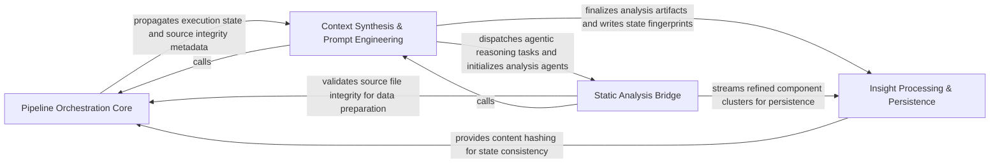

## Details

Acts as the brain of the engine, managing the high-level execution pipeline, the lifecycle of specialized AI agents, and repository-wide fingerprints for incremental updates.

### Pipeline Orchestration Core
Manages the high-level execution flow and state transitions of the architectural analysis, coordinating the sequence of operations from initial API surface discovery through to final synthesis.

**Related Classes/Methods**: _None_

**Source Files:**

- [`agents/content_hash.py`](https://github.com/CodeBoarding/CodeBoarding/blob/main/.codeboardingagents/content_hash.py)
  - `agents.content_hash.hash_whole_file` ([L64-L68](https://github.com/CodeBoarding/CodeBoarding/blob/main/.codeboardingagents/content_hash.py#L64-L68)) - Function
  - `agents.content_hash.tree_hash_from_file_hashes` ([L71-L81](https://github.com/CodeBoarding/CodeBoarding/blob/main/.codeboardingagents/content_hash.py#L71-L81)) - Function
  - `agents.content_hash.hash_repo_source_files` ([L84-L108](https://github.com/CodeBoarding/CodeBoarding/blob/main/.codeboardingagents/content_hash.py#L84-L108)) - Function
  - `agents.content_hash.compute_source_tree_hash` ([L111-L113](https://github.com/CodeBoarding/CodeBoarding/blob/main/.codeboardingagents/content_hash.py#L111-L113)) - Function

### Context Synthesis & Prompt Engineering
Translates complex codebase structures into LLM-readable prompts using a factory pattern to generate specialized instructions and inject project-specific metadata.

**Related Classes/Methods**: _None_

**Source Files:**

- [`diagram_analysis/diagram_generator.py`](https://github.com/CodeBoarding/CodeBoarding/blob/main/.codeboardingdiagram_analysis/diagram_generator.py)
  - `diagram_analysis.diagram_generator.DiagramGenerator._source_tree_hash` ([L325-L327](https://github.com/CodeBoarding/CodeBoarding/blob/main/.codeboardingdiagram_analysis/diagram_generator.py#L325-L327)) - Method
  - `diagram_analysis.diagram_generator.DiagramGenerator.pre_analysis` ([L392-L463](https://github.com/CodeBoarding/CodeBoarding/blob/main/.codeboardingdiagram_analysis/diagram_generator.py#L392-L463)) - Method
  - `diagram_analysis.diagram_generator.DiagramGenerator.generate_analysis` ([L549-L576](https://github.com/CodeBoarding/CodeBoarding/blob/main/.codeboardingdiagram_analysis/diagram_generator.py#L549-L576)) - Method
  - `diagram_analysis.diagram_generator.DiagramGenerator.finalize_and_save` ([L610-L655](https://github.com/CodeBoarding/CodeBoarding/blob/main/.codeboardingdiagram_analysis/diagram_generator.py#L610-L655)) - Method
- [`monitoring/writers.py`](https://github.com/CodeBoarding/CodeBoarding/blob/main/.codeboardingmonitoring/writers.py)
  - `monitoring.writers.StreamingStatsWriter` ([L18-L172](https://github.com/CodeBoarding/CodeBoarding/blob/main/.codeboardingmonitoring/writers.py#L18-L172)) - Class

### Static Analysis Bridge
Refines raw static analysis results by resolving code references and grouping related entities into clusters for agent processing.

**Related Classes/Methods**: _None_

**Source Files:**

- [`agents/abstraction_agent.py`](https://github.com/CodeBoarding/CodeBoarding/blob/main/.codeboardingagents/abstraction_agent.py)
  - `agents.abstraction_agent.AbstractionAgent` ([L47-L247](https://github.com/CodeBoarding/CodeBoarding/blob/main/.codeboardingagents/abstraction_agent.py#L47-L247)) - Class
- [`agents/details_agent.py`](https://github.com/CodeBoarding/CodeBoarding/blob/main/.codeboardingagents/details_agent.py)
  - `agents.details_agent.DetailsAgent` ([L50-L343](https://github.com/CodeBoarding/CodeBoarding/blob/main/.codeboardingagents/details_agent.py#L50-L343)) - Class
- [`agents/incremental_agent.py`](https://github.com/CodeBoarding/CodeBoarding/blob/main/.codeboardingagents/incremental_agent.py)
  - `agents.incremental_agent.IncrementalAgent` ([L51-L350](https://github.com/CodeBoarding/CodeBoarding/blob/main/.codeboardingagents/incremental_agent.py#L51-L350)) - Class
- [`agents/incremental_planning_agent.py`](https://github.com/CodeBoarding/CodeBoarding/blob/main/.codeboardingagents/incremental_planning_agent.py)
  - `agents.incremental_planning_agent.IncrementalPlanningAgent` ([L44-L127](https://github.com/CodeBoarding/CodeBoarding/blob/main/.codeboardingagents/incremental_planning_agent.py#L44-L127)) - Class
- [`agents/meta_agent.py`](https://github.com/CodeBoarding/CodeBoarding/blob/main/.codeboardingagents/meta_agent.py)
  - `agents.meta_agent.MetaAgent` ([L18-L66](https://github.com/CodeBoarding/CodeBoarding/blob/main/.codeboardingagents/meta_agent.py#L18-L66)) - Class
- [`diagram_analysis/diagram_generator.py`](https://github.com/CodeBoarding/CodeBoarding/blob/main/.codeboardingdiagram_analysis/diagram_generator.py)
  - `diagram_analysis.diagram_generator.DiagramGenerator._source_tree_fingerprint_map` ([L319-L323](https://github.com/CodeBoarding/CodeBoarding/blob/main/.codeboardingdiagram_analysis/diagram_generator.py#L319-L323)) - Method
  - `diagram_analysis.diagram_generator.DiagramGenerator._initialize_meta_agent` ([L329-L338](https://github.com/CodeBoarding/CodeBoarding/blob/main/.codeboardingdiagram_analysis/diagram_generator.py#L329-L338)) - Method
  - `diagram_analysis.diagram_generator.DiagramGenerator._initialize_agents` ([L340-L390](https://github.com/CodeBoarding/CodeBoarding/blob/main/.codeboardingdiagram_analysis/diagram_generator.py#L340-L390)) - Method
  - `diagram_analysis.diagram_generator.DiagramGenerator._generate_subcomponents` ([L465-L546](https://github.com/CodeBoarding/CodeBoarding/blob/main/.codeboardingdiagram_analysis/diagram_generator.py#L465-L546)) - Method

### Insight Processing & Persistence
Handles the structured output of the agentic workflow, parsing LLM responses, assigning component identifiers, and managing persistence with incremental update support.

**Related Classes/Methods**:

- `diagram_analysis.io_utils.save_analysis`:344-367

**Source Files:**

- [`diagram_analysis/diagram_generator.py`](https://github.com/CodeBoarding/CodeBoarding/blob/main/.codeboardingdiagram_analysis/diagram_generator.py)
  - `diagram_analysis.diagram_generator._component_expansion_seeds` ([L82-L88](https://github.com/CodeBoarding/CodeBoarding/blob/main/.codeboardingdiagram_analysis/diagram_generator.py#L82-L88)) - Function
- [`diagram_analysis/io_utils.py`](https://github.com/CodeBoarding/CodeBoarding/blob/main/.codeboardingdiagram_analysis/io_utils.py)
  - `diagram_analysis.io_utils._AnalysisFileStore.write` ([L113-L137](https://github.com/CodeBoarding/CodeBoarding/blob/main/.codeboardingdiagram_analysis/io_utils.py#L113-L137)) - Method
  - `diagram_analysis.io_utils.write_fingerprint` ([L324-L329](https://github.com/CodeBoarding/CodeBoarding/blob/main/.codeboardingdiagram_analysis/io_utils.py#L324-L329)) - Function
  - `diagram_analysis.io_utils.save_analysis` ([L344-L367](https://github.com/CodeBoarding/CodeBoarding/blob/main/.codeboardingdiagram_analysis/io_utils.py#L344-L367)) - Function

### [FAQ](https://github.com/CodeBoarding/GeneratedOnBoardings/tree/main?tab=readme-ov-file#faq)