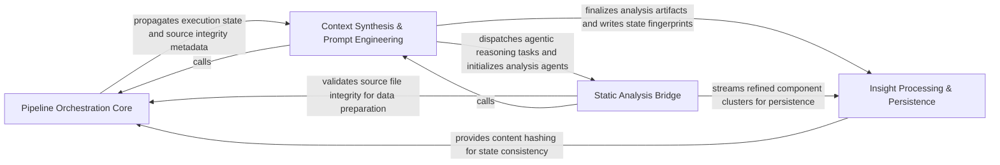

```mermaid
graph LR
    Pipeline_Orchestration_Core["Pipeline Orchestration Core"]
    Context_Synthesis_Prompt_Engineering["Context Synthesis & Prompt Engineering"]
    Static_Analysis_Bridge["Static Analysis Bridge"]
    Insight_Processing_Persistence["Insight Processing & Persistence"]
    Pipeline_Orchestration_Core -- "propagates execution state and source integrity metadata" --> Context_Synthesis_Prompt_Engineering
    Context_Synthesis_Prompt_Engineering -- "calls" --> Pipeline_Orchestration_Core
    Context_Synthesis_Prompt_Engineering -- "dispatches agentic reasoning tasks and initializes analysis agents" --> Static_Analysis_Bridge
    Context_Synthesis_Prompt_Engineering -- "finalizes analysis artifacts and writes state fingerprints" --> Insight_Processing_Persistence
    Static_Analysis_Bridge -- "validates source file integrity for data preparation" --> Pipeline_Orchestration_Core
    Static_Analysis_Bridge -- "calls" --> Context_Synthesis_Prompt_Engineering
    Static_Analysis_Bridge -- "streams refined component clusters for persistence" --> Insight_Processing_Persistence
    Insight_Processing_Persistence -- "provides content hashing for state consistency" --> Pipeline_Orchestration_Core
```

## Details

Acts as the brain of the engine, managing the high-level execution pipeline, the lifecycle of specialized AI agents, and repository-wide fingerprints for incremental updates.

### Pipeline Orchestration Core
Manages the high-level execution flow and state transitions of the architectural analysis, coordinating the sequence of operations from initial API surface discovery through to final synthesis.

**Related Classes/Methods**: _None_

**Source Files:**

- [`agents/content_hash.py`](https://github.com/CodeBoarding/CodeBoarding/blob/main/.codeboardingagents/content_hash.py)
  - `agents.content_hash.hash_whole_file` ([L64-L68](https://github.com/CodeBoarding/CodeBoarding/blob/main/.codeboardingagents/content_hash.py#L64-L68)) - Function
  - `agents.content_hash.tree_hash_from_file_hashes` ([L93-L103](https://github.com/CodeBoarding/CodeBoarding/blob/main/.codeboardingagents/content_hash.py#L93-L103)) - Function
  - `agents.content_hash.hash_repo_source_files` ([L106-L130](https://github.com/CodeBoarding/CodeBoarding/blob/main/.codeboardingagents/content_hash.py#L106-L130)) - Function
  - `agents.content_hash.compute_source_tree_hash` ([L133-L135](https://github.com/CodeBoarding/CodeBoarding/blob/main/.codeboardingagents/content_hash.py#L133-L135)) - Function

### Context Synthesis & Prompt Engineering
Translates complex codebase structures into LLM-readable prompts using a factory pattern to generate specialized instructions and inject project-specific metadata.

**Related Classes/Methods**: _None_

**Source Files:**

- [`diagram_analysis/diagram_generator.py`](https://github.com/CodeBoarding/CodeBoarding/blob/main/.codeboardingdiagram_analysis/diagram_generator.py)
  - `diagram_analysis.diagram_generator.DiagramGenerator._source_tree_hash` ([L821-L823](https://github.com/CodeBoarding/CodeBoarding/blob/main/.codeboardingdiagram_analysis/diagram_generator.py#L821-L823)) - Method
  - `diagram_analysis.diagram_generator.DiagramGenerator.pre_analysis` ([L878-L949](https://github.com/CodeBoarding/CodeBoarding/blob/main/.codeboardingdiagram_analysis/diagram_generator.py#L878-L949)) - Method
  - `diagram_analysis.diagram_generator.DiagramGenerator.generate_analysis` ([L1046-L1074](https://github.com/CodeBoarding/CodeBoarding/blob/main/.codeboardingdiagram_analysis/diagram_generator.py#L1046-L1074)) - Method
  - `diagram_analysis.diagram_generator.DiagramGenerator.finalize_and_save` ([L1139-L1188](https://github.com/CodeBoarding/CodeBoarding/blob/main/.codeboardingdiagram_analysis/diagram_generator.py#L1139-L1188)) - Method
- [`monitoring/writers.py`](https://github.com/CodeBoarding/CodeBoarding/blob/main/.codeboardingmonitoring/writers.py)
  - `monitoring.writers.StreamingStatsWriter` ([L18-L172](https://github.com/CodeBoarding/CodeBoarding/blob/main/.codeboardingmonitoring/writers.py#L18-L172)) - Class

### Static Analysis Bridge
Refines raw static analysis results by resolving code references and grouping related entities into clusters for agent processing.

**Related Classes/Methods**: _None_

**Source Files:**

- [`agents/abstraction_agent.py`](https://github.com/CodeBoarding/CodeBoarding/blob/main/.codeboardingagents/abstraction_agent.py)
  - `agents.abstraction_agent.AbstractionAgent` ([L44-L230](https://github.com/CodeBoarding/CodeBoarding/blob/main/.codeboardingagents/abstraction_agent.py#L44-L230)) - Class
- [`agents/details_agent.py`](https://github.com/CodeBoarding/CodeBoarding/blob/main/.codeboardingagents/details_agent.py)
  - `agents.details_agent.DetailsAgent` ([L45-L300](https://github.com/CodeBoarding/CodeBoarding/blob/main/.codeboardingagents/details_agent.py#L45-L300)) - Class
- [`agents/incremental_agent.py`](https://github.com/CodeBoarding/CodeBoarding/blob/main/.codeboardingagents/incremental_agent.py)
  - `agents.incremental_agent.IncrementalAgent` ([L52-L428](https://github.com/CodeBoarding/CodeBoarding/blob/main/.codeboardingagents/incremental_agent.py#L52-L428)) - Class
- [`agents/meta_agent.py`](https://github.com/CodeBoarding/CodeBoarding/blob/main/.codeboardingagents/meta_agent.py)
  - `agents.meta_agent.MetaAgent` ([L18-L66](https://github.com/CodeBoarding/CodeBoarding/blob/main/.codeboardingagents/meta_agent.py#L18-L66)) - Class
- [`diagram_analysis/diagram_generator.py`](https://github.com/CodeBoarding/CodeBoarding/blob/main/.codeboardingdiagram_analysis/diagram_generator.py)
  - `diagram_analysis.diagram_generator.DiagramGenerator._source_tree_fingerprint_map` ([L815-L819](https://github.com/CodeBoarding/CodeBoarding/blob/main/.codeboardingdiagram_analysis/diagram_generator.py#L815-L819)) - Method
  - `diagram_analysis.diagram_generator.DiagramGenerator._initialize_meta_agent` ([L825-L834](https://github.com/CodeBoarding/CodeBoarding/blob/main/.codeboardingdiagram_analysis/diagram_generator.py#L825-L834)) - Method
  - `diagram_analysis.diagram_generator.DiagramGenerator._initialize_agents` ([L836-L876](https://github.com/CodeBoarding/CodeBoarding/blob/main/.codeboardingdiagram_analysis/diagram_generator.py#L836-L876)) - Method
  - `diagram_analysis.diagram_generator.DiagramGenerator._generate_subcomponents` ([L951-L1043](https://github.com/CodeBoarding/CodeBoarding/blob/main/.codeboardingdiagram_analysis/diagram_generator.py#L951-L1043)) - Method

### Insight Processing & Persistence
Handles the structured output of the agentic workflow, parsing LLM responses, assigning component identifiers, and managing persistence with incremental update support.

**Related Classes/Methods**:

- `diagram_analysis.io_utils.save_analysis`:344-367

**Source Files:**

- [`diagram_analysis/diagram_generator.py`](https://github.com/CodeBoarding/CodeBoarding/blob/main/.codeboardingdiagram_analysis/diagram_generator.py)
  - `diagram_analysis.diagram_generator._component_expansion_seeds` ([L92-L98](https://github.com/CodeBoarding/CodeBoarding/blob/main/.codeboardingdiagram_analysis/diagram_generator.py#L92-L98)) - Function
- [`diagram_analysis/io_utils.py`](https://github.com/CodeBoarding/CodeBoarding/blob/main/.codeboardingdiagram_analysis/io_utils.py)
  - `diagram_analysis.io_utils._AnalysisFileStore.write` ([L114-L144](https://github.com/CodeBoarding/CodeBoarding/blob/main/.codeboardingdiagram_analysis/io_utils.py#L114-L144)) - Method
  - `diagram_analysis.io_utils.write_fingerprint` ([L368-L373](https://github.com/CodeBoarding/CodeBoarding/blob/main/.codeboardingdiagram_analysis/io_utils.py#L368-L373)) - Function
  - `diagram_analysis.io_utils.save_analysis` ([L388-L417](https://github.com/CodeBoarding/CodeBoarding/blob/main/.codeboardingdiagram_analysis/io_utils.py#L388-L417)) - Function

### [FAQ](https://github.com/CodeBoarding/GeneratedOnBoardings/tree/main?tab=readme-ov-file#faq)