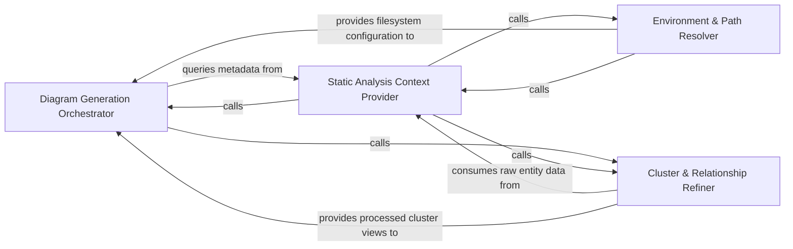

## Details

Acts as the subsystem's entry point, responsible for initializing the analysis environment, loading static analysis results, and managing the lifecycle of the DiagramGenerator.

### Diagram Generation Orchestrator
The primary controller of the subsystem that initializes the generation process, manages the DiagramGenerator lifecycle, and coordinates the flow from raw analysis results to final visual output.

**Related Classes/Methods**:

- `diagram_analysis.diagram_generator.DiagramGenerator`:72-688

**Source Files:**

- [`diagram_analysis/diagram_generator.py`](https://github.com/CodeBoarding/CodeBoarding/blob/main/.codeboardingdiagram_analysis/diagram_generator.py)
  - `diagram_analysis.diagram_generator.DiagramGenerator._build_file_coverage` ([L190-L199](https://github.com/CodeBoarding/CodeBoarding/blob/main/.codeboardingdiagram_analysis/diagram_generator.py#L190-L199)) - Method
  - `diagram_analysis.diagram_generator.DiagramGenerator._get_static_from_injected_analyzer` ([L219-L230](https://github.com/CodeBoarding/CodeBoarding/blob/main/.codeboardingdiagram_analysis/diagram_generator.py#L219-L230)) - Method
- [`diagram_analysis/file_coverage.py`](https://github.com/CodeBoarding/CodeBoarding/blob/main/.codeboardingdiagram_analysis/file_coverage.py)
  - `diagram_analysis.file_coverage.FileCoverage` ([L23-L212](https://github.com/CodeBoarding/CodeBoarding/blob/main/.codeboardingdiagram_analysis/file_coverage.py#L23-L212)) - Class
- [`monitoring/paths.py`](https://github.com/CodeBoarding/CodeBoarding/blob/main/.codeboardingmonitoring/paths.py)
  - `monitoring.paths.get_latest_run_dir` ([L30-L50](https://github.com/CodeBoarding/CodeBoarding/blob/main/.codeboardingmonitoring/paths.py#L30-L50)) - Function

### Static Analysis Context Provider
Acts as the data abstraction layer, encapsulating StaticAnalysisResults and providing queryable interfaces to access code entities, languages, and source references.

**Related Classes/Methods**:

- `static_analyzer.analysis_result.StaticAnalysisResults`:166-317

**Source Files:**

- [`agents/abstraction_agent.py`](https://github.com/CodeBoarding/CodeBoarding/blob/main/.codeboardingagents/abstraction_agent.py)
  - `agents.abstraction_agent.AbstractionAgent` ([L38-L177](https://github.com/CodeBoarding/CodeBoarding/blob/main/.codeboardingagents/abstraction_agent.py#L38-L177)) - Class
- [`agents/details_agent.py`](https://github.com/CodeBoarding/CodeBoarding/blob/main/.codeboardingagents/details_agent.py)
  - `agents.details_agent.DetailsAgent` ([L37-L249](https://github.com/CodeBoarding/CodeBoarding/blob/main/.codeboardingagents/details_agent.py#L37-L249)) - Class
- [`agents/meta_agent.py`](https://github.com/CodeBoarding/CodeBoarding/blob/main/.codeboardingagents/meta_agent.py)
  - `agents.meta_agent.MetaAgent` ([L18-L66](https://github.com/CodeBoarding/CodeBoarding/blob/main/.codeboardingagents/meta_agent.py#L18-L66)) - Class
- [`diagram_analysis/diagram_generator.py`](https://github.com/CodeBoarding/CodeBoarding/blob/main/.codeboardingdiagram_analysis/diagram_generator.py)
  - `diagram_analysis.diagram_generator.DiagramGenerator.pre_analysis` ([L257-L376](https://github.com/CodeBoarding/CodeBoarding/blob/main/.codeboardingdiagram_analysis/diagram_generator.py#L257-L376)) - Method
- [`diagram_analysis/version.py`](https://github.com/CodeBoarding/CodeBoarding/blob/main/.codeboardingdiagram_analysis/version.py)
  - `diagram_analysis.version.Version` ([L4-L6](https://github.com/CodeBoarding/CodeBoarding/blob/main/.codeboardingdiagram_analysis/version.py#L4-L6)) - Class
- [`monitoring/paths.py`](https://github.com/CodeBoarding/CodeBoarding/blob/main/.codeboardingmonitoring/paths.py)
  - `monitoring.paths.get_monitoring_base_dir` ([L8-L12](https://github.com/CodeBoarding/CodeBoarding/blob/main/.codeboardingmonitoring/paths.py#L8-L12)) - Function
- [`monitoring/writers.py`](https://github.com/CodeBoarding/CodeBoarding/blob/main/.codeboardingmonitoring/writers.py)
  - `monitoring.writers.StreamingStatsWriter` ([L18-L172](https://github.com/CodeBoarding/CodeBoarding/blob/main/.codeboardingmonitoring/writers.py#L18-L172)) - Class
- [`static_analyzer/analysis_result.py`](https://github.com/CodeBoarding/CodeBoarding/blob/main/.codeboardingstatic_analyzer/analysis_result.py)
  - `static_analyzer.analysis_result.StaticAnalysisResults.get_source_files` ([L305-L310](https://github.com/CodeBoarding/CodeBoarding/blob/main/.codeboardingstatic_analyzer/analysis_result.py#L305-L310)) - Method

### Environment & Path Resolver
Manages the physical context of the analysis, resolving project roots, monitoring directories, and artifact paths to ensure consistent file access.

**Related Classes/Methods**:

- `monitoring.paths.get_monitoring_run_dir`:15-22

**Source Files:**

- [`diagram_analysis/diagram_generator.py`](https://github.com/CodeBoarding/CodeBoarding/blob/main/.codeboardingdiagram_analysis/diagram_generator.py)
  - `diagram_analysis.diagram_generator.DiagramGenerator.pre_analysis.get_static_with_injected_analyzer` ([L272-L282](https://github.com/CodeBoarding/CodeBoarding/blob/main/.codeboardingdiagram_analysis/diagram_generator.py#L272-L282)) - Function
- [`monitoring/paths.py`](https://github.com/CodeBoarding/CodeBoarding/blob/main/.codeboardingmonitoring/paths.py)
  - `monitoring.paths.get_monitoring_run_dir` ([L15-L22](https://github.com/CodeBoarding/CodeBoarding/blob/main/.codeboardingmonitoring/paths.py#L15-L22)) - Function
- [`utils.py`](https://github.com/CodeBoarding/CodeBoarding/blob/main/.codeboardingutils.py)
  - `utils.monitoring_enabled` ([L74-L76](https://github.com/CodeBoarding/CodeBoarding/blob/main/.codeboardingutils.py#L74-L76)) - Function

### Cluster & Relationship Refiner
Performs high-level data synthesis by grouping individual code entities into logical clusters and building static relationship maps between them.

**Related Classes/Methods**: _None_

**Source Files:**

- [`static_analyzer/analysis_result.py`](https://github.com/CodeBoarding/CodeBoarding/blob/main/.codeboardingstatic_analyzer/analysis_result.py)
  - `static_analyzer.analysis_result.StaticAnalysisResults.get_all_source_files` ([L312-L317](https://github.com/CodeBoarding/CodeBoarding/blob/main/.codeboardingstatic_analyzer/analysis_result.py#L312-L317)) - Method
- [`utils.py`](https://github.com/CodeBoarding/CodeBoarding/blob/main/.codeboardingutils.py)
  - `utils.get_project_root` ([L55-L60](https://github.com/CodeBoarding/CodeBoarding/blob/main/.codeboardingutils.py#L55-L60)) - Function

### [FAQ](https://github.com/CodeBoarding/GeneratedOnBoardings/tree/main?tab=readme-ov-file#faq)