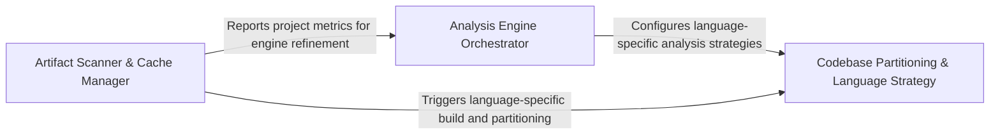

## Details

Acts as the central coordinator for the static analysis lifecycle, managing engine configurations, atomic caching, and Leiden algorithm utilities for codebase partitioning.

### Codebase Partitioning & Language Strategy
Responsible for the structural decomposition of the codebase using the Leiden algorithm and defining the configuration strategies for various programming languages (e.g., Java, Python). It transforms the codebase graph into logical clusters that the agentic workflow can process incrementally.

**Related Classes/Methods**:

- `static_analyzer.leiden_utils.find_partition`:37-63
- `static_analyzer.programming_language.ProgrammingLanguage`:23-75
- `static_analyzer.programming_language.LanguageConfig`:11-14
- `static_analyzer.leiden_utils.partition_to_clusters`:26-34

**Source Files:**

- [`static_analyzer/leiden_utils.py`](https://github.com/CodeBoarding/CodeBoarding/blob/main/.codeboardingstatic_analyzer/leiden_utils.py)
  - `static_analyzer.leiden_utils.partition_to_clusters` ([L26-L34](https://github.com/CodeBoarding/CodeBoarding/blob/main/.codeboardingstatic_analyzer/leiden_utils.py#L26-L34)) - Function
  - `static_analyzer.leiden_utils.find_partition` ([L37-L63](https://github.com/CodeBoarding/CodeBoarding/blob/main/.codeboardingstatic_analyzer/leiden_utils.py#L37-L63)) - Function
- [`static_analyzer/programming_language.py`](https://github.com/CodeBoarding/CodeBoarding/blob/main/.codeboardingstatic_analyzer/programming_language.py)
  - `static_analyzer.programming_language.LanguageConfig` ([L11-L14](https://github.com/CodeBoarding/CodeBoarding/blob/main/.codeboardingstatic_analyzer/programming_language.py#L11-L14)) - Class
  - `static_analyzer.programming_language.JavaConfig` ([L17-L20](https://github.com/CodeBoarding/CodeBoarding/blob/main/.codeboardingstatic_analyzer/programming_language.py#L17-L20)) - Class
  - `static_analyzer.programming_language.ProgrammingLanguage` ([L23-L75](https://github.com/CodeBoarding/CodeBoarding/blob/main/.codeboardingstatic_analyzer/programming_language.py#L23-L75)) - Class
  - `static_analyzer.programming_language.ProgrammingLanguage.__init__` ([L24-L42](https://github.com/CodeBoarding/CodeBoarding/blob/main/.codeboardingstatic_analyzer/programming_language.py#L24-L42)) - Method
  - `static_analyzer.programming_language.ProgrammingLanguage.get_suffix_pattern` ([L44-L49](https://github.com/CodeBoarding/CodeBoarding/blob/main/.codeboardingstatic_analyzer/programming_language.py#L44-L49)) - Method
  - `static_analyzer.programming_language.ProgrammingLanguage.get_language_id` ([L51-L53](https://github.com/CodeBoarding/CodeBoarding/blob/main/.codeboardingstatic_analyzer/programming_language.py#L51-L53)) - Method
  - `static_analyzer.programming_language.ProgrammingLanguage.get_server_parameters` ([L55-L61](https://github.com/CodeBoarding/CodeBoarding/blob/main/.codeboardingstatic_analyzer/programming_language.py#L55-L61)) - Method
  - `static_analyzer.programming_language.ProgrammingLanguage.__hash__` ([L66-L67](https://github.com/CodeBoarding/CodeBoarding/blob/main/.codeboardingstatic_analyzer/programming_language.py#L66-L67)) - Method
  - `static_analyzer.programming_language.ProgrammingLanguage.__eq__` ([L69-L72](https://github.com/CodeBoarding/CodeBoarding/blob/main/.codeboardingstatic_analyzer/programming_language.py#L69-L72)) - Method
  - `static_analyzer.programming_language.ProgrammingLanguage.__str__` ([L74-L75](https://github.com/CodeBoarding/CodeBoarding/blob/main/.codeboardingstatic_analyzer/programming_language.py#L74-L75)) - Method
  - `static_analyzer.programming_language.ProgrammingLanguageBuilder` ([L78-L152](https://github.com/CodeBoarding/CodeBoarding/blob/main/.codeboardingstatic_analyzer/programming_language.py#L78-L152)) - Class
  - `static_analyzer.programming_language.ProgrammingLanguageBuilder.__init__` ([L81-L89](https://github.com/CodeBoarding/CodeBoarding/blob/main/.codeboardingstatic_analyzer/programming_language.py#L81-L89)) - Method
  - `static_analyzer.programming_language.ProgrammingLanguageBuilder._find_lsp_server_key` ([L91-L114](https://github.com/CodeBoarding/CodeBoarding/blob/main/.codeboardingstatic_analyzer/programming_language.py#L91-L114)) - Method
  - `static_analyzer.programming_language.ProgrammingLanguageBuilder.build` ([L116-L149](https://github.com/CodeBoarding/CodeBoarding/blob/main/.codeboardingstatic_analyzer/programming_language.py#L116-L149)) - Method
  - `static_analyzer.programming_language.ProgrammingLanguageBuilder.get_supported_extensions` ([L151-L152](https://github.com/CodeBoarding/CodeBoarding/blob/main/.codeboardingstatic_analyzer/programming_language.py#L151-L152)) - Method

### Analysis Engine Orchestrator
Acts as the central configuration hub that initializes analysis engines based on detected project structures. It specifically handles complex environment scanning, such as C# solution/project detection, to generate the necessary EngineConfig for the static analysis lifecycle.

**Related Classes/Methods**:

- `static_analyzer.__init__.EngineConfig`:34-44
- `static_analyzer.csharp_config_scanner.CSharpConfigScanner`:32-103
- `static_analyzer.__init__._create_engine_configs`:51-148
- `static_analyzer.csharp_config_scanner.CSharpProjectConfig`:17-29

**Source Files:**

- [`static_analyzer/__init__.py`](https://github.com/CodeBoarding/CodeBoarding/blob/main/.codeboardingstatic_analyzer/__init__.py)
  - `static_analyzer.__init__.EngineConfig` ([L34-L44](https://github.com/CodeBoarding/CodeBoarding/blob/main/.codeboardingstatic_analyzer/__init__.py#L34-L44)) - Class
  - `static_analyzer.__init__._create_engine_configs` ([L51-L148](https://github.com/CodeBoarding/CodeBoarding/blob/main/.codeboardingstatic_analyzer/__init__.py#L51-L148)) - Function
  - `static_analyzer.__init__._lang_to_adapter_name` ([L151-L166](https://github.com/CodeBoarding/CodeBoarding/blob/main/.codeboardingstatic_analyzer/__init__.py#L151-L166)) - Function
- [`static_analyzer/csharp_config_scanner.py`](https://github.com/CodeBoarding/CodeBoarding/blob/main/.codeboardingstatic_analyzer/csharp_config_scanner.py)
  - `static_analyzer.csharp_config_scanner.CSharpProjectConfig` ([L17-L29](https://github.com/CodeBoarding/CodeBoarding/blob/main/.codeboardingstatic_analyzer/csharp_config_scanner.py#L17-L29)) - Class
  - `static_analyzer.csharp_config_scanner.CSharpProjectConfig.__init__` ([L20-L26](https://github.com/CodeBoarding/CodeBoarding/blob/main/.codeboardingstatic_analyzer/csharp_config_scanner.py#L20-L26)) - Method
  - `static_analyzer.csharp_config_scanner.CSharpProjectConfig.__repr__` ([L28-L29](https://github.com/CodeBoarding/CodeBoarding/blob/main/.codeboardingstatic_analyzer/csharp_config_scanner.py#L28-L29)) - Method
  - `static_analyzer.csharp_config_scanner.CSharpConfigScanner` ([L32-L103](https://github.com/CodeBoarding/CodeBoarding/blob/main/.codeboardingstatic_analyzer/csharp_config_scanner.py#L32-L103)) - Class
  - `static_analyzer.csharp_config_scanner.CSharpConfigScanner.__init__` ([L45-L47](https://github.com/CodeBoarding/CodeBoarding/blob/main/.codeboardingstatic_analyzer/csharp_config_scanner.py#L45-L47)) - Method
  - `static_analyzer.csharp_config_scanner.CSharpConfigScanner.scan` ([L49-L75](https://github.com/CodeBoarding/CodeBoarding/blob/main/.codeboardingstatic_analyzer/csharp_config_scanner.py#L49-L75)) - Method
  - `static_analyzer.csharp_config_scanner.CSharpConfigScanner._find_solution_roots` ([L77-L82](https://github.com/CodeBoarding/CodeBoarding/blob/main/.codeboardingstatic_analyzer/csharp_config_scanner.py#L77-L82)) - Method
  - `static_analyzer.csharp_config_scanner.CSharpConfigScanner._find_project_roots` ([L84-L86](https://github.com/CodeBoarding/CodeBoarding/blob/main/.codeboardingstatic_analyzer/csharp_config_scanner.py#L84-L86)) - Method
  - `static_analyzer.csharp_config_scanner.CSharpConfigScanner._has_cs_files` ([L88-L94](https://github.com/CodeBoarding/CodeBoarding/blob/main/.codeboardingstatic_analyzer/csharp_config_scanner.py#L88-L94)) - Method
  - `static_analyzer.csharp_config_scanner.CSharpConfigScanner._is_subpath` ([L97-L103](https://github.com/CodeBoarding/CodeBoarding/blob/main/.codeboardingstatic_analyzer/csharp_config_scanner.py#L97-L103)) - Method
- [`static_analyzer/engine/adapters/__init__.py`](https://github.com/CodeBoarding/CodeBoarding/blob/main/.codeboardingstatic_analyzer/engine/adapters/__init__.py)
  - `static_analyzer.engine.adapters.__init__.get_adapter` ([L26-L31](https://github.com/CodeBoarding/CodeBoarding/blob/main/.codeboardingstatic_analyzer/engine/adapters/__init__.py#L26-L31)) - Function
  - `static_analyzer.engine.adapters.__init__.get_all_adapters` ([L34-L36](https://github.com/CodeBoarding/CodeBoarding/blob/main/.codeboardingstatic_analyzer/engine/adapters/__init__.py#L34-L36)) - Function
- [`static_analyzer/programming_language.py`](https://github.com/CodeBoarding/CodeBoarding/blob/main/.codeboardingstatic_analyzer/programming_language.py)
  - `static_analyzer.programming_language.ProgrammingLanguage.is_supported_lang` ([L63-L64](https://github.com/CodeBoarding/CodeBoarding/blob/main/.codeboardingstatic_analyzer/programming_language.py#L63-L64)) - Method

### Artifact Scanner & Cache Manager
Manages the physical execution of analysis tools and the persistence of their outputs. It ensures that analysis results are cached atomically to prevent corruption and handles the discovery of external tools and project metrics (via Tokei or GitHub sources) required for the analysis run.

**Related Classes/Methods**:

- `static_analyzer.analysis_cache.copy_cache_files`:278-317
- `static_analyzer.scanner.ProjectScanner`:64-179
- `tool_registry.registry.ToolSource`:73-76
- `static_analyzer.analysis_cache._atomic_copy`:320-335

**Source Files:**

- [`static_analyzer/__init__.py`](https://github.com/CodeBoarding/CodeBoarding/blob/main/.codeboardingstatic_analyzer/__init__.py)
  - `static_analyzer.__init__.StaticAnalyzer.__init__` ([L172-L200](https://github.com/CodeBoarding/CodeBoarding/blob/main/.codeboardingstatic_analyzer/__init__.py#L172-L200)) - Method
- [`static_analyzer/analysis_cache.py`](https://github.com/CodeBoarding/CodeBoarding/blob/main/.codeboardingstatic_analyzer/analysis_cache.py)
  - `static_analyzer.analysis_cache.copy_cache_files` ([L278-L317](https://github.com/CodeBoarding/CodeBoarding/blob/main/.codeboardingstatic_analyzer/analysis_cache.py#L278-L317)) - Function
  - `static_analyzer.analysis_cache._atomic_copy` ([L320-L335](https://github.com/CodeBoarding/CodeBoarding/blob/main/.codeboardingstatic_analyzer/analysis_cache.py#L320-L335)) - Function
- [`static_analyzer/scanner.py`](https://github.com/CodeBoarding/CodeBoarding/blob/main/.codeboardingstatic_analyzer/scanner.py)
  - `static_analyzer.scanner._format_command` ([L16-L21](https://github.com/CodeBoarding/CodeBoarding/blob/main/.codeboardingstatic_analyzer/scanner.py#L16-L21)) - Function
  - `static_analyzer.scanner._format_stderr` ([L24-L30](https://github.com/CodeBoarding/CodeBoarding/blob/main/.codeboardingstatic_analyzer/scanner.py#L24-L30)) - Function
  - `static_analyzer.scanner._tokei_failure_message` ([L33-L61](https://github.com/CodeBoarding/CodeBoarding/blob/main/.codeboardingstatic_analyzer/scanner.py#L33-L61)) - Function
  - `static_analyzer.scanner.ProjectScanner` ([L64-L179](https://github.com/CodeBoarding/CodeBoarding/blob/main/.codeboardingstatic_analyzer/scanner.py#L64-L179)) - Class
  - `static_analyzer.scanner.ProjectScanner.__init__` ([L65-L67](https://github.com/CodeBoarding/CodeBoarding/blob/main/.codeboardingstatic_analyzer/scanner.py#L65-L67)) - Method
  - `static_analyzer.scanner.ProjectScanner.scan` ([L69-L161](https://github.com/CodeBoarding/CodeBoarding/blob/main/.codeboardingstatic_analyzer/scanner.py#L69-L161)) - Method
  - `static_analyzer.scanner.ProjectScanner._extract_suffixes` ([L164-L179](https://github.com/CodeBoarding/CodeBoarding/blob/main/.codeboardingstatic_analyzer/scanner.py#L164-L179)) - Method
- [`tool_registry/paths.py`](https://github.com/CodeBoarding/CodeBoarding/blob/main/.codeboardingtool_registry/paths.py)
  - `tool_registry.paths.is_wsl` ([L36-L50](https://github.com/CodeBoarding/CodeBoarding/blob/main/.codeboardingtool_registry/paths.py#L36-L50)) - Function
- [`tool_registry/registry.py`](https://github.com/CodeBoarding/CodeBoarding/blob/main/.codeboardingtool_registry/registry.py)
  - `tool_registry.registry.ToolSource` ([L73-L76](https://github.com/CodeBoarding/CodeBoarding/blob/main/.codeboardingtool_registry/registry.py#L73-L76)) - Class
  - `tool_registry.registry.GitHubToolSource` ([L80-L101](https://github.com/CodeBoarding/CodeBoarding/blob/main/.codeboardingtool_registry/registry.py#L80-L101)) - Class
  - `tool_registry.registry.UpstreamToolSource` ([L105-L109](https://github.com/CodeBoarding/CodeBoarding/blob/main/.codeboardingtool_registry/registry.py#L105-L109)) - Class
  - `tool_registry.registry.PackageManagerToolSource` ([L113-L121](https://github.com/CodeBoarding/CodeBoarding/blob/main/.codeboardingtool_registry/registry.py#L113-L121)) - Class
- [`utils.py`](https://github.com/CodeBoarding/CodeBoarding/blob/main/.codeboardingutils.py)
  - `utils.get_artifact_dir` ([L46-L54](https://github.com/CodeBoarding/CodeBoarding/blob/main/.codeboardingutils.py#L46-L54)) - Function

### [FAQ](https://github.com/CodeBoarding/GeneratedOnBoardings/tree/main?tab=readme-ov-file#faq)