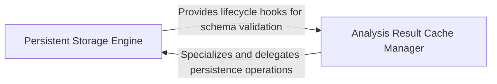

## Details

Manages the lifecycle of analysis results on disk, providing specialized caching for intermediate cluster details and final analysis outputs.

### Persistent Storage Engine
Acts as the foundational data access layer, managing the physical lifecycle of SQLite databases, including connection pooling, file-system locking, and schema versioning.

**Related Classes/Methods**:

- `caching.cache.BaseCache._open_sqlite_unlocked`:85-119
- `caching.cache.BaseCache.store`:199-216
- `caching.cache.BaseCache._reset_if_incompatible_schema`:121-135

**Source Files:**

- [`caching/cache.py`](https://github.com/CodeBoarding/CodeBoarding/blob/main/.codeboardingcaching/cache.py)
  - `caching.cache.BaseCache._open_sqlite` ([L65-L73](https://github.com/CodeBoarding/CodeBoarding/blob/main/.codeboardingcaching/cache.py#L65-L73)) - Method
  - `caching.cache.BaseCache._configure_sqlite_connection` ([L76-L83](https://github.com/CodeBoarding/CodeBoarding/blob/main/.codeboardingcaching/cache.py#L76-L83)) - Method
  - `caching.cache.BaseCache._open_sqlite_unlocked` ([L85-L119](https://github.com/CodeBoarding/CodeBoarding/blob/main/.codeboardingcaching/cache.py#L85-L119)) - Method
  - `caching.cache.BaseCache._reset_if_incompatible_schema` ([L121-L135](https://github.com/CodeBoarding/CodeBoarding/blob/main/.codeboardingcaching/cache.py#L121-L135)) - Method
  - `caching.cache.BaseCache.signature` ([L137-L139](https://github.com/CodeBoarding/CodeBoarding/blob/main/.codeboardingcaching/cache.py#L137-L139)) - Method
  - `caching.cache.BaseCache._lookup` ([L141-L157](https://github.com/CodeBoarding/CodeBoarding/blob/main/.codeboardingcaching/cache.py#L141-L157)) - Method
  - `caching.cache.BaseCache._upsert_conn` ([L159-L174](https://github.com/CodeBoarding/CodeBoarding/blob/main/.codeboardingcaching/cache.py#L159-L174)) - Method
  - `caching.cache.BaseCache._clear_conn` ([L176-L183](https://github.com/CodeBoarding/CodeBoarding/blob/main/.codeboardingcaching/cache.py#L176-L183)) - Method
  - `caching.cache.BaseCache.load` ([L185-L197](https://github.com/CodeBoarding/CodeBoarding/blob/main/.codeboardingcaching/cache.py#L185-L197)) - Method
  - `caching.cache.BaseCache.store` ([L199-L216](https://github.com/CodeBoarding/CodeBoarding/blob/main/.codeboardingcaching/cache.py#L199-L216)) - Method
  - `caching.cache.BaseCache.clear` ([L218-L229](https://github.com/CodeBoarding/CodeBoarding/blob/main/.codeboardingcaching/cache.py#L218-L229)) - Method

### Analysis Result Cache Manager
Provides the high-level API for storing and retrieving analysis artifacts, translating domain-specific objects into storable formats and managing unique cache keys.

**Related Classes/Methods**:

- `caching.details_cache.DetailsCacheKey`:12-15

**Source Files:**

- [`caching/cache.py`](https://github.com/CodeBoarding/CodeBoarding/blob/main/.codeboardingcaching/cache.py)
  - `caching.cache.BaseCache` ([L30-L268](https://github.com/CodeBoarding/CodeBoarding/blob/main/.codeboardingcaching/cache.py#L30-L268)) - Class
  - `caching.cache.BaseCache.__init__` ([L36-L63](https://github.com/CodeBoarding/CodeBoarding/blob/main/.codeboardingcaching/cache.py#L36-L63)) - Method
  - `caching.cache.BaseCache.close` ([L259-L268](https://github.com/CodeBoarding/CodeBoarding/blob/main/.codeboardingcaching/cache.py#L259-L268)) - Method
  - `caching.cache.ModelSettings` ([L271-L310](https://github.com/CodeBoarding/CodeBoarding/blob/main/.codeboardingcaching/cache.py#L271-L310)) - Class
- [`caching/details_cache.py`](https://github.com/CodeBoarding/CodeBoarding/blob/main/.codeboardingcaching/details_cache.py)
  - `caching.details_cache.DetailsCacheKey` ([L12-L15](https://github.com/CodeBoarding/CodeBoarding/blob/main/.codeboardingcaching/details_cache.py#L12-L15)) - Class
  - `caching.details_cache.FinalAnalysisCache.__init__` ([L24-L30](https://github.com/CodeBoarding/CodeBoarding/blob/main/.codeboardingcaching/details_cache.py#L24-L30)) - Method
  - `caching.details_cache.FinalAnalysisCache.build_key` ([L33-L34](https://github.com/CodeBoarding/CodeBoarding/blob/main/.codeboardingcaching/details_cache.py#L33-L34)) - Method
  - `caching.details_cache.ClusterCache.__init__` ([L43-L49](https://github.com/CodeBoarding/CodeBoarding/blob/main/.codeboardingcaching/details_cache.py#L43-L49)) - Method
  - `caching.details_cache.ClusterCache.build_key` ([L52-L53](https://github.com/CodeBoarding/CodeBoarding/blob/main/.codeboardingcaching/details_cache.py#L52-L53)) - Method
- [`caching/meta_cache.py`](https://github.com/CodeBoarding/CodeBoarding/blob/main/.codeboardingcaching/meta_cache.py)
  - `caching.meta_cache.MetaCache.__init__` ([L46-L55](https://github.com/CodeBoarding/CodeBoarding/blob/main/.codeboardingcaching/meta_cache.py#L46-L55)) - Method
- [`utils.py`](https://github.com/CodeBoarding/CodeBoarding/blob/main/.codeboardingutils.py)
  - `utils.get_cache_dir` ([L38-L45](https://github.com/CodeBoarding/CodeBoarding/blob/main/.codeboardingutils.py#L38-L45)) - Function

### [FAQ](https://github.com/CodeBoarding/GeneratedOnBoardings/tree/main?tab=readme-ov-file#faq)