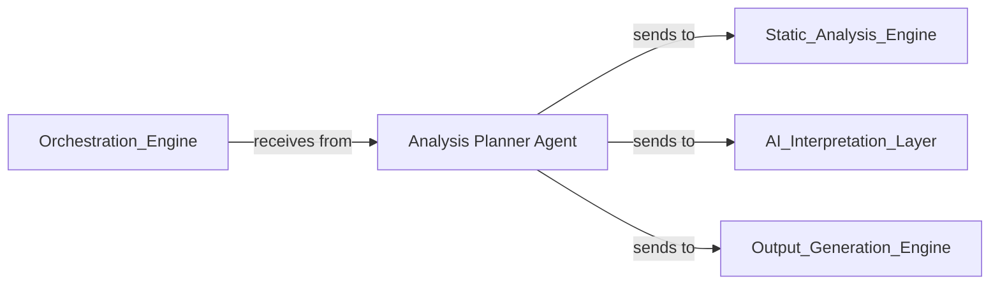

## Details

Strategically determines the optimal plan and sequence for the analysis workflow, deciding which code entities need deeper investigation based on current insights and goals.

### Analysis Planner Agent
Core component of the Analysis Planning Engine that strategically determines the optimal plan and sequence for the analysis workflow, deciding which code entities need deeper investigation based on current insights and goals. It orchestrates tasks, interacts with other engines, and monitors progress.

**Related Classes/Methods**:

- <a href="https://github.com/CodeBoarding/CodeBoarding/blob/main/.codeboardingagents/planner_agent.py" target="_blank" rel="noopener noreferrer">`agents.planner_agent.AnalysisPlannerAgent`</a>

### [FAQ](https://github.com/CodeBoarding/GeneratedOnBoardings/tree/main?tab=readme-ov-file#faq)