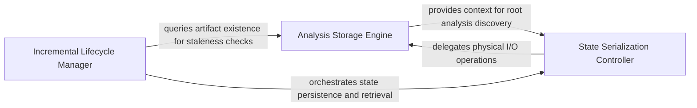

## Details

Manages the Analysis File Store to persist and retrieve static analysis and LLM reasoning results, enabling incremental analysis.

### Analysis Storage Engine
Manages the physical directory structure and file-level operations for analysis artifacts, translating logical identifiers into physical paths.

**Related Classes/Methods**: _None_

**Source Files:**

- [`diagram_analysis/io_utils.py`](https://github.com/CodeBoarding/CodeBoarding/blob/main/.codeboardingdiagram_analysis/io_utils.py)
  - `diagram_analysis.io_utils._AnalysisFileStore` ([L38-L251](https://github.com/CodeBoarding/CodeBoarding/blob/main/.codeboardingdiagram_analysis/io_utils.py#L38-L251)) - Class
  - `diagram_analysis.io_utils._AnalysisFileStore._repo_dir_for_source_lookup` ([L63-L70](https://github.com/CodeBoarding/CodeBoarding/blob/main/.codeboardingdiagram_analysis/io_utils.py#L63-L70)) - Method
  - `diagram_analysis.io_utils._AnalysisFileStore.read` ([L72-L90](https://github.com/CodeBoarding/CodeBoarding/blob/main/.codeboardingdiagram_analysis/io_utils.py#L72-L90)) - Method
  - `diagram_analysis.io_utils._AnalysisFileStore.exists` ([L97-L99](https://github.com/CodeBoarding/CodeBoarding/blob/main/.codeboardingdiagram_analysis/io_utils.py#L97-L99)) - Method
  - `diagram_analysis.io_utils._AnalysisFileStore.detect_expanded_components` ([L180-L187](https://github.com/CodeBoarding/CodeBoarding/blob/main/.codeboardingdiagram_analysis/io_utils.py#L180-L187)) - Method

### State Serialization Controller
Provides the high-level interface for persisting and retrieving analysis objects, handling the transformation between in-memory structures and serialized disk representations.

**Related Classes/Methods**: _None_

**Source Files:**

- [`diagram_analysis/io_utils.py`](https://github.com/CodeBoarding/CodeBoarding/blob/main/.codeboardingdiagram_analysis/io_utils.py)
  - `diagram_analysis.io_utils._AnalysisFileStore.read_root` ([L92-L95](https://github.com/CodeBoarding/CodeBoarding/blob/main/.codeboardingdiagram_analysis/io_utils.py#L92-L95)) - Method
  - `diagram_analysis.io_utils._AnalysisFileStore.read_sub` ([L101-L111](https://github.com/CodeBoarding/CodeBoarding/blob/main/.codeboardingdiagram_analysis/io_utils.py#L101-L111)) - Method
  - `diagram_analysis.io_utils._AnalysisFileStore.write_sub` ([L139-L178](https://github.com/CodeBoarding/CodeBoarding/blob/main/.codeboardingdiagram_analysis/io_utils.py#L139-L178)) - Method
  - `diagram_analysis.io_utils._get_store` ([L261-L266](https://github.com/CodeBoarding/CodeBoarding/blob/main/.codeboardingdiagram_analysis/io_utils.py#L261-L266)) - Function

### Incremental Lifecycle Manager
Determines the validity of existing analysis state by comparing stored metadata against current source code to implement staleness logic.

**Related Classes/Methods**: _None_

**Source Files:**

- [`diagram_analysis/io_utils.py`](https://github.com/CodeBoarding/CodeBoarding/blob/main/.codeboardingdiagram_analysis/io_utils.py)
  - `diagram_analysis.io_utils.load_root_analysis` ([L274-L276](https://github.com/CodeBoarding/CodeBoarding/blob/main/.codeboardingdiagram_analysis/io_utils.py#L274-L276)) - Function
  - `diagram_analysis.io_utils.analysis_exists` ([L279-L283](https://github.com/CodeBoarding/CodeBoarding/blob/main/.codeboardingdiagram_analysis/io_utils.py#L279-L283)) - Function
  - `diagram_analysis.io_utils.load_sub_analysis` ([L370-L372](https://github.com/CodeBoarding/CodeBoarding/blob/main/.codeboardingdiagram_analysis/io_utils.py#L370-L372)) - Function
  - `diagram_analysis.io_utils.save_sub_analysis` ([L375-L382](https://github.com/CodeBoarding/CodeBoarding/blob/main/.codeboardingdiagram_analysis/io_utils.py#L375-L382)) - Function

### [FAQ](https://github.com/CodeBoarding/GeneratedOnBoardings/tree/main?tab=readme-ov-file#faq)