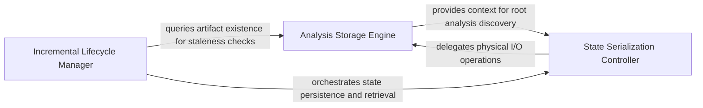

## Details

Manages the Analysis File Store to persist and retrieve static analysis and LLM reasoning results, enabling incremental analysis.

### Analysis Storage Engine
Manages the physical directory structure and file-level operations for analysis artifacts, translating logical identifiers into physical paths.

**Related Classes/Methods**: _None_

**Source Files:**

- [`diagram_analysis/io_utils.py`](https://github.com/CodeBoarding/CodeBoarding/blob/main/.codeboardingdiagram_analysis/io_utils.py)
  - `diagram_analysis.io_utils._AnalysisFileStore` ([L40-L287](https://github.com/CodeBoarding/CodeBoarding/blob/main/.codeboardingdiagram_analysis/io_utils.py#L40-L287)) - Class
  - `diagram_analysis.io_utils._AnalysisFileStore._repo_dir_for_source_lookup` ([L65-L72](https://github.com/CodeBoarding/CodeBoarding/blob/main/.codeboardingdiagram_analysis/io_utils.py#L65-L72)) - Method
  - `diagram_analysis.io_utils._AnalysisFileStore.read` ([L74-L92](https://github.com/CodeBoarding/CodeBoarding/blob/main/.codeboardingdiagram_analysis/io_utils.py#L74-L92)) - Method
  - `diagram_analysis.io_utils._AnalysisFileStore.exists` ([L99-L101](https://github.com/CodeBoarding/CodeBoarding/blob/main/.codeboardingdiagram_analysis/io_utils.py#L99-L101)) - Method
  - `diagram_analysis.io_utils._AnalysisFileStore.detect_expanded_components` ([L188-L195](https://github.com/CodeBoarding/CodeBoarding/blob/main/.codeboardingdiagram_analysis/io_utils.py#L188-L195)) - Method

### State Serialization Controller
Provides the high-level interface for persisting and retrieving analysis objects, handling the transformation between in-memory structures and serialized disk representations.

**Related Classes/Methods**: _None_

**Source Files:**

- [`diagram_analysis/io_utils.py`](https://github.com/CodeBoarding/CodeBoarding/blob/main/.codeboardingdiagram_analysis/io_utils.py)
  - `diagram_analysis.io_utils._AnalysisFileStore.read_root` ([L94-L97](https://github.com/CodeBoarding/CodeBoarding/blob/main/.codeboardingdiagram_analysis/io_utils.py#L94-L97)) - Method
  - `diagram_analysis.io_utils._AnalysisFileStore.read_sub` ([L103-L113](https://github.com/CodeBoarding/CodeBoarding/blob/main/.codeboardingdiagram_analysis/io_utils.py#L103-L113)) - Method
  - `diagram_analysis.io_utils._AnalysisFileStore.write_sub` ([L147-L186](https://github.com/CodeBoarding/CodeBoarding/blob/main/.codeboardingdiagram_analysis/io_utils.py#L147-L186)) - Method
  - `diagram_analysis.io_utils._get_store` ([L297-L302](https://github.com/CodeBoarding/CodeBoarding/blob/main/.codeboardingdiagram_analysis/io_utils.py#L297-L302)) - Function

### Incremental Lifecycle Manager
Determines the validity of existing analysis state by comparing stored metadata against current source code to implement staleness logic.

**Related Classes/Methods**: _None_

**Source Files:**

- [`diagram_analysis/io_utils.py`](https://github.com/CodeBoarding/CodeBoarding/blob/main/.codeboardingdiagram_analysis/io_utils.py)
  - `diagram_analysis.io_utils.load_root_analysis` ([L310-L312](https://github.com/CodeBoarding/CodeBoarding/blob/main/.codeboardingdiagram_analysis/io_utils.py#L310-L312)) - Function
  - `diagram_analysis.io_utils.analysis_exists` ([L315-L319](https://github.com/CodeBoarding/CodeBoarding/blob/main/.codeboardingdiagram_analysis/io_utils.py#L315-L319)) - Function
  - `diagram_analysis.io_utils.load_sub_analysis` ([L412-L414](https://github.com/CodeBoarding/CodeBoarding/blob/main/.codeboardingdiagram_analysis/io_utils.py#L412-L414)) - Function
  - `diagram_analysis.io_utils.save_sub_analysis` ([L417-L424](https://github.com/CodeBoarding/CodeBoarding/blob/main/.codeboardingdiagram_analysis/io_utils.py#L417-L424)) - Function

### [FAQ](https://github.com/CodeBoarding/GeneratedOnBoardings/tree/main?tab=readme-ov-file#faq)