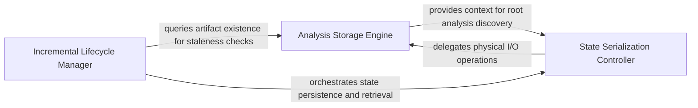

```mermaid
graph LR
    Analysis_Storage_Engine["Analysis Storage Engine"]
    State_Serialization_Controller["State Serialization Controller"]
    Incremental_Lifecycle_Manager["Incremental Lifecycle Manager"]
    Analysis_Storage_Engine -- "provides context for root analysis discovery" --> State_Serialization_Controller
    State_Serialization_Controller -- "delegates physical I/O operations" --> Analysis_Storage_Engine
    Incremental_Lifecycle_Manager -- "queries artifact existence for staleness checks" --> Analysis_Storage_Engine
    Incremental_Lifecycle_Manager -- "orchestrates state persistence and retrieval" --> State_Serialization_Controller
```

## Details

Manages the Analysis File Store to persist and retrieve static analysis and LLM reasoning results, enabling incremental analysis.

### Analysis Storage Engine
Manages the physical directory structure and file-level operations for analysis artifacts, translating logical identifiers into physical paths.

**Related Classes/Methods**: _None_

**Source Files:**

- [`diagram_analysis/io_utils.py`](https://github.com/CodeBoarding/CodeBoarding/blob/main/.codeboardingdiagram_analysis/io_utils.py)
  - `diagram_analysis.io_utils._AnalysisFileStore` ([L39-L295](https://github.com/CodeBoarding/CodeBoarding/blob/main/.codeboardingdiagram_analysis/io_utils.py#L39-L295)) - Class
  - `diagram_analysis.io_utils._AnalysisFileStore._repo_dir_for_source_lookup` ([L64-L71](https://github.com/CodeBoarding/CodeBoarding/blob/main/.codeboardingdiagram_analysis/io_utils.py#L64-L71)) - Method
  - `diagram_analysis.io_utils._AnalysisFileStore.read` ([L73-L91](https://github.com/CodeBoarding/CodeBoarding/blob/main/.codeboardingdiagram_analysis/io_utils.py#L73-L91)) - Method
  - `diagram_analysis.io_utils._AnalysisFileStore.exists` ([L98-L100](https://github.com/CodeBoarding/CodeBoarding/blob/main/.codeboardingdiagram_analysis/io_utils.py#L98-L100)) - Method
  - `diagram_analysis.io_utils._AnalysisFileStore.detect_expanded_components` ([L187-L194](https://github.com/CodeBoarding/CodeBoarding/blob/main/.codeboardingdiagram_analysis/io_utils.py#L187-L194)) - Method

### State Serialization Controller
Provides the high-level interface for persisting and retrieving analysis objects, handling the transformation between in-memory structures and serialized disk representations.

**Related Classes/Methods**: _None_

**Source Files:**

- [`diagram_analysis/io_utils.py`](https://github.com/CodeBoarding/CodeBoarding/blob/main/.codeboardingdiagram_analysis/io_utils.py)
  - `diagram_analysis.io_utils._AnalysisFileStore.read_root` ([L93-L96](https://github.com/CodeBoarding/CodeBoarding/blob/main/.codeboardingdiagram_analysis/io_utils.py#L93-L96)) - Method
  - `diagram_analysis.io_utils._AnalysisFileStore.read_sub` ([L102-L112](https://github.com/CodeBoarding/CodeBoarding/blob/main/.codeboardingdiagram_analysis/io_utils.py#L102-L112)) - Method
  - `diagram_analysis.io_utils._AnalysisFileStore.write_sub` ([L146-L185](https://github.com/CodeBoarding/CodeBoarding/blob/main/.codeboardingdiagram_analysis/io_utils.py#L146-L185)) - Method
  - `diagram_analysis.io_utils._get_store` ([L305-L310](https://github.com/CodeBoarding/CodeBoarding/blob/main/.codeboardingdiagram_analysis/io_utils.py#L305-L310)) - Function

### Incremental Lifecycle Manager
Determines the validity of existing analysis state by comparing stored metadata against current source code to implement staleness logic.

**Related Classes/Methods**: _None_

**Source Files:**

- [`diagram_analysis/io_utils.py`](https://github.com/CodeBoarding/CodeBoarding/blob/main/.codeboardingdiagram_analysis/io_utils.py)
  - `diagram_analysis.io_utils.load_root_analysis` ([L318-L320](https://github.com/CodeBoarding/CodeBoarding/blob/main/.codeboardingdiagram_analysis/io_utils.py#L318-L320)) - Function
  - `diagram_analysis.io_utils.analysis_exists` ([L323-L327](https://github.com/CodeBoarding/CodeBoarding/blob/main/.codeboardingdiagram_analysis/io_utils.py#L323-L327)) - Function
  - `diagram_analysis.io_utils.load_sub_analysis` ([L420-L422](https://github.com/CodeBoarding/CodeBoarding/blob/main/.codeboardingdiagram_analysis/io_utils.py#L420-L422)) - Function
  - `diagram_analysis.io_utils.save_sub_analysis` ([L425-L432](https://github.com/CodeBoarding/CodeBoarding/blob/main/.codeboardingdiagram_analysis/io_utils.py#L425-L432)) - Function

### [FAQ](https://github.com/CodeBoarding/GeneratedOnBoardings/tree/main?tab=readme-ov-file#faq)