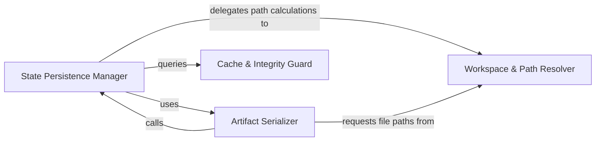

## Details

Provides a structured abstraction for persisting and retrieving analysis results, metadata, and generated diagrams.

### State Persistence Manager
The central orchestrator responsible for the high-level lifecycle of analysis data, providing the primary API to commit or retrieve the complete state of a repository's analysis.

**Related Classes/Methods**:

- `diagram_analysis.io_utils._AnalysisFileStore`:56-273

**Source Files:**

- [`codeboarding_workflows/analysis.py`](https://github.com/CodeBoarding/CodeBoarding/blob/main/.codeboardingcodeboarding_workflows/analysis.py)
  - `codeboarding_workflows.analysis.BaselineUnavailableError` ([L24-L33](https://github.com/CodeBoarding/CodeBoarding/blob/main/.codeboardingcodeboarding_workflows/analysis.py#L24-L33)) - Class
  - `codeboarding_workflows.analysis.build_generator` ([L36-L58](https://github.com/CodeBoarding/CodeBoarding/blob/main/.codeboardingcodeboarding_workflows/analysis.py#L36-L58)) - Function
  - `codeboarding_workflows.analysis.run_full` ([L61-L92](https://github.com/CodeBoarding/CodeBoarding/blob/main/.codeboardingcodeboarding_workflows/analysis.py#L61-L92)) - Function

### Artifact Serializer
Handles the transformation of complex Python objects into standardized file formats, specifically JSON for metadata and .mmd for Mermaid diagrams.

**Related Classes/Methods**: _None_

**Source Files:**

- [`codeboarding_workflows/analysis.py`](https://github.com/CodeBoarding/CodeBoarding/blob/main/.codeboardingcodeboarding_workflows/analysis.py)
  - `codeboarding_workflows.analysis.run_partial` ([L95-L161](https://github.com/CodeBoarding/CodeBoarding/blob/main/.codeboardingcodeboarding_workflows/analysis.py#L95-L161)) - Function
  - `codeboarding_workflows.analysis.run_incremental` ([L164-L213](https://github.com/CodeBoarding/CodeBoarding/blob/main/.codeboardingcodeboarding_workflows/analysis.py#L164-L213)) - Function
  - `codeboarding_workflows.analysis.run_incremental_workflow` ([L216-L239](https://github.com/CodeBoarding/CodeBoarding/blob/main/.codeboardingcodeboarding_workflows/analysis.py#L216-L239)) - Function

### Workspace & Path Resolver
Manages the physical organization of the analysis store on disk, ensuring workspace isolation and resolving absolute paths for artifacts.

**Related Classes/Methods**: _None_

**Source Files:**

- [`diagram_analysis/io_utils.py`](https://github.com/CodeBoarding/CodeBoarding/blob/main/.codeboardingdiagram_analysis/io_utils.py)
  - `diagram_analysis.io_utils._AnalysisFileStore` ([L56-L273](https://github.com/CodeBoarding/CodeBoarding/blob/main/.codeboardingdiagram_analysis/io_utils.py#L56-L273)) - Class
  - `diagram_analysis.io_utils._AnalysisFileStore._compute_expandable_components` ([L66-L71](https://github.com/CodeBoarding/CodeBoarding/blob/main/.codeboardingdiagram_analysis/io_utils.py#L66-L71)) - Method
  - `diagram_analysis.io_utils._AnalysisFileStore._write_with_lock_held` ([L185-L273](https://github.com/CodeBoarding/CodeBoarding/blob/main/.codeboardingdiagram_analysis/io_utils.py#L185-L273)) - Method

### Cache & Integrity Guard
Determines the validity of existing stored data to facilitate incremental workflows by checking for cache hits and verifying data alignment with source code.

**Related Classes/Methods**: _None_

**Source Files:**

- [`diagram_analysis/io_utils.py`](https://github.com/CodeBoarding/CodeBoarding/blob/main/.codeboardingdiagram_analysis/io_utils.py)
  - `diagram_analysis.io_utils._AnalysisFileStore.detect_expanded_components` ([L176-L183](https://github.com/CodeBoarding/CodeBoarding/blob/main/.codeboardingdiagram_analysis/io_utils.py#L176-L183)) - Method

### [FAQ](https://github.com/CodeBoarding/GeneratedOnBoardings/tree/main?tab=readme-ov-file#faq)