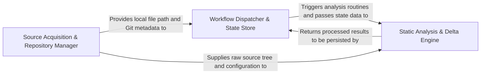

## Details

Determines the appropriate analysis strategy (Full, Incremental, or Partial) and provides a unified interface for source acquisition and state persistence.

### Source Acquisition & Repository Manager [[Expand]](./Source_Acquisition_Repository_Manager.md)
Responsible for the physical retrieval and preparation of the codebase, abstracting source location and ensuring environment validity.

**Related Classes/Methods**:

- `codeboarding_workflows.sources.remote.remote_source`:32-71
- `codeboarding_workflows.sources.local.SourceContext`:8-18
- `repo_utils.__init__.clone_repository`:100-122
- `repo_utils.__init__.require_git_import`:30-57

**Source Files:**

- [`codeboarding_workflows/sources/local.py`](https://github.com/CodeBoarding/CodeBoarding/blob/main/.codeboardingcodeboarding_workflows/sources/local.py)
  - `codeboarding_workflows.sources.local.SourceContext` ([L8-L18](https://github.com/CodeBoarding/CodeBoarding/blob/main/.codeboardingcodeboarding_workflows/sources/local.py#L8-L18)) - Class
- [`codeboarding_workflows/sources/remote.py`](https://github.com/CodeBoarding/CodeBoarding/blob/main/.codeboardingcodeboarding_workflows/sources/remote.py)
  - `codeboarding_workflows.sources.remote.onboarding_materials_exist` ([L18-L28](https://github.com/CodeBoarding/CodeBoarding/blob/main/.codeboardingcodeboarding_workflows/sources/remote.py#L18-L28)) - Function
  - `codeboarding_workflows.sources.remote.remote_source` ([L32-L71](https://github.com/CodeBoarding/CodeBoarding/blob/main/.codeboardingcodeboarding_workflows/sources/remote.py#L32-L71)) - Function
- [`repo_utils/__init__.py`](https://github.com/CodeBoarding/CodeBoarding/blob/main/.codeboardingrepo_utils/__init__.py)
  - `repo_utils.__init__.require_git_import` ([L30-L57](https://github.com/CodeBoarding/CodeBoarding/blob/main/.codeboardingrepo_utils/__init__.py#L30-L57)) - Function
  - `repo_utils.__init__.require_git_import.decorator` ([L37-L55](https://github.com/CodeBoarding/CodeBoarding/blob/main/.codeboardingrepo_utils/__init__.py#L37-L55)) - Function
  - `repo_utils.__init__.require_git_import.decorator.wrapper` ([L39-L53](https://github.com/CodeBoarding/CodeBoarding/blob/main/.codeboardingrepo_utils/__init__.py#L39-L53)) - Function
  - `repo_utils.__init__.sanitize_repo_url` ([L60-L74](https://github.com/CodeBoarding/CodeBoarding/blob/main/.codeboardingrepo_utils/__init__.py#L60-L74)) - Function
  - `repo_utils.__init__.remote_repo_exists` ([L78-L89](https://github.com/CodeBoarding/CodeBoarding/blob/main/.codeboardingrepo_utils/__init__.py#L78-L89)) - Function
  - `repo_utils.__init__.get_repo_name` ([L92-L96](https://github.com/CodeBoarding/CodeBoarding/blob/main/.codeboardingrepo_utils/__init__.py#L92-L96)) - Function
  - `repo_utils.__init__.clone_repository` ([L100-L122](https://github.com/CodeBoarding/CodeBoarding/blob/main/.codeboardingrepo_utils/__init__.py#L100-L122)) - Function
  - `repo_utils.__init__.upload_onboarding_materials` ([L144-L173](https://github.com/CodeBoarding/CodeBoarding/blob/main/.codeboardingrepo_utils/__init__.py#L144-L173)) - Function
  - `repo_utils.__init__.is_repo_dirty` ([L186-L189](https://github.com/CodeBoarding/CodeBoarding/blob/main/.codeboardingrepo_utils/__init__.py#L186-L189)) - Function
- [`repo_utils/errors.py`](https://github.com/CodeBoarding/CodeBoarding/blob/main/.codeboardingrepo_utils/errors.py)
  - `repo_utils.errors.RepoDontExistError` ([L5-L6](https://github.com/CodeBoarding/CodeBoarding/blob/main/.codeboardingrepo_utils/errors.py#L5-L6)) - Class
- [`utils.py`](https://github.com/CodeBoarding/CodeBoarding/blob/main/.codeboardingutils.py)
  - `utils.create_temp_repo_folder` ([L20-L24](https://github.com/CodeBoarding/CodeBoarding/blob/main/.codeboardingutils.py#L20-L24)) - Function
  - `utils.remove_temp_repo_folder` ([L27-L31](https://github.com/CodeBoarding/CodeBoarding/blob/main/.codeboardingutils.py#L27-L31)) - Function
  - `utils.copy_files` ([L117-L123](https://github.com/CodeBoarding/CodeBoarding/blob/main/.codeboardingutils.py#L117-L123)) - Function

### Workflow Dispatcher & State Store [[Expand]](./Workflow_Dispatcher_State_Store.md)
The decision-making layer that selects the analysis strategy and manages the serialization and retrieval of analysis artifacts.

**Related Classes/Methods**:

- `codeboarding_workflows.analysis.run_incremental_workflow`:216-239
- `diagram_analysis.io_utils._AnalysisFileStore`:56-273
- `diagram_analysis.io_utils.load_full_analysis`:301-311

**Source Files:**

- [`agents/agent_responses.py`](https://github.com/CodeBoarding/CodeBoarding/blob/main/.codeboardingagents/agent_responses.py)
  - `agents.agent_responses.index_components_by_id` ([L427-L436](https://github.com/CodeBoarding/CodeBoarding/blob/main/.codeboardingagents/agent_responses.py#L427-L436)) - Function
- [`agents/planner_agent.py`](https://github.com/CodeBoarding/CodeBoarding/blob/main/.codeboardingagents/planner_agent.py)
  - `agents.planner_agent.should_expand_component` ([L33-L91](https://github.com/CodeBoarding/CodeBoarding/blob/main/.codeboardingagents/planner_agent.py#L33-L91)) - Function
  - `agents.planner_agent.get_expandable_components` ([L94-L117](https://github.com/CodeBoarding/CodeBoarding/blob/main/.codeboardingagents/planner_agent.py#L94-L117)) - Function
- [`codeboarding_cli/commands/partial_analysis.py`](https://github.com/CodeBoarding/CodeBoarding/blob/main/.codeboardingcodeboarding_cli/commands/partial_analysis.py)
  - `codeboarding_cli.commands.partial_analysis.run_from_args.scope` ([L49-L57](https://github.com/CodeBoarding/CodeBoarding/blob/main/.codeboardingcodeboarding_cli/commands/partial_analysis.py#L49-L57)) - Function
- [`codeboarding_workflows/analysis.py`](https://github.com/CodeBoarding/CodeBoarding/blob/main/.codeboardingcodeboarding_workflows/analysis.py)
  - `codeboarding_workflows.analysis.BaselineUnavailableError` ([L24-L33](https://github.com/CodeBoarding/CodeBoarding/blob/main/.codeboardingcodeboarding_workflows/analysis.py#L24-L33)) - Class
  - `codeboarding_workflows.analysis.build_generator` ([L36-L58](https://github.com/CodeBoarding/CodeBoarding/blob/main/.codeboardingcodeboarding_workflows/analysis.py#L36-L58)) - Function
  - `codeboarding_workflows.analysis.run_partial` ([L95-L161](https://github.com/CodeBoarding/CodeBoarding/blob/main/.codeboardingcodeboarding_workflows/analysis.py#L95-L161)) - Function
  - `codeboarding_workflows.analysis.run_incremental` ([L164-L213](https://github.com/CodeBoarding/CodeBoarding/blob/main/.codeboardingcodeboarding_workflows/analysis.py#L164-L213)) - Function
  - `codeboarding_workflows.analysis.run_incremental_workflow` ([L216-L239](https://github.com/CodeBoarding/CodeBoarding/blob/main/.codeboardingcodeboarding_workflows/analysis.py#L216-L239)) - Function
- [`diagram_analysis/diagram_generator.py`](https://github.com/CodeBoarding/CodeBoarding/blob/main/.codeboardingdiagram_analysis/diagram_generator.py)
  - `diagram_analysis.diagram_generator.DiagramGenerator.process_component` ([L123-L126](https://github.com/CodeBoarding/CodeBoarding/blob/main/.codeboardingdiagram_analysis/diagram_generator.py#L123-L126)) - Method
  - `diagram_analysis.diagram_generator.DiagramGenerator._process_component` ([L128-L146](https://github.com/CodeBoarding/CodeBoarding/blob/main/.codeboardingdiagram_analysis/diagram_generator.py#L128-L146)) - Method
  - `diagram_analysis.diagram_generator.DiagramGenerator._generate_subcomponents.submit_component` ([L396-L400](https://github.com/CodeBoarding/CodeBoarding/blob/main/.codeboardingdiagram_analysis/diagram_generator.py#L396-L400)) - Function
- [`diagram_analysis/io_utils.py`](https://github.com/CodeBoarding/CodeBoarding/blob/main/.codeboardingdiagram_analysis/io_utils.py)
  - `diagram_analysis.io_utils._AnalysisFileStore` ([L56-L273](https://github.com/CodeBoarding/CodeBoarding/blob/main/.codeboardingdiagram_analysis/io_utils.py#L56-L273)) - Class
  - `diagram_analysis.io_utils._AnalysisFileStore._compute_expandable_components` ([L66-L71](https://github.com/CodeBoarding/CodeBoarding/blob/main/.codeboardingdiagram_analysis/io_utils.py#L66-L71)) - Method
  - `diagram_analysis.io_utils._AnalysisFileStore.read` ([L81-L99](https://github.com/CodeBoarding/CodeBoarding/blob/main/.codeboardingdiagram_analysis/io_utils.py#L81-L99)) - Method
  - `diagram_analysis.io_utils._AnalysisFileStore.read_root` ([L101-L104](https://github.com/CodeBoarding/CodeBoarding/blob/main/.codeboardingdiagram_analysis/io_utils.py#L101-L104)) - Method
  - `diagram_analysis.io_utils._AnalysisFileStore.read_sub` ([L106-L116](https://github.com/CodeBoarding/CodeBoarding/blob/main/.codeboardingdiagram_analysis/io_utils.py#L106-L116)) - Method
  - `diagram_analysis.io_utils._AnalysisFileStore.write` ([L118-L142](https://github.com/CodeBoarding/CodeBoarding/blob/main/.codeboardingdiagram_analysis/io_utils.py#L118-L142)) - Method
  - `diagram_analysis.io_utils._AnalysisFileStore.write_sub` ([L144-L174](https://github.com/CodeBoarding/CodeBoarding/blob/main/.codeboardingdiagram_analysis/io_utils.py#L144-L174)) - Method
  - `diagram_analysis.io_utils._AnalysisFileStore.detect_expanded_components` ([L176-L183](https://github.com/CodeBoarding/CodeBoarding/blob/main/.codeboardingdiagram_analysis/io_utils.py#L176-L183)) - Method
  - `diagram_analysis.io_utils._AnalysisFileStore._write_with_lock_held` ([L185-L273](https://github.com/CodeBoarding/CodeBoarding/blob/main/.codeboardingdiagram_analysis/io_utils.py#L185-L273)) - Method
  - `diagram_analysis.io_utils._get_store` ([L283-L288](https://github.com/CodeBoarding/CodeBoarding/blob/main/.codeboardingdiagram_analysis/io_utils.py#L283-L288)) - Function
  - `diagram_analysis.io_utils.load_root_analysis` ([L296-L298](https://github.com/CodeBoarding/CodeBoarding/blob/main/.codeboardingdiagram_analysis/io_utils.py#L296-L298)) - Function
  - `diagram_analysis.io_utils.load_full_analysis` ([L301-L311](https://github.com/CodeBoarding/CodeBoarding/blob/main/.codeboardingdiagram_analysis/io_utils.py#L301-L311)) - Function
  - `diagram_analysis.io_utils.load_analysis_metadata` ([L314-L319](https://github.com/CodeBoarding/CodeBoarding/blob/main/.codeboardingdiagram_analysis/io_utils.py#L314-L319)) - Function
  - `diagram_analysis.io_utils.load_sub_analysis` ([L399-L401](https://github.com/CodeBoarding/CodeBoarding/blob/main/.codeboardingdiagram_analysis/io_utils.py#L399-L401)) - Function
  - `diagram_analysis.io_utils.save_sub_analysis` ([L404-L411](https://github.com/CodeBoarding/CodeBoarding/blob/main/.codeboardingdiagram_analysis/io_utils.py#L404-L411)) - Function

### Static Analysis & Delta Engine [[Expand]](./Static_Analysis_Delta_Engine.md)
The core processing engine that executes language-specific scans, calculates structural changes, and identifies deltas to minimize LLM processing costs.

**Related Classes/Methods**:

- `diagram_analysis.diagram_generator.DiagramGenerator`:72-688
- `static_analyzer.analysis_result.StaticAnalysisResults`:166-317
- `diagram_analysis.cluster_delta.ClusterDelta`:46-66
- `agents.incremental_agent.IncrementalAgent`:50-241

**Source Files:**

- [`agents/abstraction_agent.py`](https://github.com/CodeBoarding/CodeBoarding/blob/main/.codeboardingagents/abstraction_agent.py)
  - `agents.abstraction_agent.AbstractionAgent` ([L38-L177](https://github.com/CodeBoarding/CodeBoarding/blob/main/.codeboardingagents/abstraction_agent.py#L38-L177)) - Class
- [`agents/details_agent.py`](https://github.com/CodeBoarding/CodeBoarding/blob/main/.codeboardingagents/details_agent.py)
  - `agents.details_agent.DetailsAgent` ([L37-L249](https://github.com/CodeBoarding/CodeBoarding/blob/main/.codeboardingagents/details_agent.py#L37-L249)) - Class
- [`agents/incremental_agent.py`](https://github.com/CodeBoarding/CodeBoarding/blob/main/.codeboardingagents/incremental_agent.py)
  - `agents.incremental_agent.IncrementalAgent` ([L50-L241](https://github.com/CodeBoarding/CodeBoarding/blob/main/.codeboardingagents/incremental_agent.py#L50-L241)) - Class
  - `agents.incremental_agent.remove_deleted_files` ([L713-L723](https://github.com/CodeBoarding/CodeBoarding/blob/main/.codeboardingagents/incremental_agent.py#L713-L723)) - Function
  - `agents.incremental_agent._scrub_one_analysis` ([L726-L742](https://github.com/CodeBoarding/CodeBoarding/blob/main/.codeboardingagents/incremental_agent.py#L726-L742)) - Function
  - `agents.incremental_agent.prune_empty_components` ([L745-L781](https://github.com/CodeBoarding/CodeBoarding/blob/main/.codeboardingagents/incremental_agent.py#L745-L781)) - Function
  - `agents.incremental_agent.prune_empty_components._has_methods` ([L755-L756](https://github.com/CodeBoarding/CodeBoarding/blob/main/.codeboardingagents/incremental_agent.py#L755-L756)) - Function
  - `agents.incremental_agent.prune_empty_components._collect_empty` ([L758-L761](https://github.com/CodeBoarding/CodeBoarding/blob/main/.codeboardingagents/incremental_agent.py#L758-L761)) - Function
  - `agents.incremental_agent._strip_relations` ([L784-L787](https://github.com/CodeBoarding/CodeBoarding/blob/main/.codeboardingagents/incremental_agent.py#L784-L787)) - Function
- [`agents/meta_agent.py`](https://github.com/CodeBoarding/CodeBoarding/blob/main/.codeboardingagents/meta_agent.py)
  - `agents.meta_agent.MetaAgent` ([L18-L66](https://github.com/CodeBoarding/CodeBoarding/blob/main/.codeboardingagents/meta_agent.py#L18-L66)) - Class
- [`diagram_analysis/analysis_json.py`](https://github.com/CodeBoarding/CodeBoarding/blob/main/.codeboardingdiagram_analysis/analysis_json.py)
  - `diagram_analysis.analysis_json.NotAnalyzedFile` ([L56-L58](https://github.com/CodeBoarding/CodeBoarding/blob/main/.codeboardingdiagram_analysis/analysis_json.py#L56-L58)) - Class
  - `diagram_analysis.analysis_json.FileCoverageReport` ([L70-L75](https://github.com/CodeBoarding/CodeBoarding/blob/main/.codeboardingdiagram_analysis/analysis_json.py#L70-L75)) - Class
- [`diagram_analysis/cluster_delta.py`](https://github.com/CodeBoarding/CodeBoarding/blob/main/.codeboardingdiagram_analysis/cluster_delta.py)
  - `diagram_analysis.cluster_delta.LanguageDelta.affected_cluster_ids` ([L41-L42](https://github.com/CodeBoarding/CodeBoarding/blob/main/.codeboardingdiagram_analysis/cluster_delta.py#L41-L42)) - Method
  - `diagram_analysis.cluster_delta.ClusterDelta.has_changes` ([L50-L51](https://github.com/CodeBoarding/CodeBoarding/blob/main/.codeboardingdiagram_analysis/cluster_delta.py#L50-L51)) - Method
  - `diagram_analysis.cluster_delta.ClusterDelta.all_affected_cluster_ids` ([L53-L54](https://github.com/CodeBoarding/CodeBoarding/blob/main/.codeboardingdiagram_analysis/cluster_delta.py#L53-L54)) - Method
  - `diagram_analysis.cluster_delta.ClusterDelta.cluster_results` ([L59-L60](https://github.com/CodeBoarding/CodeBoarding/blob/main/.codeboardingdiagram_analysis/cluster_delta.py#L59-L60)) - Method
- [`diagram_analysis/cluster_snapshot.py`](https://github.com/CodeBoarding/CodeBoarding/blob/main/.codeboardingdiagram_analysis/cluster_snapshot.py)
  - `diagram_analysis.cluster_snapshot.ClusterSnapshot.all_cluster_ids` ([L36-L37](https://github.com/CodeBoarding/CodeBoarding/blob/main/.codeboardingdiagram_analysis/cluster_snapshot.py#L36-L37)) - Method
- [`diagram_analysis/diagram_generator.py`](https://github.com/CodeBoarding/CodeBoarding/blob/main/.codeboardingdiagram_analysis/diagram_generator.py)
  - `diagram_analysis.diagram_generator._component_depth` ([L56-L60](https://github.com/CodeBoarding/CodeBoarding/blob/main/.codeboardingdiagram_analysis/diagram_generator.py#L56-L60)) - Function
  - `diagram_analysis.diagram_generator._component_expansion_seeds` ([L63-L69](https://github.com/CodeBoarding/CodeBoarding/blob/main/.codeboardingdiagram_analysis/diagram_generator.py#L63-L69)) - Function
  - `diagram_analysis.diagram_generator.DiagramGenerator._strip_ignored` ([L168-L188](https://github.com/CodeBoarding/CodeBoarding/blob/main/.codeboardingdiagram_analysis/diagram_generator.py#L168-L188)) - Method
  - `diagram_analysis.diagram_generator.DiagramGenerator._build_file_coverage` ([L190-L199](https://github.com/CodeBoarding/CodeBoarding/blob/main/.codeboardingdiagram_analysis/diagram_generator.py#L190-L199)) - Method
  - `diagram_analysis.diagram_generator.DiagramGenerator._write_file_coverage` ([L201-L217](https://github.com/CodeBoarding/CodeBoarding/blob/main/.codeboardingdiagram_analysis/diagram_generator.py#L201-L217)) - Method
  - `diagram_analysis.diagram_generator.DiagramGenerator._get_static_from_injected_analyzer` ([L219-L230](https://github.com/CodeBoarding/CodeBoarding/blob/main/.codeboardingdiagram_analysis/diagram_generator.py#L219-L230)) - Method
  - `diagram_analysis.diagram_generator.DiagramGenerator.pre_analysis` ([L257-L376](https://github.com/CodeBoarding/CodeBoarding/blob/main/.codeboardingdiagram_analysis/diagram_generator.py#L257-L376)) - Method
  - `diagram_analysis.diagram_generator.DiagramGenerator.pre_analysis.get_static_with_injected_analyzer` ([L272-L282](https://github.com/CodeBoarding/CodeBoarding/blob/main/.codeboardingdiagram_analysis/diagram_generator.py#L272-L282)) - Function
  - `diagram_analysis.diagram_generator.DiagramGenerator._generate_subcomponents` ([L378-L455](https://github.com/CodeBoarding/CodeBoarding/blob/main/.codeboardingdiagram_analysis/diagram_generator.py#L378-L455)) - Method
  - `diagram_analysis.diagram_generator.DiagramGenerator.generate_analysis` ([L458-L501](https://github.com/CodeBoarding/CodeBoarding/blob/main/.codeboardingdiagram_analysis/diagram_generator.py#L458-L501)) - Method
  - `diagram_analysis.diagram_generator.DiagramGenerator._build_file_coverage_summary` ([L535-L544](https://github.com/CodeBoarding/CodeBoarding/blob/main/.codeboardingdiagram_analysis/diagram_generator.py#L535-L544)) - Method
  - `diagram_analysis.diagram_generator.DiagramGenerator.generate_analysis_incremental` ([L547-L688](https://github.com/CodeBoarding/CodeBoarding/blob/main/.codeboardingdiagram_analysis/diagram_generator.py#L547-L688)) - Method
  - `diagram_analysis.diagram_generator._collect_components_by_id` ([L691-L706](https://github.com/CodeBoarding/CodeBoarding/blob/main/.codeboardingdiagram_analysis/diagram_generator.py#L691-L706)) - Function
  - `diagram_analysis.diagram_generator._merge_sub_analyses` ([L709-L744](https://github.com/CodeBoarding/CodeBoarding/blob/main/.codeboardingdiagram_analysis/diagram_generator.py#L709-L744)) - Function
- [`diagram_analysis/exceptions.py`](https://github.com/CodeBoarding/CodeBoarding/blob/main/.codeboardingdiagram_analysis/exceptions.py)
  - `diagram_analysis.exceptions.IncrementalCacheMissingError` ([L8-L43](https://github.com/CodeBoarding/CodeBoarding/blob/main/.codeboardingdiagram_analysis/exceptions.py#L8-L43)) - Class
  - `diagram_analysis.exceptions.IncrementalCacheMissingError.__init__` ([L25-L43](https://github.com/CodeBoarding/CodeBoarding/blob/main/.codeboardingdiagram_analysis/exceptions.py#L25-L43)) - Method
- [`diagram_analysis/file_coverage.py`](https://github.com/CodeBoarding/CodeBoarding/blob/main/.codeboardingdiagram_analysis/file_coverage.py)
  - `diagram_analysis.file_coverage.FileCoverage` ([L23-L212](https://github.com/CodeBoarding/CodeBoarding/blob/main/.codeboardingdiagram_analysis/file_coverage.py#L23-L212)) - Class
  - `diagram_analysis.file_coverage.FileCoverage.__init__` ([L30-L38](https://github.com/CodeBoarding/CodeBoarding/blob/main/.codeboardingdiagram_analysis/file_coverage.py#L30-L38)) - Method
  - `diagram_analysis.file_coverage.FileCoverage.load` ([L176-L199](https://github.com/CodeBoarding/CodeBoarding/blob/main/.codeboardingdiagram_analysis/file_coverage.py#L176-L199)) - Method
  - `diagram_analysis.file_coverage.FileCoverage.save` ([L202-L212](https://github.com/CodeBoarding/CodeBoarding/blob/main/.codeboardingdiagram_analysis/file_coverage.py#L202-L212)) - Method
- [`diagram_analysis/io_utils.py`](https://github.com/CodeBoarding/CodeBoarding/blob/main/.codeboardingdiagram_analysis/io_utils.py)
  - `diagram_analysis.io_utils.save_analysis` ([L377-L396](https://github.com/CodeBoarding/CodeBoarding/blob/main/.codeboardingdiagram_analysis/io_utils.py#L377-L396)) - Function
- [`diagram_analysis/version.py`](https://github.com/CodeBoarding/CodeBoarding/blob/main/.codeboardingdiagram_analysis/version.py)
  - `diagram_analysis.version.Version` ([L4-L6](https://github.com/CodeBoarding/CodeBoarding/blob/main/.codeboardingdiagram_analysis/version.py#L4-L6)) - Class
- [`monitoring/writers.py`](https://github.com/CodeBoarding/CodeBoarding/blob/main/.codeboardingmonitoring/writers.py)
  - `monitoring.writers.StreamingStatsWriter` ([L18-L172](https://github.com/CodeBoarding/CodeBoarding/blob/main/.codeboardingmonitoring/writers.py#L18-L172)) - Class
- [`repo_utils/__init__.py`](https://github.com/CodeBoarding/CodeBoarding/blob/main/.codeboardingrepo_utils/__init__.py)
  - `repo_utils.__init__.get_git_commit_hash` ([L177-L182](https://github.com/CodeBoarding/CodeBoarding/blob/main/.codeboardingrepo_utils/__init__.py#L177-L182)) - Function
- [`repo_utils/ignore.py`](https://github.com/CodeBoarding/CodeBoarding/blob/main/.codeboardingrepo_utils/ignore.py)
  - `repo_utils.ignore.RepoIgnoreManager` ([L164-L329](https://github.com/CodeBoarding/CodeBoarding/blob/main/.codeboardingrepo_utils/ignore.py#L164-L329)) - Class
- [`static_analyzer/analysis_result.py`](https://github.com/CodeBoarding/CodeBoarding/blob/main/.codeboardingstatic_analyzer/analysis_result.py)
  - `static_analyzer.analysis_result.StaticAnalysisResults.get_source_files` ([L305-L310](https://github.com/CodeBoarding/CodeBoarding/blob/main/.codeboardingstatic_analyzer/analysis_result.py#L305-L310)) - Method
  - `static_analyzer.analysis_result.StaticAnalysisResults.get_all_source_files` ([L312-L317](https://github.com/CodeBoarding/CodeBoarding/blob/main/.codeboardingstatic_analyzer/analysis_result.py#L312-L317)) - Method
- [`static_analyzer/csharp_config_scanner.py`](https://github.com/CodeBoarding/CodeBoarding/blob/main/.codeboardingstatic_analyzer/csharp_config_scanner.py)
  - `static_analyzer.csharp_config_scanner.CSharpProjectConfig.__init__` ([L20-L26](https://github.com/CodeBoarding/CodeBoarding/blob/main/.codeboardingstatic_analyzer/csharp_config_scanner.py#L20-L26)) - Method
  - `static_analyzer.csharp_config_scanner.CSharpProjectConfig.__repr__` ([L28-L29](https://github.com/CodeBoarding/CodeBoarding/blob/main/.codeboardingstatic_analyzer/csharp_config_scanner.py#L28-L29)) - Method
  - `static_analyzer.csharp_config_scanner.CSharpConfigScanner.__init__` ([L45-L47](https://github.com/CodeBoarding/CodeBoarding/blob/main/.codeboardingstatic_analyzer/csharp_config_scanner.py#L45-L47)) - Method
- [`static_analyzer/java_config_scanner.py`](https://github.com/CodeBoarding/CodeBoarding/blob/main/.codeboardingstatic_analyzer/java_config_scanner.py)
  - `static_analyzer.java_config_scanner.JavaProjectConfig.__init__` ([L12-L22](https://github.com/CodeBoarding/CodeBoarding/blob/main/.codeboardingstatic_analyzer/java_config_scanner.py#L12-L22)) - Method
  - `static_analyzer.java_config_scanner.JavaProjectConfig.__repr__` ([L24-L30](https://github.com/CodeBoarding/CodeBoarding/blob/main/.codeboardingstatic_analyzer/java_config_scanner.py#L24-L30)) - Method
  - `static_analyzer.java_config_scanner.JavaConfigScanner.__init__` ([L35-L37](https://github.com/CodeBoarding/CodeBoarding/blob/main/.codeboardingstatic_analyzer/java_config_scanner.py#L35-L37)) - Method
- [`static_analyzer/typescript_config_scanner.py`](https://github.com/CodeBoarding/CodeBoarding/blob/main/.codeboardingstatic_analyzer/typescript_config_scanner.py)
  - `static_analyzer.typescript_config_scanner.TypeScriptConfigScanner.__init__` ([L44-L46](https://github.com/CodeBoarding/CodeBoarding/blob/main/.codeboardingstatic_analyzer/typescript_config_scanner.py#L44-L46)) - Method
- [`telemetry/events.py`](https://github.com/CodeBoarding/CodeBoarding/blob/main/.codeboardingtelemetry/events.py)
  - `telemetry.events.track_analysis` ([L160-L222](https://github.com/CodeBoarding/CodeBoarding/blob/main/.codeboardingtelemetry/events.py#L160-L222)) - Function

### [FAQ](https://github.com/CodeBoarding/GeneratedOnBoardings/tree/main?tab=readme-ov-file#faq)