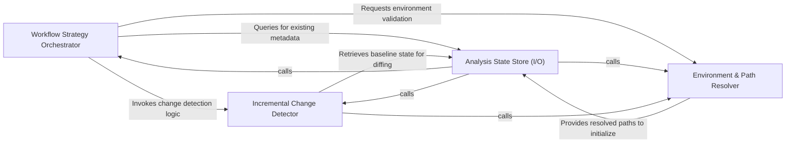

## Details

Determines the scope of work by comparing current repository state against baselines and managing IO operations for analysis results.

### Workflow Strategy Orchestrator [[Expand]](./Workflow_Strategy_Orchestrator.md)
Determines the high-level execution path (Full vs. Incremental) based on existing state and configuration.

**Related Classes/Methods**:

- `codeboarding_workflows.analysis.run_incremental_workflow`:216-239

**Source Files:**

- [`agents/agent_responses.py`](https://github.com/CodeBoarding/CodeBoarding/blob/main/.codeboardingagents/agent_responses.py)
  - `agents.agent_responses.index_components_by_id` ([L427-L436](https://github.com/CodeBoarding/CodeBoarding/blob/main/.codeboardingagents/agent_responses.py#L427-L436)) - Function
- [`agents/planner_agent.py`](https://github.com/CodeBoarding/CodeBoarding/blob/main/.codeboardingagents/planner_agent.py)
  - `agents.planner_agent.should_expand_component` ([L33-L91](https://github.com/CodeBoarding/CodeBoarding/blob/main/.codeboardingagents/planner_agent.py#L33-L91)) - Function
- [`codeboarding_cli/bootstrap.py`](https://github.com/CodeBoarding/CodeBoarding/blob/main/.codeboardingcodeboarding_cli/bootstrap.py)
  - `codeboarding_cli.bootstrap.LocalRunPaths` ([L18-L23](https://github.com/CodeBoarding/CodeBoarding/blob/main/.codeboardingcodeboarding_cli/bootstrap.py#L18-L23)) - Class
  - `codeboarding_cli.bootstrap.resolve_local_run_paths` ([L26-L35](https://github.com/CodeBoarding/CodeBoarding/blob/main/.codeboardingcodeboarding_cli/bootstrap.py#L26-L35)) - Function

### Analysis State Store (I/O) [[Expand]](./Analysis_State_Store_I_O_.md)
Provides a structured abstraction for persisting and retrieving analysis results, metadata, and generated diagrams.

**Related Classes/Methods**:

- `diagram_analysis.io_utils._AnalysisFileStore`:56-273

**Source Files:**

- [`codeboarding_workflows/analysis.py`](https://github.com/CodeBoarding/CodeBoarding/blob/main/.codeboardingcodeboarding_workflows/analysis.py)
  - `codeboarding_workflows.analysis.BaselineUnavailableError` ([L24-L33](https://github.com/CodeBoarding/CodeBoarding/blob/main/.codeboardingcodeboarding_workflows/analysis.py#L24-L33)) - Class
  - `codeboarding_workflows.analysis.build_generator` ([L36-L58](https://github.com/CodeBoarding/CodeBoarding/blob/main/.codeboardingcodeboarding_workflows/analysis.py#L36-L58)) - Function
  - `codeboarding_workflows.analysis.run_full` ([L61-L92](https://github.com/CodeBoarding/CodeBoarding/blob/main/.codeboardingcodeboarding_workflows/analysis.py#L61-L92)) - Function
  - `codeboarding_workflows.analysis.run_partial` ([L95-L161](https://github.com/CodeBoarding/CodeBoarding/blob/main/.codeboardingcodeboarding_workflows/analysis.py#L95-L161)) - Function
  - `codeboarding_workflows.analysis.run_incremental` ([L164-L213](https://github.com/CodeBoarding/CodeBoarding/blob/main/.codeboardingcodeboarding_workflows/analysis.py#L164-L213)) - Function
  - `codeboarding_workflows.analysis.run_incremental_workflow` ([L216-L239](https://github.com/CodeBoarding/CodeBoarding/blob/main/.codeboardingcodeboarding_workflows/analysis.py#L216-L239)) - Function
- [`diagram_analysis/io_utils.py`](https://github.com/CodeBoarding/CodeBoarding/blob/main/.codeboardingdiagram_analysis/io_utils.py)
  - `diagram_analysis.io_utils._AnalysisFileStore` ([L56-L273](https://github.com/CodeBoarding/CodeBoarding/blob/main/.codeboardingdiagram_analysis/io_utils.py#L56-L273)) - Class
  - `diagram_analysis.io_utils._AnalysisFileStore._compute_expandable_components` ([L66-L71](https://github.com/CodeBoarding/CodeBoarding/blob/main/.codeboardingdiagram_analysis/io_utils.py#L66-L71)) - Method
  - `diagram_analysis.io_utils._AnalysisFileStore.detect_expanded_components` ([L176-L183](https://github.com/CodeBoarding/CodeBoarding/blob/main/.codeboardingdiagram_analysis/io_utils.py#L176-L183)) - Method
  - `diagram_analysis.io_utils._AnalysisFileStore._write_with_lock_held` ([L185-L273](https://github.com/CodeBoarding/CodeBoarding/blob/main/.codeboardingdiagram_analysis/io_utils.py#L185-L273)) - Method

### Environment & Path Resolver [[Expand]](./Environment_Path_Resolver.md)
Handles pre-flight configuration by mapping inputs to system paths and initializing output directories.

**Related Classes/Methods**:

- `codeboarding_cli.bootstrap.resolve_local_run_paths`:26-35

**Source Files:**

- [`diagram_analysis/io_utils.py`](https://github.com/CodeBoarding/CodeBoarding/blob/main/.codeboardingdiagram_analysis/io_utils.py)
  - `diagram_analysis.io_utils._AnalysisFileStore.read` ([L81-L99](https://github.com/CodeBoarding/CodeBoarding/blob/main/.codeboardingdiagram_analysis/io_utils.py#L81-L99)) - Method
  - `diagram_analysis.io_utils._AnalysisFileStore.read_root` ([L101-L104](https://github.com/CodeBoarding/CodeBoarding/blob/main/.codeboardingdiagram_analysis/io_utils.py#L101-L104)) - Method
  - `diagram_analysis.io_utils._AnalysisFileStore.read_sub` ([L106-L116](https://github.com/CodeBoarding/CodeBoarding/blob/main/.codeboardingdiagram_analysis/io_utils.py#L106-L116)) - Method
  - `diagram_analysis.io_utils._AnalysisFileStore.write` ([L118-L142](https://github.com/CodeBoarding/CodeBoarding/blob/main/.codeboardingdiagram_analysis/io_utils.py#L118-L142)) - Method
  - `diagram_analysis.io_utils._AnalysisFileStore.write_sub` ([L144-L174](https://github.com/CodeBoarding/CodeBoarding/blob/main/.codeboardingdiagram_analysis/io_utils.py#L144-L174)) - Method

### Incremental Change Detector [[Expand]](./Incremental_Change_Detector.md)
Compares current repository state against persisted baselines to identify modified files for the analysis engine.

**Related Classes/Methods**: _None_

**Source Files:**

- [`diagram_analysis/io_utils.py`](https://github.com/CodeBoarding/CodeBoarding/blob/main/.codeboardingdiagram_analysis/io_utils.py)
  - `diagram_analysis.io_utils._get_store` ([L283-L288](https://github.com/CodeBoarding/CodeBoarding/blob/main/.codeboardingdiagram_analysis/io_utils.py#L283-L288)) - Function
  - `diagram_analysis.io_utils.load_root_analysis` ([L296-L298](https://github.com/CodeBoarding/CodeBoarding/blob/main/.codeboardingdiagram_analysis/io_utils.py#L296-L298)) - Function
  - `diagram_analysis.io_utils.load_full_analysis` ([L301-L311](https://github.com/CodeBoarding/CodeBoarding/blob/main/.codeboardingdiagram_analysis/io_utils.py#L301-L311)) - Function
  - `diagram_analysis.io_utils.load_analysis_metadata` ([L314-L319](https://github.com/CodeBoarding/CodeBoarding/blob/main/.codeboardingdiagram_analysis/io_utils.py#L314-L319)) - Function
  - `diagram_analysis.io_utils.load_sub_analysis` ([L399-L401](https://github.com/CodeBoarding/CodeBoarding/blob/main/.codeboardingdiagram_analysis/io_utils.py#L399-L401)) - Function
  - `diagram_analysis.io_utils.save_sub_analysis` ([L404-L411](https://github.com/CodeBoarding/CodeBoarding/blob/main/.codeboardingdiagram_analysis/io_utils.py#L404-L411)) - Function

### [FAQ](https://github.com/CodeBoarding/GeneratedOnBoardings/tree/main?tab=readme-ov-file#faq)