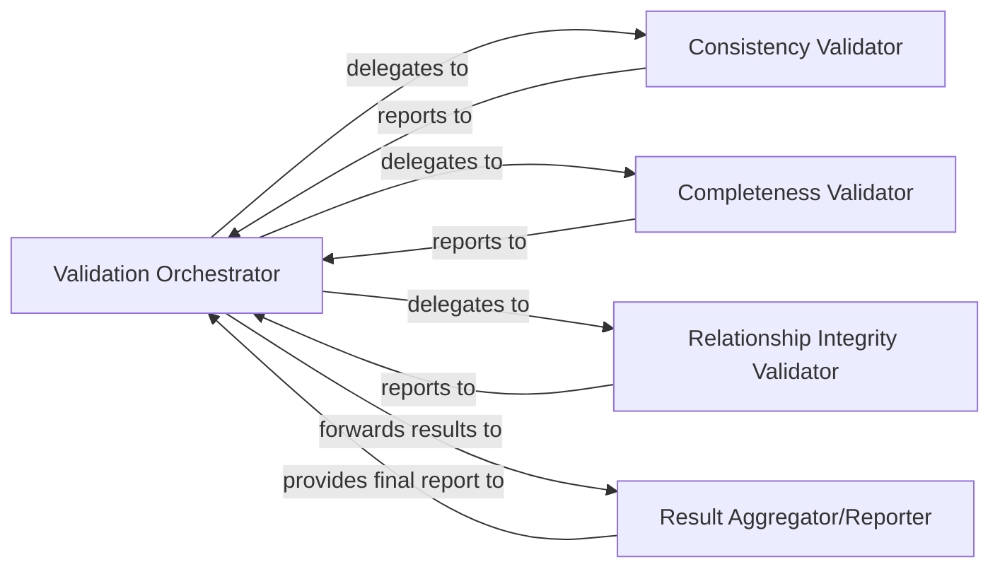

## Details

Performs comprehensive validation of generated analysis results, checking consistency, completeness, and correctness, including cluster coverage and component relationship integrity.

### Validation Orchestrator
Manages the overall validation workflow, coordinating different validation checks and aggregating their results. It acts as the entry point for initiating validation processes.

**Related Classes/Methods**:

- <a href="https://github.com/CodeBoarding/CodeBoarding/blob/main/.codeboardingagents/validation.py" target="_blank" rel="noopener noreferrer">`agents.validation.ValidationOrchestrator`</a>

### Consistency Validator
Checks for logical consistency across various analysis artifacts, ensuring that different views or representations of the codebase do not contradict each other.

**Related Classes/Methods**:

- <a href="https://github.com/CodeBoarding/CodeBoarding/blob/main/.codeboardingagents/validation.py" target="_blank" rel="noopener noreferrer">`agents.validation.ConsistencyValidator`</a>

### Completeness Validator
Verifies that all expected elements, relationships, or coverage metrics are present in the analysis results, identifying any missing information.

**Related Classes/Methods**:

- <a href="https://github.com/CodeBoarding/CodeBoarding/blob/main/.codeboardingagents/validation.py" target="_blank" rel="noopener noreferrer">`agents.validation.CompletenessValidator`</a>

### Relationship Integrity Validator
Focuses on validating the correctness and integrity of identified component relationships, ensuring they are well-formed and accurately reflect the codebase's structure.

**Related Classes/Methods**:

- <a href="https://github.com/CodeBoarding/CodeBoarding/blob/main/.codeboardingagents/validation.py" target="_blank" rel="noopener noreferrer">`agents.validation.RelationshipIntegrityValidator`</a>

### Result Aggregator/Reporter
Collects the outcomes from individual validation checks, compiles a comprehensive validation report, and potentially flags critical issues.

**Related Classes/Methods**:

- <a href="https://github.com/CodeBoarding/CodeBoarding/blob/main/.codeboardingagents/validation.py" target="_blank" rel="noopener noreferrer">`agents.validation.ResultAggregator`</a>

### [FAQ](https://github.com/CodeBoarding/GeneratedOnBoardings/tree/main?tab=readme-ov-file#faq)