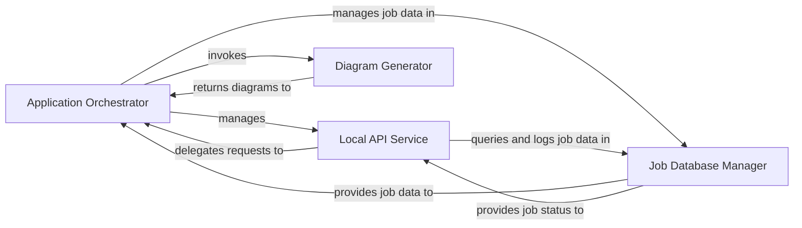

## Details

Orchestrates the main application workflow, manages analysis jobs, provides an API for external interaction, and generates diverse documentation and diagram outputs from analysis results. This component ties together the analysis results with user-consumable documentation and diagrams.

### Application Orchestrator
The central control unit that initializes the application, parses configurations, and orchestrates the entire codebase analysis and documentation generation pipeline. It coordinates the execution flow, manages repository processing, and initiates the analysis and output phases.

**Related Classes/Methods**:

- <a href="https://github.com/CodeBoarding/CodeBoarding/blob/main/.codeboardingmain.py" target="_blank" rel="noopener noreferrer">`main.main`</a>

### Local API Service
Provides a local web API for users to interact with the application. It handles requests to initiate, manage, and monitor documentation generation jobs, acting as the primary interface for external interaction.

**Related Classes/Methods**:

- <a href="https://github.com/CodeBoarding/CodeBoarding/blob/main/.codeboardingmain.py" target="_blank" rel="noopener noreferrer">`local_app.local_app`</a>

### Diagram Generator
Transforms the structured analysis results into various diagram formats (e.g., component, sequence, activity diagrams). It processes the output from static analysis to create visual representations of the codebase architecture.

**Related Classes/Methods**:

- <a href="https://github.com/CodeBoarding/CodeBoarding/blob/main/.codeboardingdiagram_analysis/diagram_generator.py" target="_blank" rel="noopener noreferrer">`diagram_analysis.diagram_generator.diagram_generator`</a>

### Job Database Manager
Manages the persistence of job-related data, including job status, configuration, and execution history, using a DuckDB database. It provides CRUD operations for job records.

**Related Classes/Methods**:

- <a href="https://github.com/CodeBoarding/CodeBoarding/blob/main/.codeboardingmain.py" target="_blank" rel="noopener noreferrer">`duckdb_crud.duckdb_crud`</a>

### [FAQ](https://github.com/CodeBoarding/GeneratedOnBoardings/tree/main?tab=readme-ov-file#faq)
