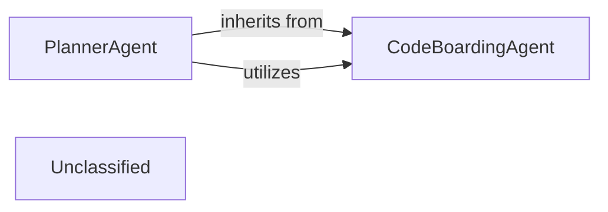

## Details

The Application Orchestrator subsystem acts as the central control unit, managing the entire workflow from initiating analysis to integrating results and coordinating output generation. It is primarily encapsulated within the `agents` package, utilizing `agents.planner_agent` and `agents.agent` modules. Within this subsystem, the `PlannerAgent` specializes in managing the initial planning phase of the code analysis, extending the `CodeBoardingAgent` which provides fundamental AI interaction and tool integration capabilities. This hierarchical structure enables specialized agents to coordinate workflow steps built upon a generic AI interaction layer, effectively implementing an "Orchestration Engine" pattern.

### CodeBoardingAgent
This is the foundational, generic AI agent within the system, serving as a core part of the "AI Interpretation Layer." It provides the essential capabilities for interacting with Large Language Models (LLMs) and integrating various specialized tools to gather and process information about the codebase. Its responsibilities include LLM initialization, API key management, and robust invocation and parsing of LLM responses.

**Related Classes/Methods**:

- <a href="https://github.com/CodeBoarding/CodeBoarding/blob/main/.codeboardingagents/agent.py" target="_blank" rel="noopener noreferrer">`agents.agent`</a>

### PlannerAgent
A specialized AI agent that extends `CodeBoardingAgent` to manage the initial planning phase of the code analysis workflow. This component is central to the "Orchestration Engine" as it determines which components of the codebase require deeper investigation based on initial insights, thereby dictating the initial steps and direction of the analysis pipeline.

**Related Classes/Methods**:

- <a href="https://github.com/CodeBoarding/CodeBoarding/blob/main/.codeboardingagents/planner_agent.py" target="_blank" rel="noopener noreferrer">`agents.planner_agent`</a>

### Unclassified
Component for all unclassified files and utility functions (Utility functions/External Libraries/Dependencies)

**Related Classes/Methods**: _None_

### [FAQ](https://github.com/CodeBoarding/GeneratedOnBoardings/tree/main?tab=readme-ov-file#faq)
