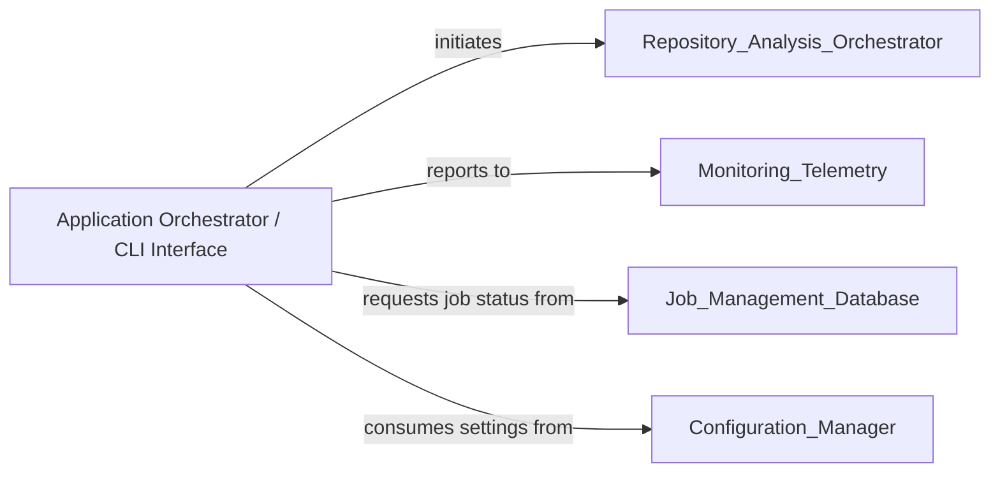

## Details

The primary control unit responsible for initiating and coordinating the entire analysis pipeline. It manages the overall application lifecycle, including project initialization, orchestrating the workflow, and managing temporary folders. It delegates specific setup and repository tasks to other components.

### Application Orchestrator / CLI Interface
Primary entry point for the CodeBoarding tool; parses CLI arguments, validates environment, performs health checks, coordinates the analysis workflow, initiates the Repository & Analysis Orchestrator, reports to Monitoring & Telemetry, interacts with Configuration Manager and Job Management Database, and manages temporary folders.

**Related Classes/Methods**:

- <a href="https://github.com/CodeBoarding/CodeBoarding/blob/main/.codeboardingmain.py" target="_blank" rel="noopener noreferrer">`repos.codeboarding.main.main`</a>

### [FAQ](https://github.com/CodeBoarding/GeneratedOnBoardings/tree/main?tab=readme-ov-file#faq)