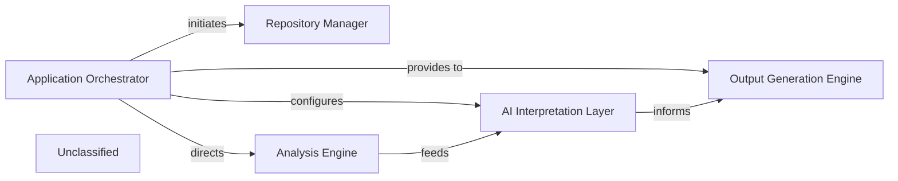

## Details

The CodeBoarding system operates through a centralized Application Orchestrator that manages the entire documentation generation workflow. It begins by interacting with the Repository Manager to acquire the source code, either by cloning remote repositories or processing local ones. Once the code is available, the Orchestrator directs it to the Analysis Engine, which is responsible for parsing the code, generating an intermediate representation, and performing static analysis. The results from the Analysis Engine are then fed into the AI Interpretation Layer, where AI models process the IR for semantic understanding. Finally, the Output Generation Engine takes the interpreted insights and produces comprehensive documentation. The Application Orchestrator also configures the AI Interpretation Layer, ensuring proper integration with underlying LLM providers. This modular design ensures a clear separation of concerns and a streamlined process for generating code documentation.

### Application Orchestrator [[Expand]](./Application_Orchestrator.md)
Manages the overall execution pipeline and workflow. Handles initial repository input (local or remote). Orchestrates the sequence of analysis steps, including repository cloning, analysis generation, and documentation output. Serves as the main entry point for the CLI.

**Related Classes/Methods**:

- <a href="https://github.com/CodeBoarding/CodeBoarding/blob/main/.codeboardingmain.py#L340-L431" target="_blank" rel="noopener noreferrer">`main`:340-431</a>
- <a href="https://github.com/CodeBoarding/CodeBoarding/blob/main/.codeboardingmain.py#L162-L216" target="_blank" rel="noopener noreferrer">`process_remote_repository`:162-216</a>
- <a href="https://github.com/CodeBoarding/CodeBoarding/blob/main/.codeboardingmain.py#L219-L247" target="_blank" rel="noopener noreferrer">`process_local_repository`:219-247</a>

### Repository Manager [[Expand]](./Repository_Manager.md)
Handles fetching and managing code repositories, including cloning remote repositories and preparing local ones for analysis.

**Related Classes/Methods**:

- <a href="https://github.com/CodeBoarding/CodeBoarding/blob/main/.codeboardingrepo_utils/__init__.py#L94-L111" target="_blank" rel="noopener noreferrer">`clone_repository`:94-111</a>

### Analysis Engine [[Expand]](./Analysis_Engine.md)
This component encapsulates the functionality previously split into "Code Parser", "Intermediate Representation (IR) Generator", and "Static Analysis Engine". It is responsible for transforming raw code into structured representations, generating a unified intermediate representation, and performing detailed code analysis on it.

**Related Classes/Methods**:

- <a href="https://github.com/CodeBoarding/CodeBoarding/blob/main/.codeboardingmain.py#L53-L66" target="_blank" rel="noopener noreferrer">`generate_analysis`:53-66</a>

### AI Interpretation Layer [[Expand]](./AI_Interpretation_Layer.md)
Processes the intermediate representation for semantic understanding using AI/LLMs. It leverages the LLM Provider Gateway to interact with various language models.

**Related Classes/Methods**:

- <a href="https://github.com/CodeBoarding/CodeBoarding/blob/main/.codeboardingagents/prompts/prompt_factory.py#L117-L122" target="_blank" rel="noopener noreferrer">`initialize_global_factory`:117-122</a>

### Output Generation Engine [[Expand]](./Output_Generation_Engine.md)
Produces documentation and other outputs based on the analysis results.

**Related Classes/Methods**:

- <a href="https://github.com/CodeBoarding/CodeBoarding/blob/main/.codeboardingmain.py#L69-L96" target="_blank" rel="noopener noreferrer">`generate_markdown_docs`:69-96</a>

### Unclassified
Component for all unclassified files and utility functions (Utility functions/External Libraries/Dependencies)

**Related Classes/Methods**: _None_

### [FAQ](https://github.com/CodeBoarding/GeneratedOnBoardings/tree/main?tab=readme-ov-file#faq)
