```mermaid
graph LR
    CLI_and_Environment_Setup["CLI and Environment Setup"]
    Repository_Acquisition_Management["Repository Acquisition & Management"]
    Static_Analysis_Orchestrator["Static Analysis Orchestrator"]
    Documentation_Generation_Orchestrator["Documentation Generation Orchestrator"]
    Output_Publication_Cleanup["Output Publication & Cleanup"]
    Unclassified["Unclassified"]
    CLI_and_Environment_Setup -- "provides configuration to" --> Repository_Acquisition_Management
    CLI_and_Environment_Setup -- "provides configuration to" --> Static_Analysis_Orchestrator
    Repository_Acquisition_Management -- "receives configuration from" --> CLI_and_Environment_Setup
    Repository_Acquisition_Management -- "invokes" --> Static_Analysis_Orchestrator
    Repository_Acquisition_Management -- "invokes" --> Documentation_Generation_Orchestrator
    Repository_Acquisition_Management -- "calls" --> Output_Publication_Cleanup
    Static_Analysis_Orchestrator -- "receives codebase from" --> Repository_Acquisition_Management
    Static_Analysis_Orchestrator -- "produces AnalysisInsights for" --> Documentation_Generation_Orchestrator
    Documentation_Generation_Orchestrator -- "receives AnalysisInsights from" --> Static_Analysis_Orchestrator
    Documentation_Generation_Orchestrator -- "produces markdown files for" --> Output_Publication_Cleanup
    Output_Publication_Cleanup -- "receives files from" --> Documentation_Generation_Orchestrator
    Output_Publication_Cleanup -- "receives upload instructions from" --> Repository_Acquisition_Management
```

## Details

The CodeBoarding application is designed to automate the generation of onboarding documentation for both local and remote Git repositories. It operates by first setting up the command-line interface and validating environment variables. Subsequently, it acquires and manages the specified code repositories, either by cloning remote ones or processing local paths. The core functionality involves orchestrating static code analysis to extract insights, which are then used to generate comprehensive markdown documentation. Finally, the generated outputs are published to a designated directory, with an option to upload them to a remote repository, followed by the cleanup of temporary resources. This modular design ensures a clear separation of concerns, facilitating maintainability and extensibility.

### CLI and Environment Setup
This component is responsible for defining, parsing, and validating command-line arguments and ensuring that all necessary environment variables (e.g., API keys) are correctly configured before the main application logic proceeds.

**Related Classes/Methods**:

- <a href="https://github.com/CodeBoarding/CodeBoarding/blob/main/.codeboardingmain.py#L296-L337" target="_blank" rel="noopener noreferrer">`main.define_cli_arguments`:296-337</a>
- <a href="https://github.com/CodeBoarding/CodeBoarding/blob/main/.codeboardingmain.py#L273-L293" target="_blank" rel="noopener noreferrer">`main.validate_arguments`:273-293</a>
- <a href="https://github.com/CodeBoarding/CodeBoarding/blob/main/.codeboardingmain.py#L24-L41" target="_blank" rel="noopener noreferrer">`main.validate_env_vars`:24-41</a>
- <a href="https://github.com/CodeBoarding/CodeBoarding/blob/main/.codeboarding." target="_blank" rel="noopener noreferrer">`os.getenv`</a>

### Repository Acquisition & Management
Manages the entire lifecycle of code repositories, including cloning remote repositories, setting up and tearing down temporary working directories, and checking for the existence of previously generated documentation. It orchestrates both remote and local repository processing flows.

**Related Classes/Methods**:

- <a href="https://github.com/CodeBoarding/CodeBoarding/blob/main/.codeboardingmain.py#L162-L216" target="_blank" rel="noopener noreferrer">`main.process_remote_repository`:162-216</a>
- <a href="https://github.com/CodeBoarding/CodeBoarding/blob/main/.codeboardingmain.py#L219-L247" target="_blank" rel="noopener noreferrer">`main.process_local_repository`:219-247</a>
- <a href="https://github.com/CodeBoarding/CodeBoarding/blob/main/.codeboardingmain.py#L44-L50" target="_blank" rel="noopener noreferrer">`main.onboarding_materials_exist`:44-50</a>
- <a href="https://github.com/CodeBoarding/CodeBoarding/blob/main/.codeboardingrepo_utils/__init__.py#L87-L91" target="_blank" rel="noopener noreferrer">`repo_utils.get_repo_name`:87-91</a>
- <a href="https://github.com/CodeBoarding/CodeBoarding/blob/main/.codeboardingrepo_utils/__init__.py#L94-L111" target="_blank" rel="noopener noreferrer">`repo_utils.clone_repository`:94-111</a>
- <a href="https://github.com/CodeBoarding/CodeBoarding/blob/main/.codeboarding." target="_blank" rel="noopener noreferrer">`repo_utils.get_branch`</a>
- <a href="https://github.com/CodeBoarding/CodeBoarding/blob/main/.codeboardingutils.py#L18-L22" target="_blank" rel="noopener noreferrer">`utils.create_temp_repo_folder`:18-22</a>
- <a href="https://github.com/CodeBoarding/CodeBoarding/blob/main/.codeboardingutils.py#L25-L29" target="_blank" rel="noopener noreferrer">`utils.remove_temp_repo_folder`:25-29</a>
- <a href="https://github.com/CodeBoarding/CodeBoarding/blob/main/.codeboarding." target="_blank" rel="noopener noreferrer">`requests`</a>

### Static Analysis Orchestrator
This component initiates and manages the static code analysis process. It delegates the actual analysis tasks to the `DiagramGenerator` and handles scenarios for both initial full analysis and subsequent partial updates of specific components.

**Related Classes/Methods**:

- <a href="https://github.com/CodeBoarding/CodeBoarding/blob/main/.codeboardingmain.py#L53-L66" target="_blank" rel="noopener noreferrer">`main.generate_analysis`:53-66</a>
- <a href="https://github.com/CodeBoarding/CodeBoarding/blob/main/.codeboardingmain.py#L99-L146" target="_blank" rel="noopener noreferrer">`main.partial_update`:99-146</a>
- <a href="https://github.com/CodeBoarding/CodeBoarding/blob/main/.codeboardingdiagram_analysis/diagram_generator.py#L34-L293" target="_blank" rel="noopener noreferrer">`diagram_analysis.DiagramGenerator`:34-293</a>
- <a href="https://github.com/CodeBoarding/CodeBoarding/blob/main/.codeboardingagents/agent_responses.py" target="_blank" rel="noopener noreferrer">`agents.agent_responses.AnalysisInsights`</a>

### Documentation Generation Orchestrator
Responsible for transforming the structured insights obtained from the static analysis into user-friendly markdown documentation. It coordinates the generation of individual markdown files based on the analysis results.

**Related Classes/Methods**:

- <a href="https://github.com/CodeBoarding/CodeBoarding/blob/main/.codeboardingmain.py#L69-L96" target="_blank" rel="noopener noreferrer">`main.generate_markdown_docs`:69-96</a>
- <a href="https://github.com/CodeBoarding/CodeBoarding/blob/main/.codeboardingoutput_generators/markdown.py" target="_blank" rel="noopener noreferrer">`output_generators.markdown.generate_markdown_file`</a>
- <a href="https://github.com/CodeBoarding/CodeBoarding/blob/main/.codeboarding." target="_blank" rel="noopener noreferrer">`repo_utils.get_branch`</a>

### Output Publication & Cleanup
Manages the final stages of the workflow, including copying all generated markdown and JSON files from temporary locations to the designated output directory and, if applicable, uploading the generated onboarding materials to a remote destination. It also handles the cleanup of temporary resources.

**Related Classes/Methods**:

- <a href="https://github.com/CodeBoarding/CodeBoarding/blob/main/.codeboardingmain.py#L250-L270" target="_blank" rel="noopener noreferrer">`main.copy_files`:250-270</a>
- <a href="https://github.com/CodeBoarding/CodeBoarding/blob/main/.codeboarding." target="_blank" rel="noopener noreferrer">`shutil.copy2`</a>
- <a href="https://github.com/CodeBoarding/CodeBoarding/blob/main/.codeboardingrepo_utils/__init__.py#L135-L162" target="_blank" rel="noopener noreferrer">`repo_utils.upload_onboarding_materials`:135-162</a>
- <a href="https://github.com/CodeBoarding/CodeBoarding/blob/main/.codeboardingutils.py#L25-L29" target="_blank" rel="noopener noreferrer">`utils.remove_temp_repo_folder`:25-29</a>

### Unclassified
Component for all unclassified files and utility functions (Utility functions/External Libraries/Dependencies)

**Related Classes/Methods**: _None_

### [FAQ](https://github.com/CodeBoarding/GeneratedOnBoardings/tree/main?tab=readme-ov-file#faq)
