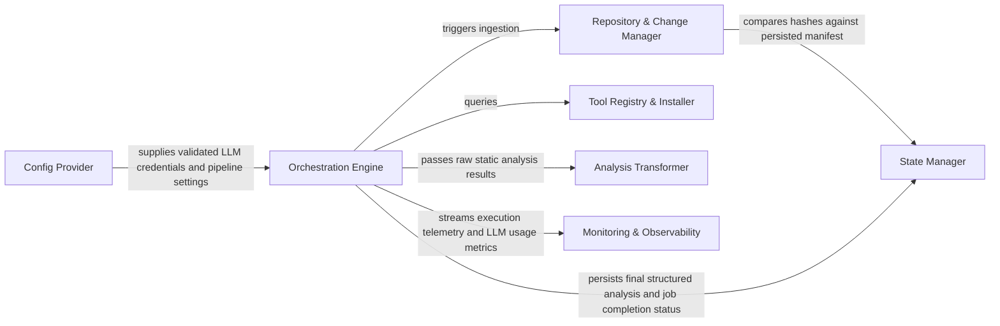

## Details

Manages the overall application lifecycle, including project initialization, repository operations (cloning, updating), change detection, and orchestrating the analysis workflow. It also handles the initial setup and environment configuration for the analysis tools.

### Orchestration Engine
Acts as the central controller for the agentic pipeline. It validates CLI arguments, manages the high‑level workflow (Clone → Analyze → Document), and updates environment‑specific configurations like VS Code settings.

**Related Classes/Methods**:

- `codeboarding.main.main`
- `codeboarding.orchestrator.PipelineManager`
- `codeboarding.vscode_config.VSCodeConfigUpdater`

### Repository & Change Manager
Manages the lifecycle of the target source code. It handles Git operations (cloning/checkout), applies exclusion filters (.gitignore), and performs structural diffing to identify modified components for incremental analysis.

**Related Classes/Methods**:

- `codeboarding.repo_utils.change_detector.ChangeDetector`
- `codeboarding.repo_utils.git_operations.GitHandler`
- `codeboarding.repo_utils.filter.PathFilter`

### Tool Registry & Installer
A plugin‑style registry that manages the lifecycle of Language Server Protocol (LSP) binaries and other static analysis tools. It handles platform‑specific dependency checks (e.g., NPM, VCPP) and automated installations.

**Related Classes/Methods**:

- `codeboarding.tool_registry.Registry`
- `codeboarding.installers.base_installer.BaseInstaller`
- `codeboarding.installers.npm_installer.NPMInstaller`

### Analysis Transformer
Normalizes raw output from various static analysis tools into a UnifiedAnalysisJson schema. It also calculates component hierarchies and generates Mermaid.js diagrams for visual documentation.

**Related Classes/Methods**:

- `codeboarding.transformers.unified_transformer.UnifiedTransformer`
- `codeboarding.transformers.mermaid_generator.MermaidGenerator`
- `codeboarding.transformers.hierarchy_builder.HierarchyBuilder`

### State Manager
Provides a persistence layer for job metadata, file hashes, and analysis results using DuckDB. It ensures that the system can recover from interruptions and track the status of long‑running documentation tasks.

**Related Classes/Methods**:

- `codeboarding.state.duckdb_store.DuckDBStore`
- `codeboarding.state.manifest.ManifestManager`
- `codeboarding.state.job_repository.JobRepository`

### Config Provider
Centralizes the loading and validation of system environment variables and LLM‑specific configurations (OpenAI, Anthropic, Ollama, etc.). It ensures that credentials and model parameters are correctly injected into the orchestrator.

**Related Classes/Methods**:

- `codeboarding.config.llm_config.LLMConfig`
- `codeboarding.config.env_loader.EnvLoader`
- `codeboarding.config.validator.ConfigValidator`

### Monitoring & Observability
A tracing framework specifically designed for LLM‑powered systems. It tracks token usage, execution costs, and step‑by‑step agentic reasoning, persisting telemetry for audit and debugging.

**Related Classes/Methods**:

- `codeboarding.monitoring.tracer.Tracer`
- `codeboarding.monitoring.usage_tracker.UsageTracker`
- `codeboarding.monitoring.logger.TelemetryLogger`

### [FAQ](https://github.com/CodeBoarding/GeneratedOnBoardings/tree/main?tab=readme-ov-file#faq)