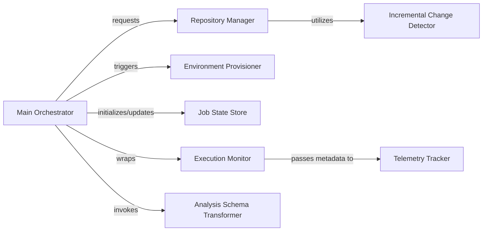

## Details

Manages the overall application lifecycle, including project initialization, repository operations (cloning, updating), change detection, and orchestrating the analysis workflow. It also handles the initial setup and environment configuration for the analysis tools.

### Main Orchestrator
Central entry point handling CLI arguments, global configuration, and coordinating the high-level execution flow of the analysis pipeline.

**Related Classes/Methods**:

- <a href="https://github.com/CodeBoarding/CodeBoarding/blob/main/.codeboardingmain.py" target="_blank" rel="noopener noreferrer">`codeboarding.main:main`</a>

### Repository Manager
Manages git operations (cloning, checkout) and applies file filtering via .gitignore and .codeboardingignore.

**Related Classes/Methods**:

- <a href="https://github.com/CodeBoarding/CodeBoarding/blob/main/.codeboardingrepo_utils/change_detector.py" target="_blank" rel="noopener noreferrer">`codeboarding.repo_utils.change_detector:RepositoryManager`</a>

### Incremental Change Detector
Analyzes git diffs to identify added or modified files, enabling partial re‑analysis of the codebase.

**Related Classes/Methods**:

- <a href="https://github.com/CodeBoarding/CodeBoarding/blob/main/.codeboardingrepo_utils/change_detector.py" target="_blank" rel="noopener noreferrer">`codeboarding.repo_utils.change_detector:IncrementalChangeDetector`</a>

### Environment Provisioner
Ensures external dependencies (JDTLS LSP, Node.js, platform‑specific binaries) are installed and available before analysis starts.

**Related Classes/Methods**:

- <a href="https://github.com/CodeBoarding/CodeBoarding/blob/main/.codeboardinginstall.py" target="_blank" rel="noopener noreferrer">`codeboarding.provisioner`</a>

### Job State Store
Persists job status, metadata, and analysis results in DuckDB to enable recovery and cross‑session continuity.

**Related Classes/Methods**:

- <a href="https://github.com/CodeBoarding/CodeBoarding/blob/main/.codeboardingduckdb_crud.py" target="_blank" rel="noopener noreferrer">`codeboarding.state_store`</a>

### Execution Monitor
Provides tracing infrastructure via decorators to track pipeline progress, capture timing, and emit structured execution events.

**Related Classes/Methods**:

- <a href="https://github.com/CodeBoarding/CodeBoarding/blob/main/.codeboardingmonitoring/__init__.py" target="_blank" rel="noopener noreferrer">`codeboarding.monitor`</a>

### Telemetry Tracker
Captures real‑time statistics, including LLM token usage and tool performance metrics for observability.

**Related Classes/Methods**:

- <a href="https://github.com/CodeBoarding/CodeBoarding/blob/main/.codeboardingmonitoring/stats.py" target="_blank" rel="noopener noreferrer">`codeboarding.telemetry`</a>

### Analysis Schema Transformer
Normalizes diverse raw analysis results into the UnifiedAnalysisJson schema for downstream documentation generation.

**Related Classes/Methods**:

- <a href="https://github.com/CodeBoarding/CodeBoarding/blob/main/.codeboardingdiagram_analysis/analysis_json.py" target="_blank" rel="noopener noreferrer">`codeboarding.transformer`</a>

### [FAQ](https://github.com/CodeBoarding/GeneratedOnBoardings/tree/main?tab=readme-ov-file#faq)