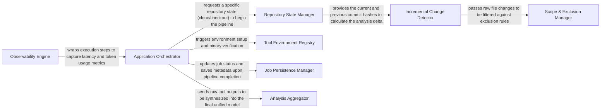

## Details

Manages the overall application lifecycle, including project initialization, repository operations (cloning, updating), change detection, and orchestrating the analysis workflow. It also handles the initial setup and environment configuration for the analysis tools.

### Application Orchestrator
The central brain of the system. It handles CLI entry points, validates the environment (API keys, paths), and coordinates the execution flow between full scans and incremental updates.

**Related Classes/Methods**:

- <a href="https://github.com/CodeBoarding/CodeBoarding/blob/main/.codeboardingmain.py" target="_blank" rel="noopener noreferrer">`repos.codeboarding.main.main`</a>
- <a href="https://github.com/CodeBoarding/CodeBoarding/blob/main/.codeboardingmain.py" target="_blank" rel="noopener noreferrer">`repos.codeboarding.orchestrator.PipelineManager`</a>
- <a href="https://github.com/CodeBoarding/CodeBoarding/blob/main/.codeboardingmain.py" target="_blank" rel="noopener noreferrer">`repos.codeboarding.config.EnvironmentValidator`</a>

### Repository State Manager
Manages the physical lifecycle of the target codebase. It handles cloning, branch switching, and generates unique state hashes to ensure analysis reproducibility.

**Related Classes/Methods**:

- <a href="https://github.com/CodeBoarding/CodeBoarding/blob/main/.codeboardingrepo_utils/errors.py" target="_blank" rel="noopener noreferrer">`repos.codeboarding.repository.RepositoryManager`</a>
- <a href="https://github.com/CodeBoarding/CodeBoarding/blob/main/.codeboardingrepo_utils/errors.py" target="_blank" rel="noopener noreferrer">`repos.codeboarding.repository.StateHasher`</a>
- <a href="https://github.com/CodeBoarding/CodeBoarding/blob/main/.codeboardingrepo_utils/errors.py" target="_blank" rel="noopener noreferrer">`repos.codeboarding.repository.ErrorHandler`</a>

### Incremental Change Detector
Optimizes performance by identifying what has changed since the last run. It compares git commit hashes and file-level diffs to determine the minimal set of files requiring re-analysis.

**Related Classes/Methods**:

- <a href="https://github.com/CodeBoarding/CodeBoarding/blob/main/.codeboardingrepo_utils/change_detector.py" target="_blank" rel="noopener noreferrer">`repos.codeboarding.repository.ChangeDetector`</a>
- <a href="https://github.com/CodeBoarding/CodeBoarding/blob/main/.codeboardingrepo_utils/change_detector.py" target="_blank" rel="noopener noreferrer">`repos.codeboarding.repository.DiffEngine`</a>

### Tool Environment Registry
Acts as a package manager for the analysis engine. It discovers, installs, and resolves paths for external binaries like LSP servers (Python/TypeScript) and Tokei across different OS platforms.

**Related Classes/Methods**:

- <a href="https://github.com/CodeBoarding/CodeBoarding/blob/main/.codeboardinginstall.py" target="_blank" rel="noopener noreferrer">`repos.codeboarding.tools.Registry`</a>
- <a href="https://github.com/CodeBoarding/CodeBoarding/blob/main/.codeboardinginstall.py" target="_blank" rel="noopener noreferrer">`repos.codeboarding.tools.BinaryInstaller`</a>
- <a href="https://github.com/CodeBoarding/CodeBoarding/blob/main/.codeboardinginstall.py" target="_blank" rel="noopener noreferrer">`repos.codeboarding.tools.PathResolver`</a>

### Scope & Exclusion Manager
Defines the "effective analysis area" by parsing `.codeboardingignore` files. It filters out noise such as build artifacts, node_modules, and test suites.

**Related Classes/Methods**:

- <a href="https://github.com/CodeBoarding/CodeBoarding/blob/main/.codeboardingrepo_utils/ignore.py" target="_blank" rel="noopener noreferrer">`repos.codeboarding.scope.IgnoreManager`</a>
- <a href="https://github.com/CodeBoarding/CodeBoarding/blob/main/.codeboardingrepo_utils/ignore.py" target="_blank" rel="noopener noreferrer">`repos.codeboarding.scope.PathFilter`</a>

### Job Persistence Manager
The system's memory. It uses DuckDB to store job metadata, execution status, and links repository versions to specific analysis results for historical tracking.

**Related Classes/Methods**:

- <a href="https://github.com/CodeBoarding/CodeBoarding/blob/main/.codeboardingduckdb_crud.py" target="_blank" rel="noopener noreferrer">`repos.codeboarding.persistence.DuckDBClient`</a>
- <a href="https://github.com/CodeBoarding/CodeBoarding/blob/main/.codeboardingduckdb_crud.py" target="_blank" rel="noopener noreferrer">`repos.codeboarding.persistence.JobStore`</a>

### Analysis Aggregator
A transformation layer that takes raw output from various static analysis tools and maps them into a `UnifiedAnalysisJson` model, preparing the data for LLM consumption.

**Related Classes/Methods**:

- <a href="https://github.com/CodeBoarding/CodeBoarding/blob/main/.codeboardingdiagram_analysis/analysis_json.py" target="_blank" rel="noopener noreferrer">`repos.codeboarding.aggregator.DataSynthesizer`</a>
- <a href="https://github.com/CodeBoarding/CodeBoarding/blob/main/.codeboardingdiagram_analysis/analysis_json.py" target="_blank" rel="noopener noreferrer">`repos.codeboarding.models.UnifiedAnalysisJson`</a>

### Observability Engine
Monitors the health and costs of the pipeline. It tracks LLM token usage, tool execution latency, and provides telemetry for the agentic workflows.

**Related Classes/Methods**:

- <a href="https://github.com/CodeBoarding/CodeBoarding/blob/main/.codeboardinghealth_main.py" target="_blank" rel="noopener noreferrer">`repos.codeboarding.observability.MetricsCollector`</a>
- <a href="https://github.com/CodeBoarding/CodeBoarding/blob/main/.codeboardinghealth_main.py" target="_blank" rel="noopener noreferrer">`repos.codeboarding.observability.MonitoringMixin`</a>
- <a href="https://github.com/CodeBoarding/CodeBoarding/blob/main/.codeboardinghealth_main.py" target="_blank" rel="noopener noreferrer">`repos.codeboarding.observability.TelemetryStreamer`</a>

### [FAQ](https://github.com/CodeBoarding/GeneratedOnBoardings/tree/main?tab=readme-ov-file#faq)