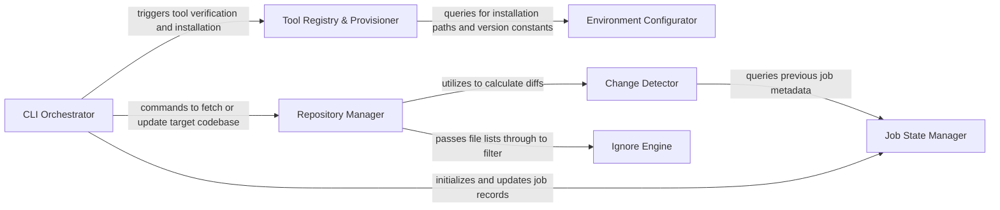

## Details

Manages the overall application lifecycle, including project initialization, repository operations (cloning, updating), change detection, and orchestrating the analysis workflow. It also handles the initial setup and environment configuration for the analysis tools.

### CLI Orchestrator
The primary controller that parses command‑line arguments, validates the environment, and sequences the high‑level pipeline flow.

**Related Classes/Methods**:

- <a href="https://github.com/CodeBoarding/CodeBoarding/blob/main/.codeboardingmain.py" target="_blank" rel="noopener noreferrer">`main.py`</a>
- <a href="https://github.com/CodeBoarding/CodeBoarding/blob/main/.codeboardinghealth_main.py" target="_blank" rel="noopener noreferrer">`health_main.py`</a>

### Repository Manager
Handles Git operations including cloning, branch switching, and local filesystem path resolution for the target project.

**Related Classes/Methods**:

- <a href="https://github.com/CodeBoarding/CodeBoarding/blob/main/.codeboardingrepo_utils/change_detector.py" target="_blank" rel="noopener noreferrer">`repo_utils/change_detector.py`</a>

### Change Detector
Identifies modified files between analysis runs to enable incremental processing and optimize LLM usage.

**Related Classes/Methods**:

- <a href="https://github.com/CodeBoarding/CodeBoarding/blob/main/.codeboardingrepo_utils/change_detector.py" target="_blank" rel="noopener noreferrer">`git_diff.py`</a>

### Tool Registry & Provisioner
Manages the lifecycle, installation, and discovery of LSP servers (Python/TS) and binary tools like Tokei.

**Related Classes/Methods**:

- <a href="https://github.com/CodeBoarding/CodeBoarding/blob/main/.codeboardingtool_registry.py" target="_blank" rel="noopener noreferrer">`tool_registry.py`</a>
- <a href="https://github.com/CodeBoarding/CodeBoarding/blob/main/.codeboardinginstall.py" target="_blank" rel="noopener noreferrer">`install.py`</a>

### Job State Manager
Tracks the status (started, finished, error) and metadata of analysis tasks to support concurrency and recovery.

**Related Classes/Methods**:

- <a href="https://github.com/CodeBoarding/CodeBoarding/blob/main/.codeboardingduckdb_crud.py" target="_blank" rel="noopener noreferrer">`duckdb_crud.py`</a>

### Ignore Engine
Implements complex filtering logic (e.g., .gitignore patterns) to exclude non‑essential files from the analysis scope.

**Related Classes/Methods**:

- <a href="https://github.com/CodeBoarding/CodeBoarding/blob/main/.codeboardingrepo_utils/ignore.py" target="_blank" rel="noopener noreferrer">`ignore.py`</a>

### Environment Configurator
Provides centralized access to application constants, path resolution, and configuration overrides.

**Related Classes/Methods**:

- <a href="https://github.com/CodeBoarding/CodeBoarding/blob/main/.codeboardingconstants.py" target="_blank" rel="noopener noreferrer">`constants.py`</a>
- <a href="https://github.com/CodeBoarding/CodeBoarding/blob/main/.codeboardingutils.py" target="_blank" rel="noopener noreferrer">`utils.py`</a>

### [FAQ](https://github.com/CodeBoarding/GeneratedOnBoardings/tree/main?tab=readme-ov-file#faq)