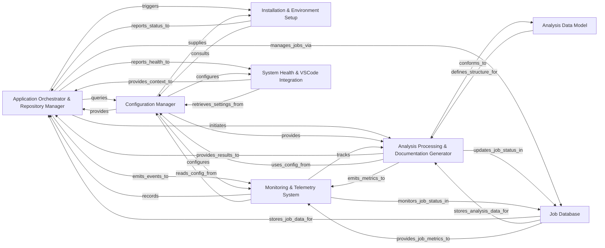

## Details

Manages the overall application lifecycle, including project initialization, repository operations (cloning, updating), change detection, and orchestrating the analysis workflow. It also handles the initial setup and environment configuration for the analysis tools.

### Application Orchestrator & Repository Manager
Manages the overall application lifecycle, including project initialization, repository operations (cloning, updating), change detection, and orchestrating the analysis workflow. It also handles the initial setup and environment configuration for the analysis tools. This component acts as the central coordinator, initiating and managing the sequence of operations.

**Related Classes/Methods**:

- <a href="https://github.com/CodeBoarding/CodeBoarding/blob/main/.codeboardingmain.py" target="_blank" rel="noopener noreferrer">`repos.codeboarding.main.main`</a>
- <a href="https://github.com/CodeBoarding/CodeBoarding/blob/main/.codeboardingrepo_utils/change_detector.py" target="_blank" rel="noopener noreferrer">`repos.codeboarding.repository.RepositoryManager`</a>
- <a href="https://github.com/CodeBoarding/CodeBoarding/blob/main/.codeboardingrepo_utils/change_detector.py" target="_blank" rel="noopener noreferrer">`repos.codeboarding.repository.ChangeDetector`</a>
- <a href="https://github.com/CodeBoarding/CodeBoarding/blob/main/.codeboardingrepo_utils/change_detector.py" target="_blank" rel="noopener noreferrer">`repos.codeboarding.orchestrator.Orchestrator`</a>
- <a href="https://github.com/CodeBoarding/CodeBoarding/blob/main/.codeboardingrepo_utils/change_detector.py" target="_blank" rel="noopener noreferrer">`repos.codeboarding.cli.parse_arguments`</a>

### Configuration Manager
Centralizes the management and retrieval of application‑wide configuration settings. Provides default configurations and allows for dynamic updates, ensuring consistent behavior across all components, including LLM providers, analysis tools, and output formats.

**Related Classes/Methods**:

- <a href="https://github.com/CodeBoarding/CodeBoarding/blob/main/.codeboardingconstants.py" target="_blank" rel="noopener noreferrer">`repos.codeboarding.config.Config`</a>
- <a href="https://github.com/CodeBoarding/CodeBoarding/blob/main/.codeboardingconstants.py" target="_blank" rel="noopener noreferrer">`repos.codeboarding.config.load_configuration`</a>
- <a href="https://github.com/CodeBoarding/CodeBoarding/blob/main/.codeboardingconstants.py" target="_blank" rel="noopener noreferrer">`repos.codeboarding.config.LLMProviderSettings`</a>
- <a href="https://github.com/CodeBoarding/CodeBoarding/blob/main/.codeboardingconstants.py" target="_blank" rel="noopener noreferrer">`repos.codeboarding.config.get_setting`</a>

### Installation & Environment Setup
Ensures necessary external tools, binaries (e.g., npm, JDTLS, VCPP redistributable), and language-specific environments are correctly installed and configured for static analysis and other operations. Updates static analysis configurations, acting as a critical prerequisite for a multi-language code analysis tool.

**Related Classes/Methods**:

- <a href="https://github.com/CodeBoarding/CodeBoarding/blob/main/.codeboardinginstall.py" target="_blank" rel="noopener noreferrer">`repos.codeboarding.env.setup_environment`</a>
- <a href="https://github.com/CodeBoarding/CodeBoarding/blob/main/.codeboardinginstall.py" target="_blank" rel="noopener noreferrer">`repos.codeboarding.env.ToolInstaller`</a>
- <a href="https://github.com/CodeBoarding/CodeBoarding/blob/main/.codeboardinginstall.py" target="_blank" rel="noopener noreferrer">`repos.codeboarding.env.LanguageEnvironment`</a>
- <a href="https://github.com/CodeBoarding/CodeBoarding/blob/main/.codeboardinginstall.py" target="_blank" rel="noopener noreferrer">`repos.codeboarding.env.update_static_analysis_config`</a>

### Monitoring & Telemetry System
Collects, processes, and persists runtime metrics, focusing on LLM usage, tool execution, and overall run statistics. Provides execution context and utilities for tracing and monitoring various parts of the system, essential for tracking performance, cost, and usage of LLM interactions and other tools.

**Related Classes/Methods**:

- <a href="https://github.com/CodeBoarding/CodeBoarding/blob/main/.codeboardingmonitoring/__init__.py" target="_blank" rel="noopener noreferrer">`repos.codeboarding.telemetry.TelemetryClient`</a>
- <a href="https://github.com/CodeBoarding/CodeBoarding/blob/main/.codeboardingmonitoring/__init__.py" target="_blank" rel="noopener noreferrer">`repos.codeboarding.telemetry.LLMUsageTracker`</a>
- <a href="https://github.com/CodeBoarding/CodeBoarding/blob/main/.codeboardingmonitoring/__init__.py" target="_blank" rel="noopener noreferrer">`repos.codeboarding.telemetry.MetricCollector`</a>
- <a href="https://github.com/CodeBoarding/CodeBoarding/blob/main/.codeboardingmonitoring/__init__.py" target="_blank" rel="noopener noreferrer">`repos.codeboarding.telemetry.TraceContext`</a>

### Analysis Data Model
Defines standardized data structures for representing code analysis results, including metadata, components, relations, and a unified analysis JSON format. Facilitates consistent data exchange between different stages of the analysis and generation pipeline.

**Related Classes/Methods**:

- <a href="https://github.com/CodeBoarding/CodeBoarding/blob/main/.codeboardingdiagram_analysis/analysis_json.py" target="_blank" rel="noopener noreferrer">`repos.codeboarding.datamodel.AnalysisResult`</a>
- <a href="https://github.com/CodeBoarding/CodeBoarding/blob/main/.codeboardingdiagram_analysis/analysis_json.py" target="_blank" rel="noopener noreferrer">`repos.codeboarding.datamodel.CodeComponent`</a>
- <a href="https://github.com/CodeBoarding/CodeBoarding/blob/main/.codeboardingdiagram_analysis/analysis_json.py" target="_blank" rel="noopener noreferrer">`repos.codeboarding.datamodel.Relationship`</a>
- <a href="https://github.com/CodeBoarding/CodeBoarding/blob/main/.codeboardingdiagram_analysis/analysis_json.py" target="_blank" rel="noopener noreferrer">`repos.codeboarding.datamodel.to_json_format`</a>

### Analysis Processing & Documentation Generator
Takes structured analysis data (conforming to the Analysis Data Model), processes it further (e.g., assigning IDs, extracting specific details), and transforms it into human‑readable documentation, typically in markdown format. This component implements the documentation generation aspect of the project.

**Related Classes/Methods**: _None_

### Job Database
Stores and manages the state and metadata of ongoing or completed analysis jobs using DuckDB. Provides CRUD operations for job information, enabling persistence and retrieval, supporting service‑oriented and pipeline architectures.

**Related Classes/Methods**:

- <a href="https://github.com/CodeBoarding/CodeBoarding/blob/main/.codeboardingduckdb_crud.py" target="_blank" rel="noopener noreferrer">`repos.codeboarding.jobdb.JobDatabase`</a>
- <a href="https://github.com/CodeBoarding/CodeBoarding/blob/main/.codeboardingduckdb_crud.py" target="_blank" rel="noopener noreferrer">`repos.codeboarding.jobdb.JobManager`</a>
- <a href="https://github.com/CodeBoarding/CodeBoarding/blob/main/.codeboardingduckdb_crud.py" target="_blank" rel="noopener noreferrer">`repos.codeboarding.jobdb.DuckDBConnector`</a>
- <a href="https://github.com/CodeBoarding/CodeBoarding/blob/main/.codeboardingduckdb_crud.py" target="_blank" rel="noopener noreferrer">`repos.codeboarding.jobdb.JobStatus`</a>

### System Health & VSCode Integration
Monitors the system's operational health, sets up logging, and provides integration points and configuration management specifically for a VS Code extension, enhancing the user experience within the IDE.

**Related Classes/Methods**:

- <a href="https://github.com/CodeBoarding/CodeBoarding/blob/main/.codeboardinghealth_main.py" target="_blank" rel="noopener noreferrer">`repos.codeboarding.health.SystemMonitor`</a>
- <a href="https://github.com/CodeBoarding/CodeBoarding/blob/main/.codeboardinghealth_main.py" target="_blank" rel="noopener noreferrer">`repos.codeboarding.vscode.VSCodeExtensionManager`</a>
- <a href="https://github.com/CodeBoarding/CodeBoarding/blob/main/.codeboardinghealth_main.py" target="_blank" rel="noopener noreferrer">`repos.codeboarding.logging.setup_logging`</a>
- <a href="https://github.com/CodeBoarding/CodeBoarding/blob/main/.codeboardinghealth_main.py" target="_blank" rel="noopener noreferrer">`repos.codeboarding.vscode.ExtensionConfig`</a>

### [FAQ](https://github.com/CodeBoarding/GeneratedOnBoardings/tree/main?tab=readme-ov-file#faq)