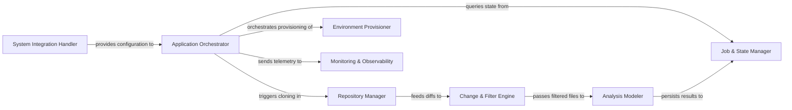

## Details

Manages the overall application lifecycle, including project initialization, repository operations (cloning, updating), change detection, and orchestrating the analysis workflow. It also handles the initial setup and environment configuration for the analysis tools.

### Application Orchestrator
The central control plane that manages the application lifecycle. It validates environment variables, processes CLI arguments, and sequences the execution flow between local and remote repository analysis.

**Related Classes/Methods**:

- <a href="https://github.com/CodeBoarding/CodeBoarding/blob/main/.codeboardingmain.py" target="_blank" rel="noopener noreferrer">`codeboarding.main`</a>

### Repository Manager
Handles low-level Git operations, including cloning remote repositories, checking out specific commits, and normalizing file paths for cross‑platform consistency.

**Related Classes/Methods**:

- <a href="https://github.com/CodeBoarding/CodeBoarding/blob/main/.codeboardingrepo_utils/change_detector.py" target="_blank" rel="noopener noreferrer">`codeboarding.repo_utils.change_detector`</a>

### Change & Filter Engine
A deterministic layer that identifies structural modifications between commits and applies exclusion rules (e.g., .gitignore) to ensure only relevant source files are analyzed.

**Related Classes/Methods**:

- <a href="https://github.com/CodeBoarding/CodeBoarding/blob/main/.codeboardingrepo_utils/change_detector.py" target="_blank" rel="noopener noreferrer">`codeboarding.repo_utils.change_detector.ChangeDetector`</a>
- <a href="https://github.com/CodeBoarding/CodeBoarding/blob/main/.codeboardingrepo_utils/change_detector.py" target="_blank" rel="noopener noreferrer">`codeboarding.repo_utils.change_detector.RepoIgnoreManager`</a>

### Job & State Manager
Manages the persistence of analysis metadata and incremental state using DuckDB. It allows the system to resume interrupted jobs and perform delta‑updates.

**Related Classes/Methods**:

- <a href="https://github.com/CodeBoarding/CodeBoarding/blob/main/.codeboardingduckdb_crud.py" target="_blank" rel="noopener noreferrer">`codeboarding.duckdb_crud`</a>

### Environment Provisioner
Automates the setup of the execution environment by installing and verifying external dependencies like LSP binaries (e.g., JDTLS) and Node.js.

**Related Classes/Methods**:

- <a href="https://github.com/CodeBoarding/CodeBoarding/blob/main/.codeboardinginstall.py" target="_blank" rel="noopener noreferrer">`codeboarding.environment_provisioner`</a>

### Analysis Modeler
Transforms raw analysis data into a structured UnifiedAnalysisJson schema, handling recursive component extraction and generating human‑readable Markdown documentation.

**Related Classes/Methods**: _None_

### Monitoring & Observability
A cross‑cutting suite that tracks LLM token usage, tool execution latency, and provides step‑by‑step execution traces for debugging agentic workflows.

**Related Classes/Methods**: _None_

### System Integration Handler
Manages host‑specific configurations, such as VS Code extension settings and system health checks, to ensure the tool is compatible with the user's environment.

**Related Classes/Methods**:

- <a href="https://github.com/CodeBoarding/CodeBoarding/blob/main/.codeboardinghealth_main.py" target="_blank" rel="noopener noreferrer">`codeboarding.system_integration_handler`</a>

### [FAQ](https://github.com/CodeBoarding/GeneratedOnBoardings/tree/main?tab=readme-ov-file#faq)