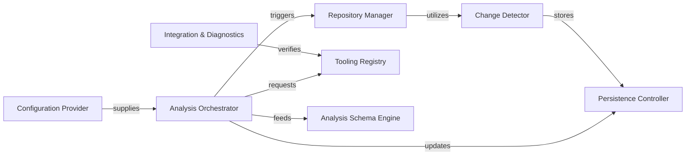

## Details

Manages the overall application lifecycle, including project initialization, repository operations (cloning, updating), change detection, and orchestrating the analysis workflow. It also handles the initial setup and environment configuration for the analysis tools.

### Analysis Orchestrator
Coordinates the end-to-end workflow, from initialization to final schema generation.

**Related Classes/Methods**:

- `analysis.orchestrator`

### Repository Manager
Handles Git operations (clone, pull) and manages the local workspace.

**Related Classes/Methods**:

- `repo_utils.repository_manager`

### Change Detector
Calculates file hashes and diffs to enable incremental analysis updates.

**Related Classes/Methods**:

- `repo_utils.change_detector`

### Tooling Registry
Provisions and resolves paths for static analysis binaries (e.g., Pyright, JDTLS).

**Related Classes/Methods**:

- `tools.registry`

### Analysis Schema Engine
Transforms raw analysis data into the UnifiedAnalysisJson format.

**Related Classes/Methods**:

- `schema.engine`

### Persistence Controller
Manages long-term storage of job states and metadata using DuckDB.

**Related Classes/Methods**:

- `persistence.db`

### Configuration Provider
Resolves and validates LLM provider settings and environment variables.

**Related Classes/Methods**:

- `config.provider`

### Integration & Diagnostics
Performs system health checks and ensures VS Code compatibility.

**Related Classes/Methods**:

- `diagnostics.health`

### [FAQ](https://github.com/CodeBoarding/GeneratedOnBoardings/tree/main?tab=readme-ov-file#faq)