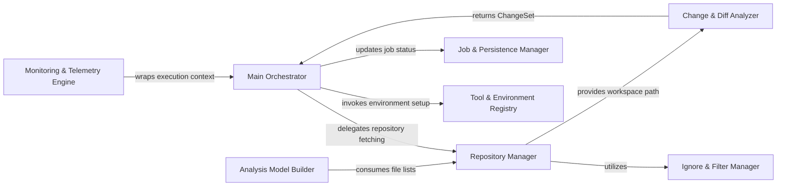

## Details

Manages the overall application lifecycle, including project initialization, repository operations (cloning, updating), change detection, and orchestrating the analysis workflow. It also handles the initial setup and environment configuration for the analysis tools.

### Main Orchestrator
The central coordinator of the analysis pipeline. It manages the end‑to‑end lifecycle, from CLI argument validation and configuration loading to delegating tasks across the repository, analysis, and persistence layers.

**Related Classes/Methods**:

- `repos.codeboarding.main.main`
- `repos.codeboarding.orchestrator.Orchestrator`
- `repos.codeboarding.config.UserConfig`

### Repository Manager
Handles all Git‑level operations and local workspace management. It is responsible for cloning, branch detection, and providing a normalized file system interface for subsequent analysis stages.

**Related Classes/Methods**:

- `repos.codeboarding.repository.RepositoryManager`
- `repos.codeboarding.repository.RepoManager.clone_repo`
- `repos.codeboarding.repository.RepoManager.get_workspace_path`

### Change & Diff Analyzer
Enables incremental processing by identifying structural and content changes between commits. It extracts line‑level diffs to minimize the scope of LLM analysis to only modified components.

**Related Classes/Methods**:

- `repos.codeboarding.repository.ChangeDetector`
- `repos.codeboarding.repo_utils.change_detector.DiffAnalyzer`
- `repos.codeboarding.repo_utils.change_detector.git_diff`

### Tool & Environment Registry
Manages the external execution environment, including LSP binaries, Node.js dependencies, and system health checks. It ensures the host system is provisioned for static analysis.

**Related Classes/Methods**:

- `repos.codeboarding.tool_registry.ToolRegistry`
- `repos.codeboarding.tool_registry.Installer`
- `repos.codeboarding.health.health_main`

### Analysis Model Builder
The static analysis engine that constructs the UnifiedAnalysisJson. It maps code entities (classes, functions) into a hierarchical tree suitable for Mermaid.js visualization.

**Related Classes/Methods**:

- `repos.codeboarding.analysis.AnalysisModelBuilder`
- `repos.codeboarding.analysis.UnifiedAnalysisJson`
- `repos.codeboarding.analysis.ComponentJson`

### Job & Persistence Manager
Manages the state and history of analysis runs using DuckDB. It tracks job statuses, repository metadata, and allows for recovery or auditing of previous analysis tasks.

**Related Classes/Methods**:

- `repos.codeboarding.persistence.JobPersistence`
- `repos.codeboarding.persistence.DuckDBManager`

### Monitoring & Telemetry Engine
Captures execution traces, LLM token usage, and performance metrics. It provides an observability layer that wraps the orchestration lifecycle to provide real‑time streaming stats.

**Related Classes/Methods**:

- `repos.codeboarding.monitoring.MonitoringEngine`
- `repos.codeboarding.monitoring.MonitoringCallback`
- `repos.codeboarding.monitoring.MonitorContext`

### Ignore & Filter Manager
Implements file‑tree pruning logic based on .gitignore and internal exclusion patterns (e.g., codeboardingignore) to ensure only relevant source code is analyzed.

**Related Classes/Methods**:

- `repos.codeboarding.ignore.IgnoreManager`
- `repos.codeboarding.ignore.codeboardingignore`

### [FAQ](https://github.com/CodeBoarding/GeneratedOnBoardings/tree/main?tab=readme-ov-file#faq)