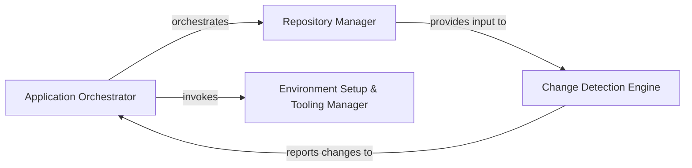

## Details

Manages the overall application lifecycle, including project initialization, repository operations (cloning, updating), change detection, and orchestrating the analysis workflow. It also handles the initial setup and environment configuration for the analysis tools.

### Application Orchestrator [[Expand]](./Application_Orchestrator.md)
The primary control unit responsible for initiating and coordinating the entire analysis pipeline. It manages the overall application lifecycle, including project initialization, orchestrating the workflow, and managing temporary folders. It delegates specific setup and repository tasks to other components.

**Related Classes/Methods**:

- <a href="https://github.com/CodeBoarding/CodeBoarding/blob/main/.codeboardingmain.py" target="_blank" rel="noopener noreferrer">`repos.codeboarding.main.main`</a>

### Repository Manager [[Expand]](./Repository_Manager.md)
Handles all interactions with code repositories, including cloning, updating, fetching branches, committing changes, and managing token storage. It also processes ignore rules and normalizes file system paths for consistent access across the system.

**Related Classes/Methods**:

- <a href="https://github.com/CodeBoarding/CodeBoarding/blob/main/.codeboardingrepo_utils/change_detector.py" target="_blank" rel="noopener noreferrer">`repos.codeboarding.repository.RepositoryManager`</a>

### Change Detection Engine [[Expand]](./Change_Detection_Engine.md)
Identifies modifications, additions, and deletions of files between different commits within a repository. It utilizes low-level Git diff utilities to provide a precise list of changed files, enabling focused analysis on only the relevant parts of the codebase.

**Related Classes/Methods**:

- <a href="https://github.com/CodeBoarding/CodeBoarding/blob/main/.codeboardingrepo_utils/change_detector.py" target="_blank" rel="noopener noreferrer">`repos.codeboarding.repository.ChangeDetector`</a>

### Environment Setup & Tooling Manager [[Expand]](./Environment_Setup_Tooling_Manager.md)
Manages the setup and configuration of the analysis environment. This includes downloading, installing, and configuring external language servers, package managers (e.g., npm, uv), and other necessary tools required for static analysis and code comprehension.

**Related Classes/Methods**:

- <a href="https://github.com/CodeBoarding/CodeBoarding/blob/main/.codeboardinginstall.py" target="_blank" rel="noopener noreferrer">`repos.codeboarding.environment.ToolingManager`</a>

### [FAQ](https://github.com/CodeBoarding/GeneratedOnBoardings/tree/main?tab=readme-ov-file#faq)