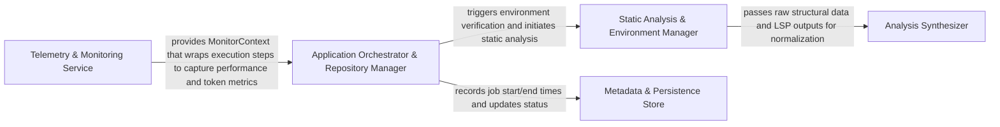

```mermaid
graph LR
    Application_Orchestrator_Repository_Manager["Application Orchestrator & Repository Manager"]
    Static_Analysis_Environment_Manager["Static Analysis & Environment Manager"]
    Analysis_Synthesizer["Analysis Synthesizer"]
    Metadata_Persistence_Store["Metadata & Persistence Store"]
    Telemetry_Monitoring_Service["Telemetry & Monitoring Service"]
    Application_Orchestrator_Repository_Manager -- "triggers environment verification and initiates static analysis" --> Static_Analysis_Environment_Manager
    Application_Orchestrator_Repository_Manager -- "records job start/end times and updates status" --> Metadata_Persistence_Store
    Static_Analysis_Environment_Manager -- "passes raw structural data and LSP outputs for normalization" --> Analysis_Synthesizer
    Telemetry_Monitoring_Service -- "provides MonitorContext that wraps execution steps to capture performance and token metrics" --> Application_Orchestrator_Repository_Manager
```

## Details

Manages the overall application lifecycle, including project initialization, repository operations (cloning, updating), change detection, and orchestrating the analysis workflow. It also handles the initial setup and environment configuration for the analysis tools.

### Application Orchestrator & Repository Manager
Manages the overall application lifecycle, including project initialization, repository operations (cloning, updating), change detection, and orchestrating the analysis workflow. It acts as the primary control surface for CLI and remote processing.

**Related Classes/Methods**:

- `repos.codeboarding.main.main`
- `repos.codeboarding.repository.RepositoryManager`
- `repos.codeboarding.repository.ChangeDetector`
- `repos.codeboarding.config.UserConfig`

### Static Analysis & Environment Manager
Ensures the execution environment is ready by downloading/installing Language Server Protocol (LSP) servers and verifying platform‑specific binaries. It executes deterministic static analysis (LSP/CFG) to extract structural code data.

**Related Classes/Methods**:

- `repos.codeboarding.tooling.LSPManager`
- `repos.codeboarding.tooling.BinaryResolver`
- `repos.codeboarding.analysis.StaticAnalyzer`

### Analysis Synthesizer
The "brain" of the data layer. It parses raw outputs from various static analysis tools and transforms them into the UnifiedAnalysisJson schema, mapping internal IDs to human‑readable component names.

**Related Classes/Methods**:

- `repos.codeboarding.synthesizer.AnalysisSynthesizer`
- `repos.codeboarding.schema.UnifiedAnalysisJson`
- `repos.codeboarding.synthesizer.ComponentMapper`

### Metadata & Persistence Store
Provides a persistence layer using DuckDB to track job history, status updates, and analysis metadata. This ensures reproducibility and allows the system to skip analysis for unchanged files.

**Related Classes/Methods**:

- `repos.codeboarding.store.MetadataStore`
- `repos.codeboarding.store.JobTracker`
- `repos.codeboarding.store.DuckDBClient`

### Telemetry & Monitoring Service
A cross‑cutting service that wraps execution steps in a MonitorContext. It specifically tracks LLM token usage and streams real‑time execution statistics to the filesystem for external monitoring.

**Related Classes/Methods**:

- `repos.codeboarding.telemetry.MonitorContext`
- `repos.codeboarding.telemetry.TokenUsageTracker`
- `repos.codeboarding.telemetry.TelemetryStreamer`

### [FAQ](https://github.com/CodeBoarding/GeneratedOnBoardings/tree/main?tab=readme-ov-file#faq)