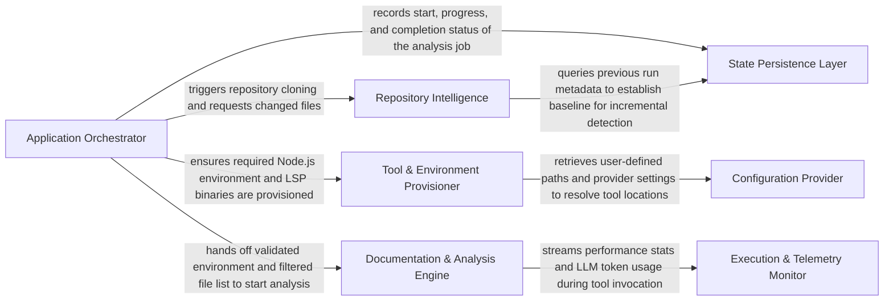

```mermaid
graph LR
    Application_Orchestrator["Application Orchestrator"]
    Repository_Intelligence["Repository Intelligence"]
    Tool_Environment_Provisioner["Tool & Environment Provisioner"]
    Documentation_Analysis_Engine["Documentation & Analysis Engine"]
    Execution_Telemetry_Monitor["Execution & Telemetry Monitor"]
    State_Persistence_Layer["State Persistence Layer"]
    Configuration_Provider["Configuration Provider"]
    Application_Orchestrator -- "triggers repository cloning and requests changed files" --> Repository_Intelligence
    Application_Orchestrator -- "ensures required Node.js environment and LSP binaries are provisioned" --> Tool_Environment_Provisioner
    Application_Orchestrator -- "hands off validated environment and filtered file list to start analysis" --> Documentation_Analysis_Engine
    Application_Orchestrator -- "records start, progress, and completion status of the analysis job" --> State_Persistence_Layer
    Repository_Intelligence -- "queries previous run metadata to establish baseline for incremental detection" --> State_Persistence_Layer
    Documentation_Analysis_Engine -- "streams performance stats and LLM token usage during tool invocation" --> Execution_Telemetry_Monitor
    Tool_Environment_Provisioner -- "retrieves user‑defined paths and provider settings to resolve tool locations" --> Configuration_Provider
```

## Details

Manages the overall application lifecycle, including project initialization, repository operations (cloning, updating), change detection, and orchestrating the analysis workflow. It also handles the initial setup and environment configuration for the analysis tools.

### Application Orchestrator
The central controller that parses CLI arguments, manages the high‑level execution pipeline, and sequences environment checks, repository updates, and analysis tasks.

**Related Classes/Methods**:

- `repos.codeboarding.main.main`
- `repos.codeboarding.orchestrator.Orchestrator`

### Repository Intelligence
Handles Git operations and incremental change detection. It normalizes file paths and applies exclusion patterns (.gitignore) to provide a filtered set of files for analysis.

**Related Classes/Methods**:

- `repos.codeboarding.repository.RepositoryManager`
- `repos.codeboarding.repository.ChangeDetector`
- `repos.codeboarding.repository.WorkspaceFilter`

### Tool & Environment Provisioner
Bootstraps the execution environment by managing nodeenv, downloading LSP binaries, and resolving cross‑platform executable paths for the analysis tools.

**Related Classes/Methods**:

- `repos.codeboarding.tools.ToolRegistry`
- `repos.codeboarding.environment.NodeEnvManager`
- `repos.codeboarding.tools.LSPResolver`

### Documentation & Analysis Engine
The core processing unit that transforms raw static analysis data into hierarchical component maps, renders Mermaid.js diagrams, and generates final Markdown documentation.

**Related Classes/Methods**:

- `repos.codeboarding.engine.AnalysisEngine`
- `repos.codeboarding.renderer.MarkdownRenderer`
- `repos.codeboarding.renderer.MermaidGenerator`

### Execution & Telemetry Monitor
Intercepts tool and LLM calls to track performance metrics, token usage, and execution logs, providing real‑time observability into the agentic workflow.

**Related Classes/Methods**:

- `repos.codeboarding.telemetry.TelemetryMonitor`
- `repos.codeboarding.telemetry.TokenTracker`
- `repos.codeboarding.logging.ExecutionLogger`

### State Persistence Layer
Manages the DuckDB database to store job statuses, analysis metadata, and historical run data, enabling resumability and incremental processing.

**Related Classes/Methods**:

- `repos.codeboarding.database.DuckDBManager`
- `repos.codeboarding.state.JobStateManager`

### Configuration Provider
Loads and validates user configurations (TOML), managing provider‑specific settings for LLMs and local tool paths.

**Related Classes/Methods**:

- `repos.codeboarding.config.UserConfig`
- `repos.codeboarding.config.ConfigLoader`

### [FAQ](https://github.com/CodeBoarding/GeneratedOnBoardings/tree/main?tab=readme-ov-file#faq)