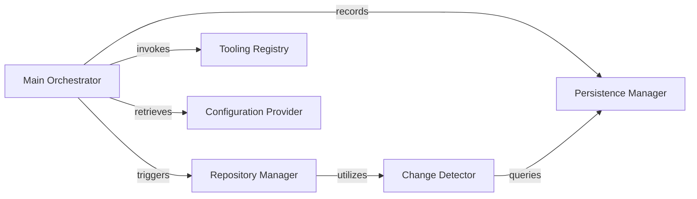

```mermaid
graph LR
    Main_Orchestrator["Main Orchestrator"]
    Repository_Manager["Repository Manager"]
    Change_Detector["Change Detector"]
    Tooling_Registry["Tooling Registry"]
    Persistence_Manager["Persistence Manager"]
    Configuration_Provider["Configuration Provider"]
    Main_Orchestrator -- "invokes" --> Tooling_Registry
    Main_Orchestrator -- "triggers" --> Repository_Manager
    Repository_Manager -- "utilizes" --> Change_Detector
    Main_Orchestrator -- "records" --> Persistence_Manager
    Change_Detector -- "queries" --> Persistence_Manager
    Main_Orchestrator -- "retrieves" --> Configuration_Provider
```

## Details

Manages the overall application lifecycle, including project initialization, repository operations (cloning, updating), change detection, and orchestrating the analysis workflow. It also handles the initial setup and environment configuration for the analysis tools.

### Main Orchestrator
Acts as the central controller; validates CLI arguments and coordinates the sequential pipeline (Clone → Analyze → Generate).

**Related Classes/Methods**:

- `main:MainOrchestrator`
- `health_main:HealthOrchestrator`

### Repository Manager
Manages the physical lifecycle of the target codebase, including URL sanitization, cloning, and local path management.

**Related Classes/Methods**:

- `repo_utils.change_detector:RepositoryManager`

### Change Detector
Implements incremental analysis logic by comparing versions and generating a ChangeSet to identify structural modifications.

**Related Classes/Methods**:

- `repo_utils.change_detector:ChangeDetector`

### Tooling Registry
Manages external dependencies (LSP servers, Tokei); ensures required binaries are installed and compatible with the host OS.

**Related Classes/Methods**:

- `tool_registry:ToolingRegistry`
- `install:Installer`

### Persistence Manager
Handles state persistence using DuckDB; tracks job history, analysis metadata, and previous repository states.

**Related Classes/Methods**:

- `duckdb_crud:PersistenceManager`

### Configuration Provider
Centralizes user-defined settings and environment-specific constants required for orchestrating the workflow.

**Related Classes/Methods**:

- `user_config:ConfigurationProvider`
- `vscode_constants:VSCodeConstants`

### [FAQ](https://github.com/CodeBoarding/GeneratedOnBoardings/tree/main?tab=readme-ov-file#faq)