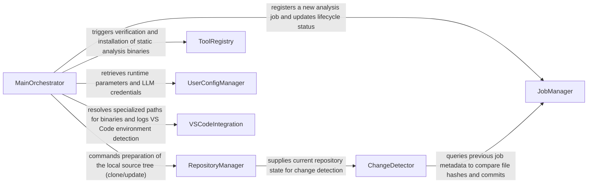

```mermaid
graph LR
    MainOrchestrator["MainOrchestrator"]
    RepositoryManager["RepositoryManager"]
    ChangeDetector["ChangeDetector"]
    ToolRegistry["ToolRegistry"]
    JobManager["JobManager"]
    UserConfigManager["UserConfigManager"]
    VSCodeIntegration["VSCodeIntegration"]
    MainOrchestrator -- "retrieves runtime parameters and LLM credentials" --> UserConfigManager
    MainOrchestrator -- "triggers verification and installation of static analysis binaries" --> ToolRegistry
    MainOrchestrator -- "commands preparation of the local source tree (clone/update)" --> RepositoryManager
    MainOrchestrator -- "registers a new analysis job and updates lifecycle status" --> JobManager
    RepositoryManager -- "supplies current repository state for change detection" --> ChangeDetector
    ChangeDetector -- "queries previous job metadata to compare file hashes and commits" --> JobManager
    MainOrchestrator -- "resolves specialized paths for binaries and logs VS Code environment detection" --> VSCodeIntegration
```

## Details

Manages the overall application lifecycle, including project initialization, repository operations (cloning, updating), change detection, and orchestrating the analysis workflow. It also handles the initial setup and environment configuration for the analysis tools.

### MainOrchestrator
The central entry point; sequences the pipeline from tool verification to final documentation generation.

**Related Classes/Methods**:

- `main.MainOrchestrator`

### RepositoryManager
Manages Git operations including cloning, branch checkouts, and path normalization for the target project.

**Related Classes/Methods**:

- `repo_utils.change_detector.RepositoryManager`

### ChangeDetector
Analyzes Git diffs to determine which files require re-analysis, enabling incremental processing.

**Related Classes/Methods**:

- `repo_utils.change_detector.ChangeDetector`

### ToolRegistry
Verifies, installs, and locates required static analysis binaries (LSP servers, Tokei).

**Related Classes/Methods**:

- `main.ToolRegistry`

### JobManager
Handles persistence of analysis jobs, tracking status, progress, and metadata via DuckDB.

**Related Classes/Methods**:

- `duckdb_crud.JobManager`

### UserConfigManager
Loads and validates system-wide settings, LLM provider credentials, and runtime parameters.

**Related Classes/Methods**:

- `user_config.UserConfigManager`

### VSCodeIntegration
Provides environment-specific pathing and binary locations when running as a VS Code extension.

**Related Classes/Methods**:

- `integration.VSCodeIntegration`

### [FAQ](https://github.com/CodeBoarding/GeneratedOnBoardings/tree/main?tab=readme-ov-file#faq)