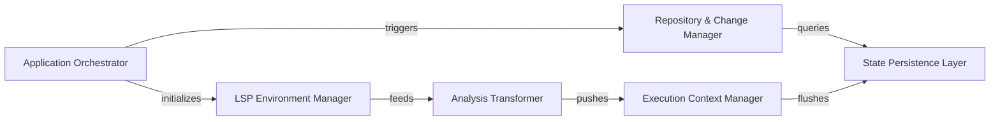

```mermaid
graph LR
    Application_Orchestrator["Application Orchestrator"]
    Repository_Change_Manager["Repository & Change Manager"]
    LSP_Environment_Manager["LSP Environment Manager"]
    Analysis_Transformer["Analysis Transformer"]
    Execution_Context_Manager["Execution Context Manager"]
    State_Persistence_Layer["State Persistence Layer"]
    Application_Orchestrator -- "triggers" --> Repository_Change_Manager
    Application_Orchestrator -- "initializes" --> LSP_Environment_Manager
    Repository_Change_Manager -- "queries" --> State_Persistence_Layer
    LSP_Environment_Manager -- "feeds" --> Analysis_Transformer
    Analysis_Transformer -- "pushes" --> Execution_Context_Manager
    Execution_Context_Manager -- "flushes" --> State_Persistence_Layer
```

## Details

Manages the overall application lifecycle, including project initialization, repository operations (cloning, updating), change detection, and orchestrating the analysis workflow. It also handles the initial setup and environment configuration for the analysis tools.

### Application Orchestrator
The central entry point that manages the CLI lifecycle. It validates user configurations (LLM providers, paths) and coordinates the high-level execution flow from repository ingestion to final documentation generation.

**Related Classes/Methods**:

- `repos.codeboarding.main.main`
- `repos.codeboarding.core.config.ConfigProvider`
- `repos.codeboarding.core.registry.PluginLoader`

### Repository & Change Manager
Handles all filesystem and Git operations. It clones/updates repositories and utilizes an incremental change detector to compare Git diffs against historical states, ensuring only modified files are processed.

**Related Classes/Methods**:

- `repos.codeboarding.repository.RepositoryManager`
- `repos.codeboarding.repository.ChangeDetector`
- `repos.codeboarding.repository.PathNormalizer`

### LSP Environment Manager
Manages the lifecycle of Language Server Protocol (LSP) binaries. It handles platform-specific binary downloads, Node/NPM environment resolution, and executes static analysis to extract raw code symbols.

**Related Classes/Methods**:

- `repos.codeboarding.lsp.LSPManager`
- `repos.codeboarding.lsp.BinaryDownloader`
- `repos.codeboarding.lsp.EnvironmentResolver`

### Analysis Transformer
Normalizes raw, language-specific LSP data into a UnifiedAnalysisJson format. It maps code components to documentation schemas and calculates structural metrics like recursion depth and ID assignment.

**Related Classes/Methods**:

- `repos.codeboarding.analysis.Transformer`
- `repos.codeboarding.analysis.SchemaMapper`
- `repos.codeboarding.analysis.UnifiedAnalysisJson`

### Execution Context Manager
The "Brain" of the agentic workflow. It tracks the reasoning loop, manages function-calling traces, records LLM token usage, and maintains the state of the current analysis run.

**Related Classes/Methods**:

- `repos.codeboarding.core.context.ExecutionContext`
- `repos.codeboarding.agents.AgentCore`
- `repos.codeboarding.core.stats.UsageTracker`

### State Persistence Layer
Manages the long-term storage of analysis metadata and job history using DuckDB. It provides the CRUD interface for incremental runs to look up previous file hashes and analysis results.

**Related Classes/Methods**:

- `repos.codeboarding.database.DuckDBInterface`
- `repos.codeboarding.database.StateStore`
- `repos.codeboarding.database.MetadataManager`

### [FAQ](https://github.com/CodeBoarding/GeneratedOnBoardings/tree/main?tab=readme-ov-file#faq)