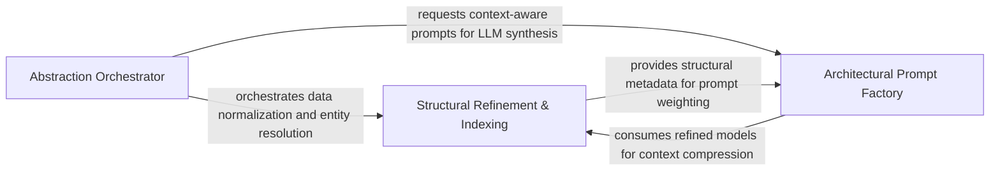

## Details

Orchestration layer that synthesizes deterministic static data into architectural components using AI-augmented logic.

### Abstraction Orchestrator
Manages the high-level lifecycle and state machine of the architectural synthesis process, coordinating the sequential execution of analysis steps.

**Related Classes/Methods**: _None_

**Source Files:**

- [`static_analyzer/engine/source_inspector.py`](https://github.com/CodeBoarding/CodeBoarding/blob/main/.codeboardingstatic_analyzer/engine/source_inspector.py)
  - `static_analyzer.engine.source_inspector.SourceInspector.__init__` ([L99-L104](https://github.com/CodeBoarding/CodeBoarding/blob/main/.codeboardingstatic_analyzer/engine/source_inspector.py#L99-L104)) - Method

### Structural Refinement & Indexing
Acts as the deterministic backbone of the engine, performing data normalization, entity resolution, and structural validation to bridge raw static analysis clusters and abstracted components.

**Related Classes/Methods**: _None_

**Source Files:**

- [`static_analyzer/engine/source_inspector.py`](https://github.com/CodeBoarding/CodeBoarding/blob/main/.codeboardingstatic_analyzer/engine/source_inspector.py)
  - `static_analyzer.engine.source_inspector.SourceInspector._smallest_named_node_ending_at` ([L326-L337](https://github.com/CodeBoarding/CodeBoarding/blob/main/.codeboardingstatic_analyzer/engine/source_inspector.py#L326-L337)) - Method

### Architectural Prompt Factory
Translates complex structural data and project context into structured prompts for LLM reasoning, encapsulating domain-specific logic for architectural analysis.

**Related Classes/Methods**: _None_

**Source Files:**

- [`static_analyzer/engine/source_inspector.py`](https://github.com/CodeBoarding/CodeBoarding/blob/main/.codeboardingstatic_analyzer/engine/source_inspector.py)
  - `static_analyzer.engine.source_inspector.SourceInspector._node_size` ([L381-L382](https://github.com/CodeBoarding/CodeBoarding/blob/main/.codeboardingstatic_analyzer/engine/source_inspector.py#L381-L382)) - Method

### [FAQ](https://github.com/CodeBoarding/GeneratedOnBoardings/tree/main?tab=readme-ov-file#faq)