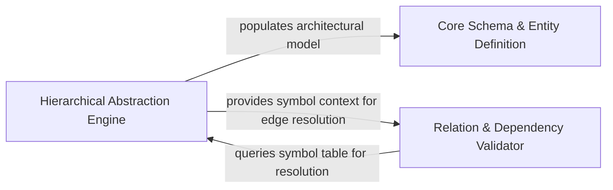

## Details

Contains the core entities of the software architecture domain, representing structural elements and their interconnections.

### Core Schema & Entity Definition
Defines the fundamental data structures and validation logic for architectural entities, providing a unified vocabulary for components, clusters, and relations.

**Related Classes/Methods**: _None_

**Source Files:**

- [`agents/agent_responses.py`](https://github.com/CodeBoarding/CodeBoarding/blob/main/.codeboardingagents/agent_responses.py)
  - `agents.agent_responses.ComponentRelations.llm_str` ([L606-L609](https://github.com/CodeBoarding/CodeBoarding/blob/main/.codeboardingagents/agent_responses.py#L606-L609)) - Method

### Hierarchical Abstraction Engine
Manages the logic for lifting low-level code artifacts into higher-level architectural clusters and mapping physical files to logical architectural views.

**Related Classes/Methods**: _None_

**Source Files:**

- [`agents/agent_responses.py`](https://github.com/CodeBoarding/CodeBoarding/blob/main/.codeboardingagents/agent_responses.py)
  - `agents.agent_responses.Relation.analysis_dump` ([L380-L386](https://github.com/CodeBoarding/CodeBoarding/blob/main/.codeboardingagents/agent_responses.py#L380-L386)) - Method

### Relation & Dependency Validator
Handles the modeling and verification of architectural graph edges, ensuring dependencies are accurately mapped to source code locations.

**Related Classes/Methods**: _None_

**Source Files:**

- [`agents/agent_responses.py`](https://github.com/CodeBoarding/CodeBoarding/blob/main/.codeboardingagents/agent_responses.py)
  - `agents.agent_responses.Relation.edge_count` ([L377-L378](https://github.com/CodeBoarding/CodeBoarding/blob/main/.codeboardingagents/agent_responses.py#L377-L378)) - Method

### [FAQ](https://github.com/CodeBoarding/GeneratedOnBoardings/tree/main?tab=readme-ov-file#faq)