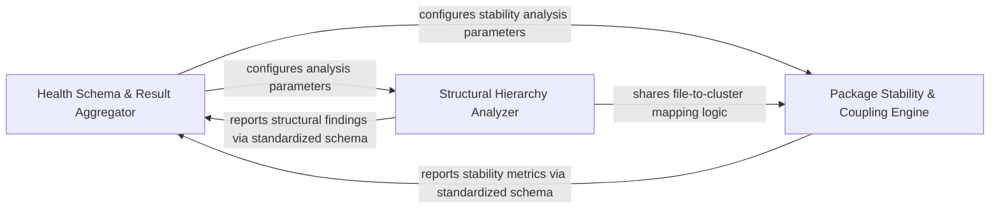

## Details

Defines the data schema for diagnostic findings and performs high-level architectural assessments, including package instability and inheritance depth, to aggregate a unified health baseline.

### Health Schema & Result Aggregator
Defines the standardized data contract for all architectural diagnostics, providing a common language for aggregating disparate checks into a unified report.

**Related Classes/Methods**: _None_

**Source Files:**

- [`health/checks/cohesion.py`](https://github.com/CodeBoarding/CodeBoarding/blob/main/.codeboardinghealth/checks/cohesion.py)
  - `health.checks.cohesion.check_component_cohesion` ([L9-L99](https://github.com/CodeBoarding/CodeBoarding/blob/main/.codeboardinghealth/checks/cohesion.py#L9-L99)) - Function
- [`health/checks/inheritance.py`](https://github.com/CodeBoarding/CodeBoarding/blob/main/.codeboardinghealth/checks/inheritance.py)
  - `health.checks.inheritance._compute_inheritance_depths` ([L15-L50](https://github.com/CodeBoarding/CodeBoarding/blob/main/.codeboardinghealth/checks/inheritance.py#L15-L50)) - Function
- [`health/models.py`](https://github.com/CodeBoarding/CodeBoarding/blob/main/.codeboardinghealth/models.py)
  - `health.models.FindingEntity` ([L18-L39](https://github.com/CodeBoarding/CodeBoarding/blob/main/.codeboardinghealth/models.py#L18-L39)) - Class
  - `health.models.FindingGroup` ([L42-L48](https://github.com/CodeBoarding/CodeBoarding/blob/main/.codeboardinghealth/models.py#L42-L48)) - Class
  - `health.models.StandardCheckSummary` ([L63-L85](https://github.com/CodeBoarding/CodeBoarding/blob/main/.codeboardinghealth/models.py#L63-L85)) - Class

### Structural Hierarchy Analyzer
Evaluates internal object model complexity by analyzing class relationships and monitoring for deep inheritance trees that violate maintainability principles.

**Related Classes/Methods**:

- `health.checks.inheritance.check_inheritance_depth`:53-104

**Source Files:**

- [`health/checks/inheritance.py`](https://github.com/CodeBoarding/CodeBoarding/blob/main/.codeboardinghealth/checks/inheritance.py)
  - `health.checks.inheritance.check_inheritance_depth` ([L53-L104](https://github.com/CodeBoarding/CodeBoarding/blob/main/.codeboardinghealth/checks/inheritance.py#L53-L104)) - Function
- [`static_analyzer/cluster_helpers.py`](https://github.com/CodeBoarding/CodeBoarding/blob/main/.codeboardingstatic_analyzer/cluster_helpers.py)
  - `static_analyzer.cluster_helpers.get_files_for_cluster_ids` ([L496-L511](https://github.com/CodeBoarding/CodeBoarding/blob/main/.codeboardingstatic_analyzer/cluster_helpers.py#L496-L511)) - Function

### Package Stability & Coupling Engine
Implements formal dependency metrics, such as Afferent and Efferent coupling, to calculate the Instability index and assess the risk profile of the package structure.

**Related Classes/Methods**:

- `health.checks.instability.check_package_instability`:8-77

**Source Files:**

- [`health/checks/instability.py`](https://github.com/CodeBoarding/CodeBoarding/blob/main/.codeboardinghealth/checks/instability.py)
  - `health.checks.instability.check_package_instability` ([L8-L77](https://github.com/CodeBoarding/CodeBoarding/blob/main/.codeboardinghealth/checks/instability.py#L8-L77)) - Function
- [`static_analyzer/graph.py`](https://github.com/CodeBoarding/CodeBoarding/blob/main/.codeboardingstatic_analyzer/graph.py)
  - `static_analyzer.graph.ClusterResult.get_files_for_cluster` ([L63-L64](https://github.com/CodeBoarding/CodeBoarding/blob/main/.codeboardingstatic_analyzer/graph.py#L63-L64)) - Method

### [FAQ](https://github.com/CodeBoarding/GeneratedOnBoardings/tree/main?tab=readme-ov-file#faq)