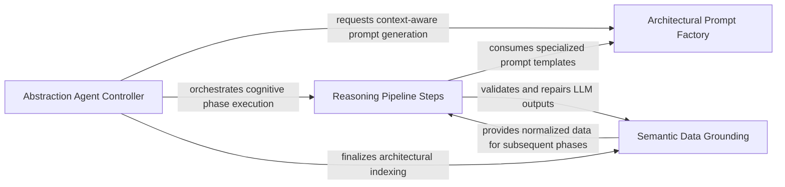

## Details

The primary intelligence layer that performs high-level synthesis, grouping code clusters into logical components, identifying public API surfaces, and conducting the final architectural analysis.

### Abstraction Agent Controller
Manages the lifecycle and execution state of the architectural discovery process, coordinating transitions between reasoning phases.

**Related Classes/Methods**: _None_

**Source Files:**

- [`agents/agent_responses.py`](https://github.com/CodeBoarding/CodeBoarding/blob/main/.codeboardingagents/agent_responses.py)
  - `agents.agent_responses.LLMBaseModel` ([L24-L129](https://github.com/CodeBoarding/CodeBoarding/blob/main/.codeboardingagents/agent_responses.py#L24-L129)) - Class
  - `agents.agent_responses.RelationCallSite` ([L179-L183](https://github.com/CodeBoarding/CodeBoarding/blob/main/.codeboardingagents/agent_responses.py#L179-L183)) - Class
  - `agents.agent_responses.RelationEdge` ([L186-L245](https://github.com/CodeBoarding/CodeBoarding/blob/main/.codeboardingagents/agent_responses.py#L186-L245)) - Class
  - `agents.agent_responses.ClustersComponent` ([L389-L437](https://github.com/CodeBoarding/CodeBoarding/blob/main/.codeboardingagents/agent_responses.py#L389-L437)) - Class
  - `agents.agent_responses.ClusterAnalysis` ([L440-L452](https://github.com/CodeBoarding/CodeBoarding/blob/main/.codeboardingagents/agent_responses.py#L440-L452)) - Class
  - `agents.agent_responses.AnalysisInsights` ([L509-L534](https://github.com/CodeBoarding/CodeBoarding/blob/main/.codeboardingagents/agent_responses.py#L509-L534)) - Class
  - `agents.agent_responses.AnalysisInsights.llm_str` ([L524-L530](https://github.com/CodeBoarding/CodeBoarding/blob/main/.codeboardingagents/agent_responses.py#L524-L530)) - Method
  - `agents.agent_responses.AnalysisInsights.file_to_component` ([L532-L534](https://github.com/CodeBoarding/CodeBoarding/blob/main/.codeboardingagents/agent_responses.py#L532-L534)) - Method
  - `agents.agent_responses.ComponentArchitecture` ([L537-L550](https://github.com/CodeBoarding/CodeBoarding/blob/main/.codeboardingagents/agent_responses.py#L537-L550)) - Class
  - `agents.agent_responses.ComponentApiSurface` ([L553-L587](https://github.com/CodeBoarding/CodeBoarding/blob/main/.codeboardingagents/agent_responses.py#L553-L587)) - Class
  - `agents.agent_responses.ComponentApiSurfaces` ([L590-L598](https://github.com/CodeBoarding/CodeBoarding/blob/main/.codeboardingagents/agent_responses.py#L590-L598)) - Class
  - `agents.agent_responses.ComponentRelations` ([L601-L609](https://github.com/CodeBoarding/CodeBoarding/blob/main/.codeboardingagents/agent_responses.py#L601-L609)) - Class
  - `agents.agent_responses.CFGComponent` ([L685-L701](https://github.com/CodeBoarding/CodeBoarding/blob/main/.codeboardingagents/agent_responses.py#L685-L701)) - Class
  - `agents.agent_responses.CFGAnalysisInsights` ([L704-L716](https://github.com/CodeBoarding/CodeBoarding/blob/main/.codeboardingagents/agent_responses.py#L704-L716)) - Class
  - `agents.agent_responses.ExpandComponent` ([L719-L726](https://github.com/CodeBoarding/CodeBoarding/blob/main/.codeboardingagents/agent_responses.py#L719-L726)) - Class
  - `agents.agent_responses.ValidationInsights` ([L729-L739](https://github.com/CodeBoarding/CodeBoarding/blob/main/.codeboardingagents/agent_responses.py#L729-L739)) - Class
  - `agents.agent_responses.UpdateAnalysis` ([L742-L751](https://github.com/CodeBoarding/CodeBoarding/blob/main/.codeboardingagents/agent_responses.py#L742-L751)) - Class
  - `agents.agent_responses.MetaAnalysisInsights` ([L754-L780](https://github.com/CodeBoarding/CodeBoarding/blob/main/.codeboardingagents/agent_responses.py#L754-L780)) - Class
  - `agents.agent_responses.FileClassification` ([L783-L790](https://github.com/CodeBoarding/CodeBoarding/blob/main/.codeboardingagents/agent_responses.py#L783-L790)) - Class
  - `agents.agent_responses.ComponentFiles` ([L793-L805](https://github.com/CodeBoarding/CodeBoarding/blob/main/.codeboardingagents/agent_responses.py#L793-L805)) - Class
  - `agents.agent_responses.ScopeRelations` ([L808-L816](https://github.com/CodeBoarding/CodeBoarding/blob/main/.codeboardingagents/agent_responses.py#L808-L816)) - Class
  - `agents.agent_responses.ScopeOperationAction` ([L819-L823](https://github.com/CodeBoarding/CodeBoarding/blob/main/.codeboardingagents/agent_responses.py#L819-L823)) - Class
  - `agents.agent_responses.ScopedClusterRef` ([L826-L835](https://github.com/CodeBoarding/CodeBoarding/blob/main/.codeboardingagents/agent_responses.py#L826-L835)) - Class
  - `agents.agent_responses.ScopeOperation` ([L838-L868](https://github.com/CodeBoarding/CodeBoarding/blob/main/.codeboardingagents/agent_responses.py#L838-L868)) - Class
  - `agents.agent_responses.ScopeUpdateDecision` ([L871-L879](https://github.com/CodeBoarding/CodeBoarding/blob/main/.codeboardingagents/agent_responses.py#L871-L879)) - Class
  - `agents.agent_responses.FilePath` ([L882-L896](https://github.com/CodeBoarding/CodeBoarding/blob/main/.codeboardingagents/agent_responses.py#L882-L896)) - Class

### Architectural Prompt Factory
Translates codebase state and analysis results into structured, domain-specific prompts to guide LLM reasoning.

**Related Classes/Methods**: _None_

**Source Files:**

- [`agents/agent_responses.py`](https://github.com/CodeBoarding/CodeBoarding/blob/main/.codeboardingagents/agent_responses.py)
  - `agents.agent_responses.ClustersComponent.llm_str` ([L435-L437](https://github.com/CodeBoarding/CodeBoarding/blob/main/.codeboardingagents/agent_responses.py#L435-L437)) - Method
  - `agents.agent_responses.ClusterAnalysis.llm_str` ([L447-L452](https://github.com/CodeBoarding/CodeBoarding/blob/main/.codeboardingagents/agent_responses.py#L447-L452)) - Method
  - `agents.agent_responses.Component.file_paths` ([L492-L494](https://github.com/CodeBoarding/CodeBoarding/blob/main/.codeboardingagents/agent_responses.py#L492-L494)) - Method

### Reasoning Pipeline Steps
Implements discrete cognitive phases where the agent interacts with the LLM to synthesize architectural aspects.

**Related Classes/Methods**: _None_

**Source Files:**

- [`agents/agent_responses.py`](https://github.com/CodeBoarding/CodeBoarding/blob/main/.codeboardingagents/agent_responses.py)
  - `agents.agent_responses.Component.llm_str` ([L496-L506](https://github.com/CodeBoarding/CodeBoarding/blob/main/.codeboardingagents/agent_responses.py#L496-L506)) - Method
  - `agents.agent_responses.ComponentArchitecture.llm_str` ([L545-L550](https://github.com/CodeBoarding/CodeBoarding/blob/main/.codeboardingagents/agent_responses.py#L545-L550)) - Method
  - `agents.agent_responses.ComponentApiSurfaces.llm_str` ([L595-L598](https://github.com/CodeBoarding/CodeBoarding/blob/main/.codeboardingagents/agent_responses.py#L595-L598)) - Method
  - `agents.agent_responses.ComponentFiles.llm_str` ([L800-L805](https://github.com/CodeBoarding/CodeBoarding/blob/main/.codeboardingagents/agent_responses.py#L800-L805)) - Method

### Semantic Data Grounding
Maps LLM-generated abstractions back to concrete code entities, normalizing responses and maintaining a single source of truth.

**Related Classes/Methods**: _None_

**Source Files:**

- [`agents/agent_responses.py`](https://github.com/CodeBoarding/CodeBoarding/blob/main/.codeboardingagents/agent_responses.py)
  - `agents.agent_responses.ExpandComponent.llm_str` ([L725-L726](https://github.com/CodeBoarding/CodeBoarding/blob/main/.codeboardingagents/agent_responses.py#L725-L726)) - Method

### [FAQ](https://github.com/CodeBoarding/GeneratedOnBoardings/tree/main?tab=readme-ov-file#faq)