```mermaid
graph LR
    LLM_Schema_Protocol["LLM-Schema Protocol"]
    Architectural_Domain_Models["Architectural Domain Models"]
    Analysis_Aggregator_Serializer["Analysis Aggregator & Serializer"]
    Static_Inventory_Identity_Registry["Static Inventory & Identity Registry"]
    LLM_Schema_Protocol -- "provides schema definitions for structured output" --> Analysis_Aggregator_Serializer
    Architectural_Domain_Models -- "implements extraction protocol for LLM compatibility" --> LLM_Schema_Protocol
    Architectural_Domain_Models -- "calls" --> Analysis_Aggregator_Serializer
    Analysis_Aggregator_Serializer -- "queries ground truth for validation and enrichment" --> Static_Inventory_Identity_Registry
    Static_Inventory_Identity_Registry -- "instantiates and populates domain entities" --> Architectural_Domain_Models
    Static_Inventory_Identity_Registry -- "calls" --> Analysis_Aggregator_Serializer
    click LLM_Schema_Protocol href "https://github.com/CodeBoarding/CodeBoarding/blob/main/.codeboarding/LLM_Schema_Protocol.md" "Details"
    click Architectural_Domain_Models href "https://github.com/CodeBoarding/CodeBoarding/blob/main/.codeboarding/Architectural_Domain_Models.md" "Details"
    click Analysis_Aggregator_Serializer href "https://github.com/CodeBoarding/CodeBoarding/blob/main/.codeboarding/Analysis_Aggregator_Serializer.md" "Details"
    click Static_Inventory_Identity_Registry href "https://github.com/CodeBoarding/CodeBoarding/blob/main/.codeboarding/Static_Inventory_Identity_Registry.md" "Details"
```

## Details

Defines the formal data contract and Pydantic models for representing components, relations, and insights, facilitating communication between probabilistic reasoning and deterministic requirements.

### LLM-Schema Protocol [[Expand]](./LLM_Schema_Protocol.md)
Defines the foundational protocol for making Pydantic models compatible with LLM extraction, managing JSON schema generation and instruction strings.

**Related Classes/Methods**: _None_

**Source Files:**

- [`agents/agent_responses.py`](https://github.com/CodeBoarding/CodeBoarding/blob/main/.codeboardingagents/agent_responses.py)
  - `agents.agent_responses.CFGComponent.llm_str` ([L694-L701](https://github.com/CodeBoarding/CodeBoarding/blob/main/.codeboardingagents/agent_responses.py#L694-L701)) - Method
  - `agents.agent_responses.CFGAnalysisInsights.llm_str` ([L710-L716](https://github.com/CodeBoarding/CodeBoarding/blob/main/.codeboardingagents/agent_responses.py#L710-L716)) - Method

### Architectural Domain Models [[Expand]](./Architectural_Domain_Models.md)
Contains the core entities of the software architecture domain, representing structural elements and their interconnections.

**Related Classes/Methods**: _None_

**Source Files:**

- [`agents/agent_responses.py`](https://github.com/CodeBoarding/CodeBoarding/blob/main/.codeboardingagents/agent_responses.py)
  - `agents.agent_responses.Relation.edge_count` ([L377-L378](https://github.com/CodeBoarding/CodeBoarding/blob/main/.codeboardingagents/agent_responses.py#L377-L378)) - Method
  - `agents.agent_responses.Relation.analysis_dump` ([L380-L386](https://github.com/CodeBoarding/CodeBoarding/blob/main/.codeboardingagents/agent_responses.py#L380-L386)) - Method
  - `agents.agent_responses.ComponentRelations.llm_str` ([L606-L609](https://github.com/CodeBoarding/CodeBoarding/blob/main/.codeboardingagents/agent_responses.py#L606-L609)) - Method

### Analysis Aggregator & Serializer [[Expand]](./Analysis_Aggregator_Serializer.md)
Responsible for aggregating individual architectural entities into a cohesive analysis report and handling serialization.

**Related Classes/Methods**: _None_

**Source Files:**

- [`agents/agent_responses.py`](https://github.com/CodeBoarding/CodeBoarding/blob/main/.codeboardingagents/agent_responses.py)
  - `agents.agent_responses.Relation.llm_str` ([L324-L325](https://github.com/CodeBoarding/CodeBoarding/blob/main/.codeboardingagents/agent_responses.py#L324-L325)) - Method

### Static Inventory & Identity Registry [[Expand]](./Static_Inventory_Identity_Registry.md)
Maintains the deterministic ground truth of the codebase, providing identity systems and file-level metadata for validation.

**Related Classes/Methods**: _None_

**Source Files:**

- [`agents/agent_responses.py`](https://github.com/CodeBoarding/CodeBoarding/blob/main/.codeboardingagents/agent_responses.py)
  - `agents.agent_responses.ScopeRelations.llm_str` ([L813-L816](https://github.com/CodeBoarding/CodeBoarding/blob/main/.codeboardingagents/agent_responses.py#L813-L816)) - Method

### [FAQ](https://github.com/CodeBoarding/GeneratedOnBoardings/tree/main?tab=readme-ov-file#faq)