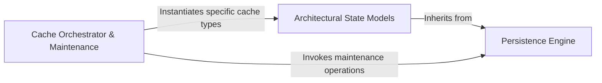

## Details

Provides a persistence layer for the reasoning process, storing cluster groupings and final analysis results to skip redundant LLM processing.

### Persistence Engine
Manages the low-level lifecycle of the cache database, providing a thread-safe, schema-validated interface for SQLite.

**Related Classes/Methods**:

- `caching.cache.BaseCache`:30-268
- `caching.cache.BaseCache.store`:199-216
- `caching.cache.BaseCache.load`:185-197
- `caching.cache.BaseCache._open_sqlite_unlocked`:85-119

**Source Files:**

- [`caching/cache.py`](https://github.com/CodeBoarding/CodeBoarding/blob/main/.codeboardingcaching/cache.py)
  - `caching.cache.BaseCache._open_sqlite` ([L65-L73](https://github.com/CodeBoarding/CodeBoarding/blob/main/.codeboardingcaching/cache.py#L65-L73)) - Method
  - `caching.cache.BaseCache._configure_sqlite_connection` ([L76-L83](https://github.com/CodeBoarding/CodeBoarding/blob/main/.codeboardingcaching/cache.py#L76-L83)) - Method
  - `caching.cache.BaseCache._open_sqlite_unlocked` ([L85-L119](https://github.com/CodeBoarding/CodeBoarding/blob/main/.codeboardingcaching/cache.py#L85-L119)) - Method
  - `caching.cache.BaseCache._reset_if_incompatible_schema` ([L121-L135](https://github.com/CodeBoarding/CodeBoarding/blob/main/.codeboardingcaching/cache.py#L121-L135)) - Method
  - `caching.cache.BaseCache.signature` ([L137-L139](https://github.com/CodeBoarding/CodeBoarding/blob/main/.codeboardingcaching/cache.py#L137-L139)) - Method
  - `caching.cache.BaseCache._lookup` ([L141-L157](https://github.com/CodeBoarding/CodeBoarding/blob/main/.codeboardingcaching/cache.py#L141-L157)) - Method
  - `caching.cache.BaseCache._upsert_conn` ([L159-L174](https://github.com/CodeBoarding/CodeBoarding/blob/main/.codeboardingcaching/cache.py#L159-L174)) - Method
  - `caching.cache.BaseCache._clear_conn` ([L176-L183](https://github.com/CodeBoarding/CodeBoarding/blob/main/.codeboardingcaching/cache.py#L176-L183)) - Method
  - `caching.cache.BaseCache.load` ([L185-L197](https://github.com/CodeBoarding/CodeBoarding/blob/main/.codeboardingcaching/cache.py#L185-L197)) - Method
  - `caching.cache.BaseCache.store` ([L199-L216](https://github.com/CodeBoarding/CodeBoarding/blob/main/.codeboardingcaching/cache.py#L199-L216)) - Method
  - `caching.cache.BaseCache.clear` ([L218-L229](https://github.com/CodeBoarding/CodeBoarding/blob/main/.codeboardingcaching/cache.py#L218-L229)) - Method
  - `caching.cache.BaseCache.load_most_recent_run` ([L231-L257](https://github.com/CodeBoarding/CodeBoarding/blob/main/.codeboardingcaching/cache.py#L231-L257)) - Method

### Architectural State Models
Defines the specialized schemas and lookup keys for architectural reasoning data, mapping generic storage to domain-specific entities.

**Related Classes/Methods**:

- `caching.details_cache.ClusterCache`:37-53
- `caching.details_cache.FinalAnalysisCache`:18-34
- `caching.details_cache.DetailsCacheKey`:12-15
- `caching.meta_cache.MetaCache`:40-111

**Source Files:**

- [`caching/cache.py`](https://github.com/CodeBoarding/CodeBoarding/blob/main/.codeboardingcaching/cache.py)
  - `caching.cache.BaseCache.__init__` ([L36-L63](https://github.com/CodeBoarding/CodeBoarding/blob/main/.codeboardingcaching/cache.py#L36-L63)) - Method
- [`caching/details_cache.py`](https://github.com/CodeBoarding/CodeBoarding/blob/main/.codeboardingcaching/details_cache.py)
  - `caching.details_cache.DetailsCacheKey` ([L12-L15](https://github.com/CodeBoarding/CodeBoarding/blob/main/.codeboardingcaching/details_cache.py#L12-L15)) - Class
  - `caching.details_cache.FinalAnalysisCache.__init__` ([L24-L30](https://github.com/CodeBoarding/CodeBoarding/blob/main/.codeboardingcaching/details_cache.py#L24-L30)) - Method
  - `caching.details_cache.FinalAnalysisCache.build_key` ([L33-L34](https://github.com/CodeBoarding/CodeBoarding/blob/main/.codeboardingcaching/details_cache.py#L33-L34)) - Method
  - `caching.details_cache.ClusterCache.__init__` ([L43-L49](https://github.com/CodeBoarding/CodeBoarding/blob/main/.codeboardingcaching/details_cache.py#L43-L49)) - Method
  - `caching.details_cache.ClusterCache.build_key` ([L52-L53](https://github.com/CodeBoarding/CodeBoarding/blob/main/.codeboardingcaching/details_cache.py#L52-L53)) - Method
- [`caching/meta_cache.py`](https://github.com/CodeBoarding/CodeBoarding/blob/main/.codeboardingcaching/meta_cache.py)
  - `caching.meta_cache.MetaCache.__init__` ([L46-L55](https://github.com/CodeBoarding/CodeBoarding/blob/main/.codeboardingcaching/meta_cache.py#L46-L55)) - Method

### Cache Orchestrator & Maintenance
Integrates the caching layer into the agentic workflow and manages the health of the persistence layer, including pruning stale data.

**Related Classes/Methods**:

- `agents.details_agent.DetailsAgent.__init__`:38-65
- `caching.details_cache.prune_details_caches`:56-58
- `diagram_analysis.run_context._load_existing_run_id`:43-60

**Source Files:**

- [`agents/details_agent.py`](https://github.com/CodeBoarding/CodeBoarding/blob/main/.codeboardingagents/details_agent.py)
  - `agents.details_agent.DetailsAgent.__init__` ([L38-L65](https://github.com/CodeBoarding/CodeBoarding/blob/main/.codeboardingagents/details_agent.py#L38-L65)) - Method
- [`caching/details_cache.py`](https://github.com/CodeBoarding/CodeBoarding/blob/main/.codeboardingcaching/details_cache.py)
  - `caching.details_cache.FinalAnalysisCache` ([L18-L34](https://github.com/CodeBoarding/CodeBoarding/blob/main/.codeboardingcaching/details_cache.py#L18-L34)) - Class
  - `caching.details_cache.ClusterCache` ([L37-L53](https://github.com/CodeBoarding/CodeBoarding/blob/main/.codeboardingcaching/details_cache.py#L37-L53)) - Class
  - `caching.details_cache.prune_details_caches` ([L56-L58](https://github.com/CodeBoarding/CodeBoarding/blob/main/.codeboardingcaching/details_cache.py#L56-L58)) - Function
- [`diagram_analysis/run_context.py`](https://github.com/CodeBoarding/CodeBoarding/blob/main/.codeboardingdiagram_analysis/run_context.py)
  - `diagram_analysis.run_context.RunContext` ([L13-L40](https://github.com/CodeBoarding/CodeBoarding/blob/main/.codeboardingdiagram_analysis/run_context.py#L13-L40)) - Class
  - `diagram_analysis.run_context._load_existing_run_id` ([L43-L60](https://github.com/CodeBoarding/CodeBoarding/blob/main/.codeboardingdiagram_analysis/run_context.py#L43-L60)) - Function

### [FAQ](https://github.com/CodeBoarding/GeneratedOnBoardings/tree/main?tab=readme-ov-file#faq)