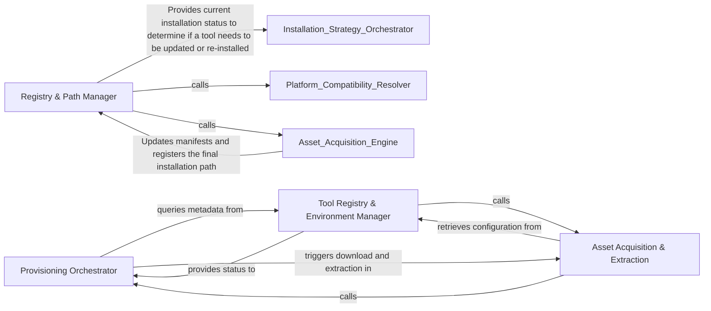

## Details

Handles low-level mechanics of fetching, verifying, and extracting external binaries and compressed archives.

### Registry & Path Manager
Maintains the state of the local tool registry, tracks installations via manifests, and provides a unified interface for locating binaries.

**Related Classes/Methods**: _None_

**Source Files:**

- [`tool_registry/installers.py`](https://github.com/CodeBoarding/CodeBoarding/blob/main/.codeboardingtool_registry/installers.py)
  - `tool_registry.installers.install_tools` ([L515-L537](https://github.com/CodeBoarding/CodeBoarding/blob/main/.codeboardingtool_registry/installers.py#L515-L537)) - Function
- [`tool_registry/registry.py`](https://github.com/CodeBoarding/CodeBoarding/blob/main/.codeboardingtool_registry/registry.py)
  - `tool_registry.registry.ToolDependency.is_available_on_host` ([L140-L152](https://github.com/CodeBoarding/CodeBoarding/blob/main/.codeboardingtool_registry/registry.py#L140-L152)) - Method

### Provisioning Orchestrator
Manages the high-level logic for tool availability checks and the sequencing of installation tasks.

**Related Classes/Methods**:

- `tool_registry.installers.install_tools`:515-537
- `tool_registry.registry.ToolDependency.is_available_on_host`:140-152

**Source Files:**

- [`tool_registry/installers.py`](https://github.com/CodeBoarding/CodeBoarding/blob/main/.codeboardingtool_registry/installers.py)
  - `tool_registry.installers._is_compressed_asset` ([L85-L88](https://github.com/CodeBoarding/CodeBoarding/blob/main/.codeboardingtool_registry/installers.py#L85-L88)) - Function
  - `tool_registry.installers._extract_compressed_binary` ([L91-L137](https://github.com/CodeBoarding/CodeBoarding/blob/main/.codeboardingtool_registry/installers.py#L91-L137)) - Function

### Asset Acquisition & Extraction
Handles the physical retrieval of binaries from remote sources, checksum validation, and decompression of archives.

**Related Classes/Methods**:

- `tool_registry.installers.download_asset`:140-163
- `tool_registry.installers.install_archive_tool`:475-509

**Source Files:**

- [`tool_registry/installers.py`](https://github.com/CodeBoarding/CodeBoarding/blob/main/.codeboardingtool_registry/installers.py)
  - `tool_registry.installers.asset_url` ([L51-L57](https://github.com/CodeBoarding/CodeBoarding/blob/main/.codeboardingtool_registry/installers.py#L51-L57)) - Function
  - `tool_registry.installers.download_asset` ([L140-L163](https://github.com/CodeBoarding/CodeBoarding/blob/main/.codeboardingtool_registry/installers.py#L140-L163)) - Function
  - `tool_registry.installers.install_native_tools` ([L169-L271](https://github.com/CodeBoarding/CodeBoarding/blob/main/.codeboardingtool_registry/installers.py#L169-L271)) - Function
  - `tool_registry.installers.install_archive_tool` ([L475-L509](https://github.com/CodeBoarding/CodeBoarding/blob/main/.codeboardingtool_registry/installers.py#L475-L509)) - Function

### Tool Registry & Environment Manager
Maintains the source of truth for tool metadata, version constraints, and platform-specific configuration.

**Related Classes/Methods**:

- `tool_registry.registry.ToolDependency`:127-152

**Source Files:**

- [`tool_registry/installers.py`](https://github.com/CodeBoarding/CodeBoarding/blob/main/.codeboardingtool_registry/installers.py)
  - `tool_registry.installers.resolve_native_asset_name` ([L60-L82](https://github.com/CodeBoarding/CodeBoarding/blob/main/.codeboardingtool_registry/installers.py#L60-L82)) - Function
  - `tool_registry.installers.install_tools` ([L515-L537](https://github.com/CodeBoarding/CodeBoarding/blob/main/.codeboardingtool_registry/installers.py#L515-L537)) - Function
- [`tool_registry/registry.py`](https://github.com/CodeBoarding/CodeBoarding/blob/main/.codeboardingtool_registry/registry.py)
  - `tool_registry.registry.ToolDependency.is_available_on_host` ([L140-L152](https://github.com/CodeBoarding/CodeBoarding/blob/main/.codeboardingtool_registry/registry.py#L140-L152)) - Method

### [FAQ](https://github.com/CodeBoarding/GeneratedOnBoardings/tree/main?tab=readme-ov-file#faq)