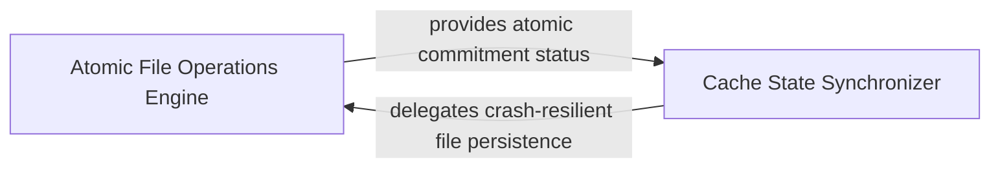

## Details

Provides low-level, thread-safe file system operations to ensure that cache persistence and migration are performed atomically, preventing partial writes or data corruption.

### Atomic File Operations Engine
Provides low-level primitives for thread-safe and crash-resilient file manipulation, abstracting the complexity of atomic rename and replace operations.

**Related Classes/Methods**:

- `static_analyzer.analysis_cache._atomic_copy`:321-336

**Source Files:**

- [`static_analyzer/analysis_cache.py`](https://github.com/CodeBoarding/CodeBoarding/blob/main/.codeboardingstatic_analyzer/analysis_cache.py)
  - `static_analyzer.analysis_cache._atomic_copy` ([L321-L336](https://github.com/CodeBoarding/CodeBoarding/blob/main/.codeboardingstatic_analyzer/analysis_cache.py#L321-L336)) - Function

### Cache State Synchronizer
Orchestrates the movement and synchronization of analysis artifacts between temporary processing space and persistent storage, ensuring atomic transitions of cache states.

**Related Classes/Methods**:

- `static_analyzer.analysis_cache.copy_cache_files`:279-318

**Source Files:**

- [`static_analyzer/analysis_cache.py`](https://github.com/CodeBoarding/CodeBoarding/blob/main/.codeboardingstatic_analyzer/analysis_cache.py)
  - `static_analyzer.analysis_cache.copy_cache_files` ([L279-L318](https://github.com/CodeBoarding/CodeBoarding/blob/main/.codeboardingstatic_analyzer/analysis_cache.py#L279-L318)) - Function

### [FAQ](https://github.com/CodeBoarding/GeneratedOnBoardings/tree/main?tab=readme-ov-file#faq)